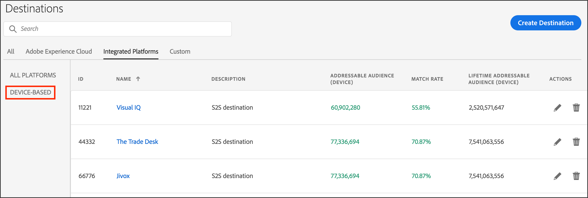

# Público-alvo endereçável {#addressable-audiences}

Uma visão geral do recurso Público-alvo endereçável e dos casos de uso.

## O que é um Público-alvo endereçável? {#addressable-audience-description}

O [!UICONTROL Addressable Audiences] recurso mostra a sobreposição entre os públicos-alvo que você vê em todas as suas propriedades, onde [!DNL Audience Manager] coleta dados e o destino selecionado. Para ajudá-lo a entender esse conceito, dê uma olhada na ilustração abaixo. A sobreposição entre cada círculo representa os diferentes tipos de públicos-alvo endereçáveis.

<table id="table_6DC02E219B074BF782EAA0E9DB9495FB"> 
 <thead> 
  <tr> 
   <th colname="col1" class="entry"> Métrica </th> 
   <th colname="col2" class="entry"> Descrição </th> 
  </tr> 
 </thead>
 <tbody> 
    <tr> 
   <td colname="col1"> 
 <b>Público-alvo endereçável do Audience Manager para um destino</b> 
 </td> 
   <td colname="col2"> 
Uma contagem de todos os dispositivos que interagiram com todos os clientes do Audience Manager no nível da plataforma durante o período de análise do relatório e que podem ser combinados com o destino escolhido. 
 
Essa métrica é útil porque mostra: 
 
 
     <ul id="ul_67A82A40C7A64457822272B45D2817FC"> 
      <li id="li_DAEFB565CE774F68AA29274A021F1E5A"> O tamanho do público-alvo total endereçável que  o Audience Manager pode atingir em um destino de direcionamento específico. </li> 
      <li id="li_AF26F88068CA44F7B5C4C42DE5E21055">O tamanho do pool de perfis do  Audience Manager para uma plataforma de definição de metas e o tamanho de seus públicos-alvo. </li> 
     </ul> 
 </td> 
  </tr> 
  <tr> 
   <td colname="col1"> 
 <b>Público-alvo total do cliente</b> 
 </td> 
   <td colname="col2"> 
Uma contagem de dispositivos que perceberam uma característica baseada em regras em suas propriedades ou uma característica integrada de seus arquivos offline durante a janela de retrospectiva. 
 </td> 
  </tr> 
  <tr> 
   <td colname="col1"> 
 <b>Taxa de correspondência de público-alvo endereçável</b> 
 </td> 
   <td colname="col2"> 
    <draft-comment> 
     
Uma contagem de sobreposição de dispositivos que perceberam uma característica baseada em regras ou uma característica integrada durante a janela de retrospectiva e dispositivos que possuem uma sincronização de ID com o destino escolhido independentemente do tempo de sincronização. 
 
    </draft-comment> 
Essa métrica representa dispositivos que: 
     <ul id="ul_B609B402A29D44898DF0B1ABC6011D40"> 
      <li id="li_27A530DE2AEB48069BECFB2D78E94C4E">Tenham percebido uma característica baseada em regras ou integrada durante a janela de retrospectiva <b>E</b> </li> 
      <li id="li_47C44ECAEC5844DEB11C6A93C8F061BB">Ter uma sincronização de ID com o destino escolhido, independentemente do tempo de sincronização. </li> 
     </ul> 
 </td> 
  </tr> 
  <tr> 
   <td colname="col1"> 
 <b>Taxa de correspondência do cliente</b> 
 </td> 
   <td colname="col2"> 
Público-alvo endereçável do cliente /Público-alvo total do cliente expresso em %. 
 </td> 
  </tr>
   <tr> 
   <td colname="col1"> 
 <b>População total de segmentos</b> 
 </td> 
   <td colname="col2"> 
Uma contagem de todos os dispositivos que eram membros do seu segmento durante o período de análise do relatório. 
 </td> 
  </tr> 
  <tr> 
   <td colname="col1"> 
 <b>Público-alvo endereçável do segmento</b> 
 </td> 
   <td colname="col2"> 
O número de usuários que pertenceram ao segmento durante o período de análise do relatório e que têm uma sincronização de ID ativa no site. Os segmentos podem incluir seus próprios dados primários e dados de terceiros e de terceiros, por meio de características adquiridas no <a href="../features/audience-marketplace/marketplace-data-buyers/marketplace-data-buyers.md"> Audience Marketplace</a>. 
 
 
Dica: Quando usada com o período de análise de 1 dia, essa métrica pode ajudá-lo a entender o estado atual de seus segmentos. Isso ocorre porque a métrica Público-alvo  endereçável do segmento representa os usuários que permaneceram em um segmento durante o dia anterior. Combine isso com o fato de que  o Audience Manager atualiza  Públicos endereçáveis diariamente, combinando essa métrica e o período de pesquisa fornece o instantâneo mais atualizado de seus segmentos. 
 
 </td> 
  </tr> 
  <tr> 
   <td colname="col1"> 
 <b>Taxa de correspondência do segmento</b> 
 </td> 
   <td colname="col2"> 
Público-alvo endereçável do segmento /População total do segmento expressa como %. 
 </td> 
  </tr>  
 </tbody> 
</table>

## Interface do público-alvo endereçável {#addressable-audience-interface}

O [!UICONTROL Addressable Audience] recurso transforma esse conceito abstrato em dados quantificáveis. Em [!DNL Audience Manager]geral, esse recurso exibe a sobreposição do público-alvo com visualizações de dados que fornecem informações instantâneas juntamente com dados numéricos em forma de tabela.

[!UICONTROL Addressable Audiences] está localizado em **[!UICONTROL Audience Data > Destinations]**. Selecione **[!UICONTROL Integrated Platforms > Device-Based]** para ver as métricas de públicos-alvo endereçáveis.

As três métricas que você pode ver na página de aterrissagem Públicos-alvo endereçáveis representam:

| Métrica | Descrição |
---------|----------|
| **Público-alvo endereçável (dispositivos)** | Essa métrica representa o Público-alvo endereçável do cliente (descrito na tabela acima) *nos últimos 30 dias.* |
| **Taxa de correspondência** | Essa métrica representa a Taxa de correspondência do público-alvo endereçável (descrita na tabela acima) *para os últimos 30 dias*. |
| **Público-alvo endereçável da duração (dispositivos)** | Uma contagem de todos os dispositivos que interagiram com todos os clientes do Audience Manager no nível da plataforma durante o período de análise do relatório e que podem ser combinados com esse destino. Consulte Métricas [de nível de](/help/using/features/addressable-audiences.md#platform-level-metrics) plataforma para obter mais informações. |

Clique no nome de um destino servidor a servidor para exibir os dados de público-alvo endereçáveis. Observe que esse recurso retorna dados somente para destinos de servidor para servidor e o acesso requer permissões de administrador.

A revisão desses dados pode ajudá-lo com:

* **** Previsão e planejamento: [!UICONTROL Segment Addressable Audience] os dados fornecem mais granularidade nos segmentos que você está planejando enviar para um destino para direcionamento e ativação do público-alvo.

* **** Análises de desempenho: O [!UICONTROL Addressable Audiences] recurso também é uma ferramenta de solução de problemas. Ele permite que você revise o desempenho da campanha, entenda o alcance da campanha e faça uma verificação cruzada com parceiros de definição de metas/ativação se você não visualizar os resultados esperados.

### Prospecção com dados de terceiros e implicações para taxas de correspondência

Antes de adquirir dados de terceiros para aquisição de público-alvo, os clientes podem validar a sobreposição com outros provedores de dados. Isso pode ajudá-lo a tomar uma decisão informada antes de comprar novos dados. As sincronizações de ID para dados de terceiros adquiridos dependem não apenas da sobreposição de seus dados, mas também de pegadas de provedores de terceiros com todos os outros [!DNL Audience Manager] clientes. Seu [!DNL Adobe] consultor pode ajudá-lo a identificar outras fontes de dados relevantes para otimizar campanhas de prospecção.

### Usuários móveis e taxas de correspondência

Há lacunas ao tentar conectar usuários de aplicativos móveis [!DNL Safari] nos quais não há cookies de terceiros presentes. Isso dificulta a sincronização de usuários com alguns parceiros, pois somente essas [!DNL Adobe] IDs de cookies de terceiros sincronizados são fornecidas nos registros de entrega de mídia. Esta é uma razão pela qual você pode ver taxas [de correspondência](../features/addressable-audiences.md#low-match-rates) baixas para seus destinos.

## Intervalos de datas em públicos-alvo e destinos endereçáveis {#date-ranges}

Leia as seções abaixo para ver os intervalos de datas disponíveis e como os dados expiram em cada intervalo nos relatórios de um [!UICONTROL Addressable Audience] ou [!UICONTROL Destination].

## Intervalos de datas e fusos horários disponíveis {#available-date-ranges}

<!-- addressable-audience-dates.xml -->

Os relatórios para seus [!UICONTROL Addressable Audiences] e [Destinos](../features/destinations/destinations.md) usam os mesmos intervalos de intervalo de datas. As opções de intervalo de datas incluem:

* [!UICONTROL Last 1 Day] (Esse intervalo é executado da meia-noite à meia-noite do período de 24 horas anterior. Não é uma métrica em tempo real ou atual.)
* [!UICONTROL Last 7 Days]
* [!UICONTROL Last 14 Days]
* [!UICONTROL Last 30 Days]
* [!UICONTROL Last 60 Days]
* [!UICONTROL Last 90 Days]
* [!UICONTROL Lifetime]

Todas as datas e intervalos de datas são definidos no [!DNL UTC] fuso horário. Consulte Fusos [horários no Audience Manager](../reference/aam-time-zones.md).

## Dados em intervalos de datas {#date-range-intervals}

As métricas [!UICONTROL Addressable Audience] e [!UICONTROL Destination] retornam uma contagem de usuários únicos para o intervalo de tempo selecionado. Por exemplo, um visitante é contado apenas uma vez, mesmo se ele chegar ao site várias vezes. A primeira visita é a única e é registrada. As visitas subsequentes são visitas recorrentes e não são contadas porque não são exclusivas.

Os intervalos de datas contêm dados para o intervalo de tempo selecionado ou anterior. Além disso, os dados envelhecem fora de cada intervalo de relatório conforme o tempo passa. Por exemplo, vamos supor que você veja dois visitantes depois de escolher a [!UICONTROL Last 30 Days] opção. Nos relatórios, esses visitantes:

* *Serão* incluídos nos resultados retornados pelos intervalos de tempo mais longos (60 dias, 90 dias e Duração).
* *Não será* incluído nos intervalos mais curtos que precedem a [!UICONTROL Last 30 Day] opção (Atual, 7 dias e 14 dias).

E, no dia 31, esses visitantes só aparecem nos 60 dias, 90 dias e nos [!UICONTROL Lifetime] resultados. Eles envelheceram fora do intervalo de 30 dias. Os visitantes não envelhecem fora do [!UICONTROL Lifetime] intervalo.

## Métricas de público-alvo endereçáveis {#addressable-audience-metrics}

Esta seção descreve os tipos de métricas fornecidas por [!UICONTROL Addressable Audiences].

### Métricas no nível do cliente {#customer-level-metrics}

<!-- addressable-audience-metrics.xml -->

Essas métricas retornam dados de características realizadas quando os visitantes chegam ao seu site ou quando você envia arquivos de dados de entrada para [!DNL Audience Manager]. Essas métricas fornecem uma visão abrangente do tamanho do público-alvo para sua conta.

<table id="table_6DC02E219B074BF782EAA0E9DB9495FB"> 
 <thead> 
  <tr> 
   <th colname="col1" class="entry"> Métrica </th> 
   <th colname="col2" class="entry"> Descrição </th> 
  </tr> 
 </thead>
 <tbody> 
  <tr> 
   <td colname="col1"> 
 <b>Público-alvo endereçável do cliente</b> 
 </td> 
   <td colname="col2"> 
    <draft-comment> 
     
Uma contagem de sobreposição de dispositivos que perceberam uma característica baseada em regras ou uma característica integrada durante a janela de retrospectiva e dispositivos que possuem uma sincronização de ID com o destino escolhido independentemente do tempo de sincronização. 
 
    </draft-comment> 
Essa métrica representa dispositivos que: 
     <ul id="ul_B609B402A29D44898DF0B1ABC6011D40"> 
      <li id="li_27A530DE2AEB48069BECFB2D78E94C4E">Tenham percebido uma característica baseada em regras ou integrada durante a janela de retrospectiva <b>E</b> </li> 
      <li id="li_47C44ECAEC5844DEB11C6A93C8F061BB">Ter uma sincronização de ID com o destino escolhido, independentemente do tempo de sincronização. </li> 
     </ul> 
 </td> 
  </tr> 
  <tr> 
   <td colname="col1"> 
 <b>Público-alvo total do cliente</b> 
 </td> 
   <td colname="col2"> 
Uma contagem de dispositivos que perceberam uma característica baseada em regras em suas propriedades ou uma característica integrada de seus arquivos offline durante a janela de retrospectiva. 
 </td> 
  </tr> 
  <tr> 
   <td colname="col1"> 
 <b>Taxa de correspondência do cliente</b> 
 </td> 
   <td colname="col2"> 
Público-alvo endereçável do cliente /Público-alvo total do cliente expresso em %. 
 </td> 
  </tr> 
 </tbody> 
</table>

### Métricas de correspondência no nível do segmento {#segment-level-metrics}

Essas métricas retornam dados sobre a associação a segmentos. Eles ajudam a fornecer uma exibição mais granular e precisa do tamanho do público-alvo para cada um dos seus segmentos.

>[!NOTE]
>
>A forma como a janela de retrospectiva é aplicada no nível do segmento é diferente daquela no nível do cliente. Os visitantes podem visitar o site e perceber uma característica há 10 dias, e eles podem se qualificar para um segmento desde então e sair do segmento há 2 dias. Quando a análise de 7 dias for aplicada, esses visitantes serão contados no nível do segmento, mas não no nível do cliente.

<table id="table_4185AA02CC774B6C93B02E45F88BBBD9"> 
 <thead> 
  <tr> 
   <th colname="col1" class="entry"> Métrica </th> 
   <th colname="col2" class="entry"> Descrição </th> 
  </tr> 
 </thead>
 <tbody> 
  <tr> 
   <td colname="col1"> 
 <b>Público-alvo endereçável do segmento</b> 
 </td> 
   <td colname="col2"> 
O número de usuários que pertenceram ao segmento durante o período de análise do relatório e que têm uma sincronização de ID ativa no site. Os segmentos podem incluir seus próprios dados primários e dados de terceiros e de terceiros, por meio de características adquiridas no <a href="../features/audience-marketplace/marketplace-data-buyers/marketplace-data-buyers.md"> Audience Marketplace</a>. 
 
 
Dica: Quando usada com o período de análise de 1 dia, essa métrica pode ajudá-lo a entender o estado atual de seus segmentos. Isso ocorre porque a métrica Público-alvo  endereçável do segmento representa os usuários que permaneceram em um segmento durante o dia anterior. Combine isso com o fato de que  o Audience Manager atualiza  Públicos endereçáveis diariamente, combinando essa métrica e o período de pesquisa fornece o instantâneo mais atualizado de seus segmentos. 
 
 </td> 
  </tr> 
  <tr> 
   <td colname="col1"> 
 <b>População total de segmentos</b> 
 </td> 
   <td colname="col2"> 
Uma contagem de todos os dispositivos que eram membros do seu segmento durante o período de análise do relatório. 
 </td> 
  </tr> 
  <tr> 
   <td colname="col1"> 
 <b>Taxa de correspondência do segmento</b> 
 </td> 
   <td colname="col2"> 
Público-alvo endereçável do segmento /População total do segmento expressa como %. 
 </td> 
  </tr> 
 </tbody> 
</table>

### Métricas de nível de plataforma {#platform-level-metrics}

Essa métrica retorna dados sobre atividades coletadas em todos os clientes do Audience Manager. Eles podem fornecer uma visão mais ampla do público-alvo do cliente em comparação aos clientes do Audience Manager agregados.

<table id="table_B6654D9858FF46AF95B1C181D4608D26"> 
 <thead> 
  <tr> 
   <th colname="col1" class="entry"> Métrica </th> 
   <th colname="col2" class="entry"> Descrição </th> 
  </tr> 
 </thead>
 <tbody> 
  <tr> 
   <td colname="col1"> 
 <b>Público-alvo endereçável do Audience Manager</b> 
 </td> 
   <td colname="col2"> 
Uma contagem de todos os dispositivos que interagiram com todos os clientes do Audience Manager no nível da plataforma durante o período de análise do relatório e que podem ser combinados com o destino escolhido. 
 
Essa métrica é útil porque mostra: 
 
 
     <ul id="ul_67A82A40C7A64457822272B45D2817FC"> 
      <li id="li_DAEFB565CE774F68AA29274A021F1E5A"> O tamanho do público-alvo total endereçável que  o Audience Manager pode atingir em um destino de direcionamento específico. </li> 
      <li id="li_AF26F88068CA44F7B5C4C42DE5E21055">O tamanho do pool de perfis do  Audience Manager para uma plataforma de definição de metas e o tamanho de seus públicos-alvo. </li> 
     </ul> 
 </td> 
  </tr> 
 </tbody> 
</table>

## Comparação entre públicos-alvo endereçáveis ao cliente e ao segmento{#comparing-metrics}

Você não deve comparar as métricas [!UICONTROL Customer Addressable Audience] e [!UICONTROL Segment Addressable Audience] para determinar se uma é mais significativa do que a outra. Essas são métricas separadas, diferentes e independentes. Conforme descrito nas definições acima, cada uma destas é derivada de diferentes conjuntos de dados. Considerando isso, você deve evitar tirar conclusões se uma métrica for maior que a outra. Tudo o que você pode dizer ao comparar isso é que:

* [!UICONTROL Customer Addressable Audiences] é baseado em realizações características *para seus próprios dados* primários. Essa métrica fornece uma visão ampla e abrangente de sua integração com um parceiro de dados.

* [!UICONTROL Segment Addressable Audiences] é baseado em qualificações de segmento *para seus próprios dados primários, além de dados* secundários e de terceiros. Essa métrica fornece uma visão granular e mais precisa de seus públicos-alvo endereçáveis em uma plataforma de definição de metas.

## Causas de baixas taxas de correspondência para públicos-alvo endereçáveis {#low-match-rates}

Elementos comuns responsáveis por baixas taxas de [!UICONTROL Addressable Audience] correspondência ou discrepâncias nos números reportados.

<!-- addressable-audiences.xml -->

<table id="table_895D536F69134330A4F13887ECAFD4F5"> 
 <thead> 
  <tr> 
   <th colname="col1" class="entry"> Causa </th> 
   <th colname="col2" class="entry"> Descrição </th> 
  </tr> 
 </thead>
 <tbody> 
  <tr> 
   <td colname="col1"> 
 <b>Tráfego móvel</b> 
 </td> 
   <td colname="col2"> 
A maioria das integrações servidor a servidor depende de processos de sincronização facilitados por cookies de terceiros. No entanto, os ambientes móveis não usam cookies de terceiros. Como resultado, seus números de Público-alvo endereçável podem parecer baixos em comparação ao tamanho do segmento. 
 
A partir de janeiro de 2018, você poderá ativar públicos-alvo móveis nos mesmos destinos da Google e Adobe Advertising Cloud configurados para públicos-alvo baseados em cookies. Embora isso signifique que você pode enviar segmentos com cookie combinado e associação de ID móvel para seus destinos do Google e da Advertising Cloud, lembre-se de que os Públicos-alvo endereçáveis exibem apenas a sobreposição entre IDs de cookie e destinos. O Audience Manager envia 100% dos públicos-alvo móveis para destinos, mas os públicos-alvo móveis não são medidos pela métrica Público-alvo endereçável. 
 
 
<b>Observação</b>:  Por exemplo, pegue um segmento com uma população de 1.000.000. Se você mapear esse segmento para um destino do Google ou Adobe Advertising Cloud, você pode ver um Público-alvo endereçável de 700.000 dispositivos e uma Taxa de correspondência de 70%. A associação de 700.000 consiste em IDs de cookie que têm uma sincronização de ID com o destino. Seu público-alvo endereçável pode, na verdade, ser muito maior, pois as IDs móveis endereçáveis não aparecem nessa métrica. 
 
 </td> 
  </tr> 
  <tr> 
   <td colname="col1"> 
 <b>Tráfego Safari</b> 
 </td> 
   <td colname="col2"> 
O Safari bloqueia cookies de terceiros. Isso impede que o Audience Manager sincronize IDs com o destino. Com a introdução do <a href="https://webkit.org/blog/8311/intelligent-tracking-prevention-2-0/" format="https" scope="external"> ITP 2.0</a>, você pode esperar que seus públicos-alvo endereçáveis não incluam usuários do Safari. 
 </td>
  </tr> 
  <tr> 
   <td colname="col1"> 
 <b>Impressões de mídia rastreadas</b> 
 </td> 
   <td colname="col2"> 
Devido às práticas recomendadas do servidor de publicidade, as sincronizações de ID não são feitas em tags de publicidade. Os clientes que fazem uma grande quantidade de anúncios externos não sincronizarão os usuários às integrações de terceiros nesses ambientes. Além disso, uma grande quantidade de dados coletados de impressão de mídia poderia reduzir os números de público-alvo endereçáveis. 
 </td>
  </tr> 
 </tbody> 
</table>

## Solução de problemas com públicos-alvo endereçáveis {#troubleshooting}

Além de encontrar as taxas de correspondência, você também pode usar [!UICONTROL Addressable Audiences] como uma ferramenta de solução de problemas.

<!-- addressable-audiences-troubleshooting.xml -->

Por exemplo, digamos que você envie um segmento para um destino e esse destino mostra números baixos de relatórios. A verificação dos [!UICONTROL Addressable Audience] resultados mostrará se isso é um problema técnico ou apenas um caso de taxas de correspondência baixas. Uma taxa de correspondência baixa mostra que seu destino não é tão bom para seus segmentos selecionados. No entanto, uma diferença nos números totais de público-alvo endereçável entre o Audience Manager e o destino indica um problema de integração, sincronização ou outro problema técnico. Nesses casos, entre em contato com seu gerente de conta.