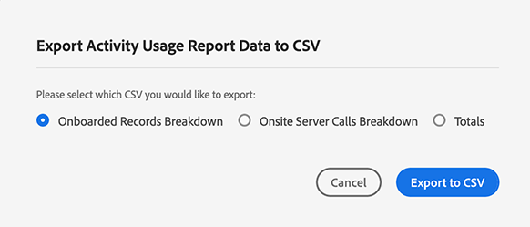

# [!UICONTROL Activity Usage Reporting] {#activity-usage-reporting}

## Visão geral {#overview}

O [!UICONTROL Activity Usage Report] ajuda a visualizar e rastrear o uso da atividade da instância do Audience Manager, fornecendo uma ideia clara de como o uso da atividade se compara ao compromisso contratual.

Além disso, você pode baixar o [!UICONTROL Activity Usage Report] sempre que precisar, para manutenção de registros e análise personalizada.

## Considerações {#considerations}

O [!UICONTROL Activity Usage Report] está disponível para todos os usuários Audience Manager com [privilégios de administrador](edit-account-settings.md).

>[!IMPORTANT]
>
>O [!UICONTROL Activity Usage Report] mostra as estatísticas de uso de atividade da sua instância do Audience Manager. Para quaisquer dúvidas de faturamento relacionadas ao uso da atividade, entre em contato com o representante da Adobe.

## Casos de uso {#use-cases}

Há dois casos de uso principais do [!UICONTROL Activity Usage Report]:

* **Rastreamento do uso real da atividade da instância em relação ao compromisso de uso da atividade**: a maioria dos clientes tem um compromisso mensal de atividade estimado por instância de Audience Manager, que é então acumulado em um compromisso anual de atividade em todas as instâncias. Embora esse relatório não seja um relatório de faturamento, ele pode fornecer orientação útil sobre se você está excedendo o uso da atividade comprometida.
* **Validação para alterações de implementação**: se você atualizou recentemente sua implementação, como configurar o encaminhamento pelo lado do servidor do [!DNL Adobe Analytics] ou alterar as configurações de chamadas do servidor do [!DNL Adobe Target], este relatório poderá ajudá-lo a verificar se o novo volume de atividade está alinhado com o volume de atividade esperado.

## Usando o [!UICONTROL Activity Usage Report] {#using}

Para ver o [!UICONTROL Activity Usage Report], faça logon na sua conta Audience Manager e vá para **[!UICONTROL Administration]** > **[!UICONTROL Usage]**.

Em seguida, use o filtro **[!UICONTROL Reporting Interval]** para selecionar o intervalo para o qual gerar o relatório. Você pode escolher entre 30, 60, 90 dias ou um intervalo de datas personalizado.

Depois que o relatório for carregado, você poderá ver um detalhamento de [!UICONTROL Activities] para o período selecionado.

[!UICONTROL Activities] defina o total agregado de todas as interações no local e fora dele com o Audience Manager, dividido nas seguintes categorias:

* **[!UICONTROL Server Calls]**: Qualquer evento de coleta ou recuperação de dados enviado ao Audience Manager de sites, servidores, email, aplicativos móveis ou outros sistemas.
* **[!UICONTROL Pixel Calls] (anteriormente conhecido como [!UICONTROL Impression Server Calls])**: dados coletados de anúncios (como volume de impressão de uma plataforma de direcionamento) ou chamadas de impressão de email feitas para o Audience Manager. Elas exigem a presença do parâmetro `d_event` na cadeia de caracteres de consulta.
* **[!UICONTROL On-Boarded Records]**: registros exclusivos assimilados de seu próprio CRM (sistema de gerenciamento de relacionamento com o cliente) ou outros arquivos de dados offline, como registros de call center, IDs de dispositivo e feeds de dados personalizados de provedores de dados externos.
* **[!UICONTROL Log File Records]**: registros exclusivos de arquivos de log assimilados em Audience Manager de uma plataforma de direcionamento.

>[!NOTE]
>
>Um registro exclusivo define cada registro individual de dados em um arquivo armazenado pelo Adobe em nome de um cliente Audience Manager.

Além disso, você pode usar os tipos de gráfico [!UICONTROL Activity Usage Trends] para alternar entre dois tipos de gráfico.

Você também pode passar o cursor sobre uma data específica na linha do tempo para ver o uso detalhado dessa data.

## Exportando [!UICONTROL Activity Usage Reports] {#export}

Para obter uma visão geral melhor do seu nível de uso de atividade de Audience Manager, você pode exportar o [!UICONTROL Activity Usage Report] com base no tipo de registros que deseja incluir.

Os relatórios **[!UICONTROL Onboarded Records Breakdown]** e **[!UICONTROL Onsite Server Calls Breakdown]** fornecem o insight mais granular dos dados de origem disponíveis para essas atividades. O volume atribuído a esses detalhamentos se baseia na sua implementação.

### [!UICONTROL Onboarded Records Breakdown] {#onboarded-breakdown}

Este relatório contém registros integrados detalhados por fonte de dados.

### [!UICONTROL Onsite Server Calls Breakdown] {#onsite-breakdown}

Este relatório contém um detalhamento das chamadas do servidor de três fontes: [!UICONTROL Analytics], [!UICONTROL Target] e [!UICONTROL Other].

* **[!UICONTROL Analytics]**: Estas são chamadas de servidor faturáveis passadas de todas as instâncias [!UICONTROL Adobe Analytics] para o Audience Manager, incluindo o encaminhamento pelo lado do servidor. Chamadas de servidor secundárias ou chamadas de servidor duplicadas (como no caso do encaminhamento pelo lado do servidor de vários conjuntos de relatórios) não são atividades faturáveis, portanto, não são incluídas neste detalhamento.
* **[!UICONTROL Target]**: Estas são chamadas do lado do servidor de [!UICONTROL Adobe Target] para Audience Manager, para recuperar dados de segmento de Audience Manager como parte de uma integração de servidor para servidor.
* **[!UICONTROL Other]**: Inclui chamadas de qualquer outro site ou sistema (sites parceiros, chamadas diretas do servidor etc.), chamadas de navegador/aplicativo móveis via [!DNL SDK], [!DNL DIL], chamadas de evento e [!DNL DCS] chamadas. Também inclui chamadas de [!DNL Target], se configuradas como uma integração de cookie (em vez de servidor para servidor).
