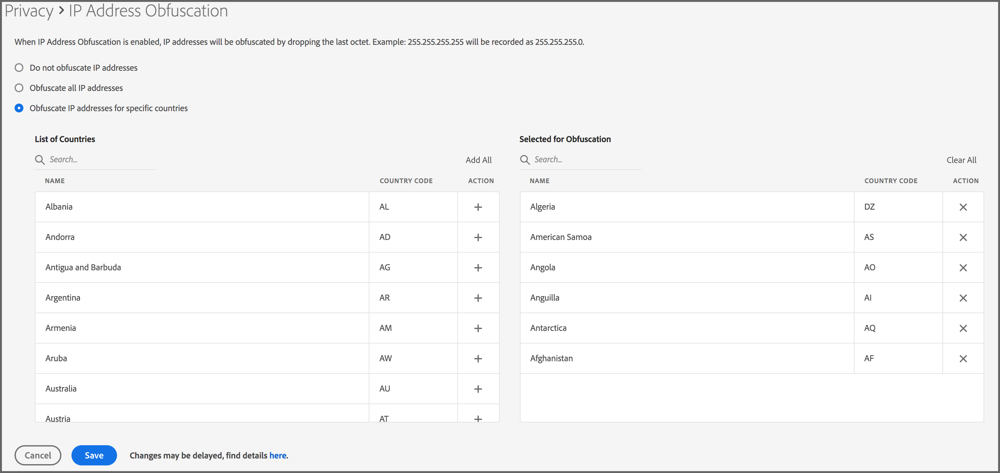

# Ofuscação de endereço IP {#ip-obfuscation}

Use esse recurso para ofuscar endereços IP coletados no Audience Manager.

## Visão geral e metodologia {#overview-and-methodology}

Sua empresa pode desejar ofuscar o endereço IP em muitos países devido aos regulamentos globais de privacidade. O Audience Manager permite ofuscar os endereços IP de visitantes em uma base global ou de país por país.

### Metodologia de ofuscação de IP

Seguindo os princípios de &quot;Privacidade por design&quot;, o Adobe Audience Manager permite que os clientes habilitem a ofuscação de IP a partir da interface do usuário, globalmente em todas as regiões geográficas ou para países específicos. Ao habilitar essa configuração, o último octeto (a última parte) do endereço IP é imediatamente descartado quando o endereço IP é assimilado na Audience Manager. O Audience Manager descarta essa parte do endereço IP antes do processamento (incluindo antes de qualquer pesquisa geográfica ou registro opcional do endereço IP). Por exemplo:

* Antes da ofuscação: `255.255.255.255`
* Após ofuscação: `255.255.255.0`

Consulte também Coleta e ofuscação de endereço IP na nossa [seção Privacidade de dados](/help/using/overview/data-security-and-privacy/data-privacy.md).

### Precedência de ofuscação de IP {#precedence}

[Ofuscação de IP em nível de sequência de dados](https://experienceleague.adobe.com/docs/experience-platform/edge/datastreams/configure.html?lang=en#create) tem prioridade sobre qualquer opção de ofuscação de IP definida no Audience Manager e é aplicada a todos os endereços IP. Qualquer pesquisa de localização geográfica feita pelo Audience Manager é afetada pela opção [!UICONTROL IP obfuscation] no nível de sequência de dados. Uma pesquisa de geolocalização no Audience Manager, com base em um IP totalmente ofuscado, resultará em uma região desconhecida e todos os segmentos baseados nos dados de geolocalização resultantes não serão realizados.

## Requisitos de ofuscação de endereço IP {#ip-obfuscation-requirements}

A ofuscação de endereço IP está disponível somente para contas de administrador do Audience Manager. Consulte [Criar Usuários](/help/using/features/administration/administration-overview.md#create-users) para entender como atribuir privilégios de administrador a um usuário.

>[!NOTE]
>
> Devido ao grande volume de dados processados pelo Audience Manager, as alterações de ofuscação de IP podem levar até 4 horas para entrarem em vigor, a partir do momento em que você atualizar as configurações.

## Configurar ofuscação de endereço IP {#configure-ip-obfuscation}

Siga as etapas abaixo para configurar a ofuscação do endereço IP.

1. Faça logon no Audience Manager com uma conta de administrador e vá para **Administração > Privacidade**.
2. Escolha o tipo de ofuscação de IP que deseja usar.
   1. **Ofuscar todos os endereços IP:** selecione esta opção para que o Audience Manager ofusque o último octeto de todos os endereços IP de visitantes, independentemente da região de onde eles são originários.
   2. **Ofuscar endereços IP de países específicos:** selecione esta opção para que o Audience Manager ofusque o último octeto de endereços IP de visitantes de países específicos. Use o campo **Lista de Países** ou o campo **Pesquisa** correspondente para localizar os países para os quais habilitar a ofuscação de IP e clique no ícone + para adicioná-los à lista **Selecionados para Ofuscação**. Depois de adicionar todos os países necessários à lista **Selecionado para ofuscação**, clique em **Salvar**.

## Desativar ofuscação de endereço IP {#disable-ip-obfuscation}

Para desabilitar a ofuscação de endereço IP globalmente, vá para **Administração > Privacidade**, selecione **Não ofuscar endereços IP** e clique em **Salvar**.

Para desabilitar a ofuscação de endereço IP para países específicos, localize os países na lista **Selecionado para ofuscação** e clique no ícone **X** correspondente. Clique em **Salvar** quando terminar.

## Conceitos relacionados {#related-concepts}

* [Privacidade de dados](/help/using/overview/data-security-and-privacy/data-privacy.md)
* Demonstração do vídeo de ofuscação do endereço IP

>[!VIDEO](https://video.tv.adobe.com/v/27218/)
