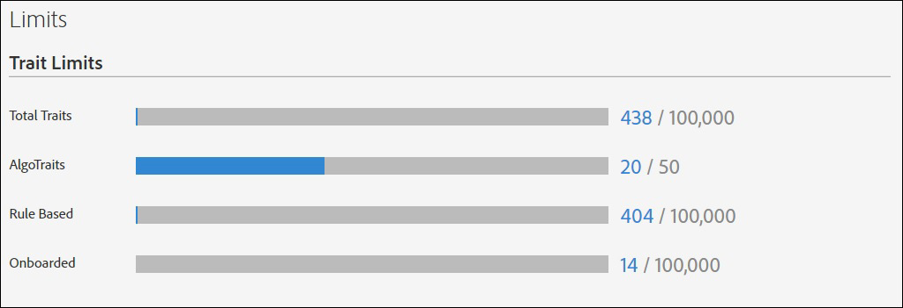

# Limites de uso {#usage-limits}

O Audience Manager define um limite máximo no número de características, segmentos, destinos e modelos algorítmicos que você pode criar para uma conta. Os limites se aplicam a esses itens, sejam eles criados na interface do usuário ou programaticamente através dos métodos [!DNL API]. Os limites de uso ajudam a proteger o Audience Manager de processos automatizados que podem tentar comprometer nosso [!DNL API]s ou a interface do usuário.

## Limites de mapeamento de ID {#id-mapping-limits}

A tabela abaixo lista os limites de [mapeamento de ID](../../integration/sending-audience-data/batch-data-transfer-explained/id-sync-http.md) para IDs de dispositivo. Quando uma ID atinge qualquer um dos limites abaixo, o Audience Manager adiciona novos mapeamentos de ID com base em uma lógica FIFO (primeiro a entrar, primeiro a sair), removendo o mapeamento de ID armazenado mais antigo e adicionando o novo. Consulte o [Índice de IDs](../../reference/ids-in-aam.md) no Audience Manager para obter detalhes sobre as IDs com suporte no Audience Manager.

| Mapeamento de ID | Limite máximo |
|-----------|-------------- |
| ID do Advertising do Dispositivo ([DAID](../../reference/ids-in-aam.md)) para ID entre dispositivos ([DPUUID](../../reference/ids-in-aam.md)) | 100 IDs do Device Advertising ([DAID](../../reference/ids-in-aam.md)) para 1 ID entre dispositivos ([DPUUID](../../reference/ids-in-aam.md)) |
| ID entre dispositivos ([DPUUID](../../reference/ids-in-aam.md)) para ID do Advertising do Dispositivo ([DAID](../../reference/ids-in-aam.md)) | 10 IDs entre dispositivos ([DPUUID](../../reference/ids-in-aam.md)) para 1 ID de Advertising de Dispositivo ([DAID](../../reference/ids-in-aam.md)), a cada [DPID](../../reference/ids-in-aam.md) |
| ID de cookie/navegador para cookie/ID do navegador | 1000 IDs de cookie/navegador para 1 ID de cookie/navegador |

## Limites de Item {#item-limits}

As tabelas listam os limites atuais por tipo de item. Não é possível criar novas características, segmentos, destinos ou [!UICONTROL Algorithmic Models] se você atingir um limite específico para um desses itens. Se você atingir um limite, exclua um item mais antigo antes de criar um novo.

### Limites de características

| Tipo de característica | Limite máximo |
| -------------------------- | ------------------------------------- |
| Características totais | 100.000 |
| Total de qualificações de características | 150 mil. Para obter mais informações sobre qualificação de característica, consulte Limite de qualificação de característica na [Referência de qualificações de característica](/help/using/features/traits/trait-and-segment-qualification-reference.md#trait-qualification-limit). |
| Algorítmico | 50 |
| Baseado em regras | 100.000 |
| Integrado | 100.000 |
| Características de pasta | 2.000 |

### Limites de segmento

| Tipo de segmento | Limite máximo |
| -------------- | ------------- |
| Total de segmentos | 20.000 |

### Limites de destino

| Tipo de destino | Limite máximo |
| ------------------ | ------------- |
| Total de destinos | 1.000 |
| Cookie | 1.000 |
| URL | 1.000 |
| S2S | 100 |
| Adobe Analytics | 10 |

### Limites do modelo algorítmico

| Item | Limite máximo |
| -------- | ----- |
| Ativo [!UICONTROL Look-Alike Models] | &#x200B;20. O Audience Manager só conta modelos algorítmicos *ativos* em relação ao limite. |
| [!UICONTROL Look-Alike Models] tamanho máximo do público | 25 milhões.  Observe que esse limite não pode ser aumentado. Você pode diminuir o tamanho dos públicos selecionando menos fontes de dados para o modelo ou uma janela de retrospectiva mais curta. |
| Número máximo de características excluídas para um [!UICONTROL Look-Alike Model] | &#x200B;500. Consulte [Exclusão de característica em modelagem algorítmica](/help/using/features/algorithmic-models/trait-exclusion-algo-models.md). |
| Máximo [!UICONTROL Predictive Audiences Models] | 10 |
| Número máximo de perfis da linha de base para [!UICONTROL Predictive Audiences Models] | 50 |

### Limites de pasta

| Item | Limite máximo |
| ------------- | ------------------ |
| Pastas de características | 2 mil.  A estrutura de pastas pode ter no máximo 5 níveis de profundidade. |

### Limites de sinais derivados

| Item | Limite máximo |
| --------------- | ------------- |
| Sinais derivados | 50 mil. |

### Limite de contas de usuário da empresa

| Item | Limite máximo |
| ----------- | ------------- |
| Número máximo de contas de usuário para uma empresa | Mil. |

## Monitorar uso {#monitor-usage}

Você pode ver o uso e os limites da sua conta acessando **[!UICONTROL Administration > Limits]**. O acesso exige permissões de administrador.

## Aumentar Limites de Itens {#increase-item-limits}

Os limites padrão listados aqui devem fornecer capacidade suficiente para suas necessidades comerciais. Se sua organização atingir esses limites de forma consistente, entre em contato com o representante de conta para saber sobre um aumento.
