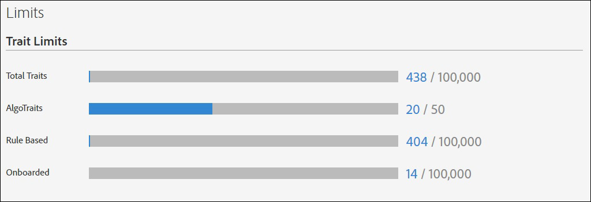

# Limites de uso {#usage-limits}

O Audience Manager define um limite máximo para o número de características, segmentos, destinos e modelos algorítmicos que você pode criar para uma conta. Os limites se aplicam a esses itens, sejam eles criados na interface do usuário ou por meio de métodos [!DNL API] programaticamente. Os limites de uso ajudam a proteger o Audience Manager de processos automatizados que podem tentar comprometer nossa [!DNL API]s ou interface do usuário.

## Limites de mapeamento de ID {#id-mapping-limits}

A tabela abaixo lista os limites [ID mapping](../../integration/sending-audience-data/batch-data-transfer-explained/id-sync-http.md) para IDs de dispositivo. Quando uma ID atinge qualquer um dos limites abaixo, o Audience Manager adiciona novos mapeamentos de ID com base em uma lógica FIFO (primeiro a entrar, primeiro a sair), removendo o mapeamento de ID armazenado mais antigo e adicionando o novo. Consulte [Índice de IDs](../../reference/ids-in-aam.md) no Audience Manager para obter detalhes sobre as IDs suportadas pelo Audience Manager.

| Mapeamento de ID | Limite máximo |
|-----------|-------------- |
| ID de publicidade do dispositivo ([DAID](../../reference/ids-in-aam.md)) para ID entre dispositivos ([DPUUID](../../reference/ids-in-aam.md)) | 100 IDs de publicidade de dispositivo ([DAID](../../reference/ids-in-aam.md)) para 1 ID entre dispositivos ([DPUUID](../../reference/ids-in-aam.md)) |
| ID entre dispositivos ([DPUUID](../../reference/ids-in-aam.md)) para ID de publicidade do dispositivo ([DAID](../../reference/ids-in-aam.md)) | 10 IDs entre dispositivos ([DPUUID](../../reference/ids-in-aam.md)) para 1 ID de anúncio do dispositivo ([DAID](../../reference/ids-in-aam.md)), de acordo com cada [DPID](../../reference/ids-in-aam.md) |
| ID do cookie/navegador para cookie/ID do navegador | IDs de cookie/navegador 1000 para 1 cookie/ID de navegador |

## Limites de item {#item-limits}

As tabelas listam os limites atuais por tipo de item. Não é possível criar novas características, segmentos, destinos ou [!UICONTROL Algorithmic Models] se você atingir um limite específico para um desses itens. Se você atingir um limite, deverá excluir um item mais antigo antes de criar um novo.

### Limites da característica

| Tipo de característica | Limite máximo |
| -------------------------- | ------------------------------------- |
| Total de características | 100.000 |
| Total de qualificações de característica | 150.000. Para obter mais informações sobre qualificação de característica, consulte Limite de qualificação de característica em [Referência de qualificações de característica](/help/using/features/traits/trait-and-segment-qualification-reference.md#trait-qualification-limit). |
| Algorítmico | 50 |
| Baseado em regras | 100.000 |
| Integrado | 100.000 |
| Características da pasta | 2.000 |

### Limites do segmento

| Tipo de segmento | Limite máximo |
| -------------- | ------------- |
| Total de segmentos | 20.000 |

### Limites de destino

| Tipo de destino | Limite máximo |
| ------------------ | ------------- |
| Destinos totais | 1.000 |
| Cookie | 1.000 |
| URL | 1.000 |
| S2S | 100 |
| Adobe Analytics | 10 |

### Limites de modelo algorítmico

| Item | Limite máximo |
| -------- | ----- |
| Ativo [!UICONTROL Look-Alike Models] | 20. O Audience Manager só conta os modelos algorítmicos *ativos* em relação ao limite. |
| [!UICONTROL Look-Alike Models] tamanho máximo do público-alvo | 25.000.000.  Observe que esse limite não pode ser aumentado. Você pode diminuir os tamanhos do público-alvo selecionando menos fontes de dados para o modelo ou selecionando uma janela de retrospectiva mais curta. |
| Número máximo de características excluídas para um [!UICONTROL Look-Alike Model] | 500. Consulte [Exclusão de característica na Modelagem algorítmica](/help/using/features/algorithmic-models/trait-exclusion-algo-models.md). |
| Máximo [!UICONTROL Predictive Audiences Models] | 10º |
| Número máximo de personas de linha de base para [!UICONTROL Predictive Audiences Models] | 50º |

### Limites da pasta

| Item | Limite máximo |
| ------------- | ------------------ |
| Pastas de características | 2.000.  Sua estrutura de pastas pode ter no máximo 5 níveis de profundidade. |

### Limites de sinais derivados

| Item | Limite máximo |
| --------------- | ------------- |
| Sinais derivados | 50.000. |

### Limite de contas de usuário da empresa

| Item | Limite máximo |
| ----------- | ------------- |
| Número máximo de contas de usuário para uma empresa | 1.000. |

## Uso do monitor {#monitor-usage}

Você pode ver o uso e os limites da sua conta acessando **[!UICONTROL Administration > Limits]**. O Access requer permissões de administrador.

## Aumentar limites de item {#increase-item-limits}

Os limites padrão listados aqui devem fornecer capacidade suficiente para as necessidades de sua empresa. Se sua organização atingir esses limites de maneira consistente, entre em contato com seu representante de conta para discutir um aumento.