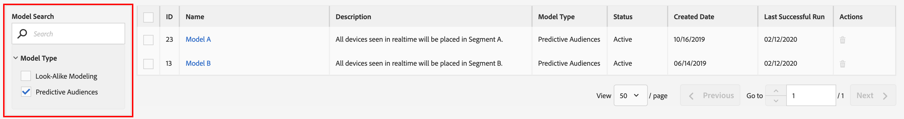
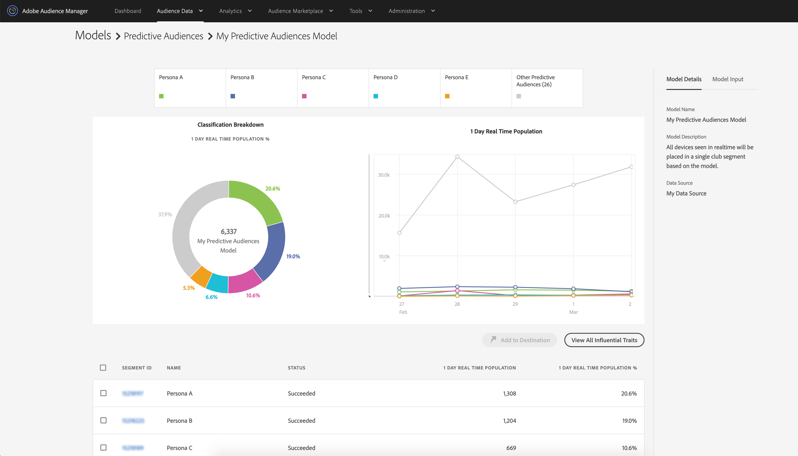
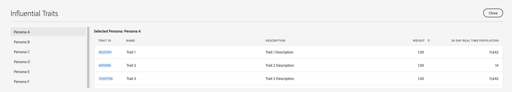

# Relatórios dos públicos preditivos

Depois de salvar um modelo [!UICONTROL Predictive Audiences], os start do Audience Manager treinam-no. Dentro de algumas horas, o modelo calculado será start analisando audiências nos [Servidores de Coleta de Dados](https://docs.adobe.com/content/help/en/audience-manager/user-guide/reference/system-components/components-data-collection.html#dcs-pcs). O relatórios estará disponível no dia seguinte.

Para ver os resultados de sua classificação [!UICONTROL Predictive Audiences], vá para **[!UICONTROL Audience Data]** > **[!UICONTROL Models]** e clique em seu modelo na lista.

Use as opções de filtragem no lado esquerdo para procurar o nome do modelo ou filtrar os resultados com base no tipo de modelo.

A tabela de modelos mostra as seguintes informações:

* **[!UICONTROL ID]**: a ID do modelo identifica exclusivamente cada modelo na sua conta do Audience Manager;
* **[!UICONTROL Name]**: o nome fornecido na etapa de criação do modelo;
* **[!UICONTROL Description]**: a descrição fornecida na etapa de criação do modelo;
* **[!UICONTROL Model Type]**: O tipo de cada modelo ([!UICONTROL Look-Alike Modeling] ou  [!UICONTROL Predictive Audiences]);
* **[!UICONTROL Status]**: o status de cada modelo:
   * **[!UICONTROL Pending]**: o modelo está a ser inicializado e irá produzir resultados em breve em start;
   * **[!UICONTROL Active]**: o modelo está sendo executado com êxito e produzindo resultados;
   * **[!UICONTROL Warning]**: o modelo não produziu resultados devido a dados insuficientes (ou seja, população de linhas de base baixa, perfis de utilizador não são ricos);
   * **[!UICONTROL Error]**: falha ao executar o modelo. Você deve entrar em contato com seu representante de Adobe.

## Relatório de visão geral do modelo{#model-report}

Após escolher um modelo, sua página de relatórios será carregada. Na parte superior da página, você pode ver os 5 maiores segmentos preditivos, com base em 1 dia de realização em tempo real, pelos quais o modelo classificou sua audiência de público alvo. A categoria **[!UICONTROL Other]** inclui o restante das personas, que não foram incluídas nos 5 maiores segmentos preditivos.

O Audience Manager exibe um gráfico de rosca codificado por cores e um gráfico de linha do tempo para seu [!UICONTROL Predictive Audiences].

Clicar nas guias de personas na parte superior da página as adiciona ou remove do gráfico e do gráfico.

O gráfico de rosca mostra um detalhamento personalizado de sua audiência de públicos alvos, enquanto o gráfico mostra a tendência de população em tempo real de 1 dia dos segmentos preditivos nos últimos 6 dias.

Se o status do modelo for [!UICONTROL Pending], [!UICONTROL Warning] ou [!UICONTROL Error], o status do modelo será exibido em vez dos gráficos.

A tabela do relatório mostra as seguintes informações para cada segmento [!UICONTROL Predictive Audiences].

1. **[!UICONTROL SEGMENT ID]**: a ID de segmento do segmento criado automaticamente associado a cada pessoa;
1. **[!UICONTROL NAME]**: o nome da pessoa;
1. **[!UICONTROL STATUS]**: o status do  [!UICONTROL Predictive Audiences] segmento:
   * **[!UICONTROL Succeeded]**: os usuários estão sendo classificados neste segmento;
   * **[!UICONTROL Pending]**: o segmento ainda está sendo inicializado;
   * **[!UICONTROL Insufficient Training Data]**: os usuários não estão sendo classificados neste segmento devido a dados insuficientes. A população basal total é muito baixa e não fornece dados suficientes para aprender.
1. **[!UICONTROL 1 DAY REAL TIME POPULATION]**: O número de realizações de segmento para cada persona, nas últimas 24 horas.
1. **[!UICONTROL 1 DAY REAL TIME POPULATION %]**: A porcentagem de realizações de segmentos para cada persona, nas últimas 24 horas, da população total do modelo.

## Características influentes{#influential-traits}

[!UICONTROL Influential Traits] são características que o  [!UICONTROL Predictive Audiences] algoritmo descobriu ser os mais fortes indicadores para determinar a classificação persona de um visitante.

O sinal indica se a presença da característica aumenta (+) ou diminui(-) a probabilidade do usuário pertencer à persona selecionada.

Para visualização dos traços influentes de todas as suas personas, clique em [!UICONTROL View All Influential Traits].

A janela [!UICONTROL Influential Traits] mostra as seguintes informações, para cada persona do modelo selecionado:

1. **[!UICONTROL TRAIT ID]**: a ID de característica de cada característica influente para a pessoa selecionada;
1. **[!UICONTROL NAME]**: O nome de cada característica influente da pessoa selecionada;
1. **[!UICONTROL DESCRIPTION]**: a descrição de cada característica influente da pessoa selecionada;
1. **[!UICONTROL WEIGHT]**: o peso de cada característica influente para a persona selecionada. [!UICONTROL Influential Traits] são classificadas por padrão por peso, em ordem decrescente.  O valor dos pesos indica seu poder preditivo. O sinal indica se a presença do traço aumenta (+) ou diminui(-) a probabilidade de pertencer a uma persona.
1. **[!UICONTROL 30 DAY REAL TIME POPULATION]**: o número de realizações de características únicas para cada característica influente para a pessoa selecionada, nos últimos 30 dias.
