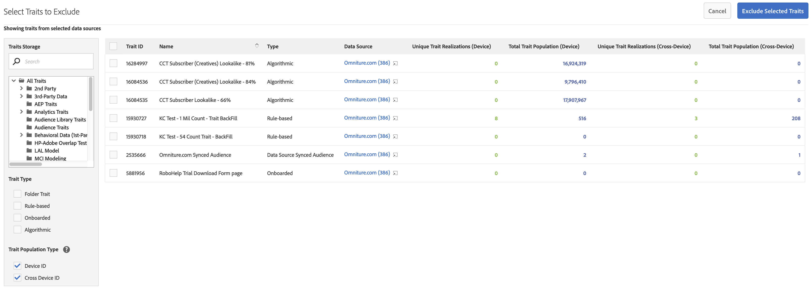

# Modelagem semelhante: Exclusão de característica {#algorithmic-models-trait-exclusion}

O [!UICONTROL Trait Exclusion] fornece controles adicionais no fluxo de trabalho de modelagem, permitindo adicionar os painéis de proteção necessários ao modelo, com base na experiência do seu domínio e nos requisitos regulatórios. Use a opção [!UICONTROL Exclusions] para selecionar quais características ignorar ao criar modelos de uma ou mais fontes de dados.

## Casos de uso {#use-cases}

Estes são alguns casos de uso que você pode resolver com o [!UICONTROL Trait Exclusion]:

* O [!UICONTROL Trait Exclusion] permite que você exclua certas características &quot;pega-tudo&quot;, como características de visitante do site, para que você não vicie o modelo, resultando em resultados simples.
* Você pode remover características desconhecidas ou desconhecidas de uma fonte de dados para entender melhor as características influentes.
* Você pode excluir certas características, como características demográficas, para ajudar com as obrigações de conformidade que possa ter.

>[!IMPORTANT]
>
>Uma observação importante sobre o terceiro caso de uso. Se o provedor de dados de terceiros adicionar uma nova característica demográfica ao feed de dados *depois que você criou o modelo*, a característica será automaticamente selecionada pelo modelo. Não é possível excluir características da modelagem após a criação do modelo. Consulte [Limitações e aspectos importantes](../../features/algorithmic-models/trait-exclusion-algo-models.md#important-aspects-and-limitations). Tenha cuidado ao usar este recurso e trabalhe com o provedor de dados para garantir que você seja informado de qualquer alteração na estrutura do feed.

## Como usar exclusões de características {#how-to-use}

Use o fluxo de trabalho [Criar um modelo](../../features/algorithmic-models/create-model.md#build-model) para criar novos modelos algorítmicos.

1. A seleção [!UICONTROL Exclusions] fica esmaecida até que você selecione uma ou mais fontes de dados para modelagem.
2. Depois de selecionar uma ou mais fontes de dados para modelagem, pressione **[!UICONTROL Browse All Traits]**.
3. Na janela **[!UICONTROL Select Traits to Exclude]**, é possível ver todas as características associadas às fontes de dados selecionadas anteriormente. Selecione as características que deseja excluir.
4. Você pode filtrar as características por tipo de característica, tipo de população de característica ([ID de Dispositivo](../../reference/ids-in-aam.md) e [ID entre Dispositivos](../../reference/ids-in-aam.md)) ou pode procurar as pastas de características. Observe que as pastas de características exibem apenas as características associadas às fontes de dados selecionadas.
5. Pressione **[!UICONTROL Exclude Selected Traits]**.

>[!TIP]
>
>Você pode excluir pastas inteiras excluindo a característica da pasta em vez de excluir as características na pasta, uma por uma. Por exemplo, em uma pasta com 20 características, você só precisaria excluir a característica da pasta, em vez de excluir todas as características uma por uma.

Se preferir tutoriais em vídeo, assista à demonstração em vídeo da Exclusão de características:

>[!VIDEO](https://video.tv.adobe.com/v/25569/?quality=12)

Além disso, assista ao vídeo abaixo para obter uma visão detalhada de como as métricas entre dispositivos funcionam.

>[!VIDEO](https://video.tv.adobe.com/v/33445/?quality=12)

## Aspectos importantes e limitações {#important-aspects-and-limitations}

Anote os seguintes aspectos e limitações relacionados a [!UICONTROL Trait Exclusion]:

<table id="table_BA5C3545BC9E4717BD567B00C803AA53"> 
 <thead> 
  <tr> 
   <th colname="col1" class="entry"> Item </th> 
   <th colname="col2" class="entry"> Descrição </th>
  </tr> 
 </thead>
 <tbody> 
  <tr> 
   <td colname="col1"> 
Características excluídas na exibição de resumo dos modelos 
 </td>
   <td colname="col2"> 
As características excluídas <i>não aparecem</i> na exibição de Resumo de Modelos. Você pode ver as características excluídas somente no fluxo de trabalho <b> Editar Modelo</b>. 
 </td>
  </tr> 
  <tr> 
   <td colname="col1"> 
Controles de acesso com base em função (RBAC) 
 </td>
   <td colname="col2"> 
Observe as seguintes limitações para empresas que usam o <a href="../../features/administration/administration-overview.md#administration"> RBAC</a>: 
 

     <ul id="ul_38A4056C235B428C822EA4A353893786"> 
      <li id="li_2624FB35581F4807B8530910D63FFDBF">Se você não tiver acesso para exibir uma característica, <i>não poderá</i> selecionar essa característica para ser excluída do modelo. </li>
      <li id="li_3FD7A12AAAA8462EA84A760C05F20379">Se você não tiver acesso para exibir uma característica, <i>não poderá</i> exibi-la na lista de características excluídas. </li>
     </ul> 
 </td>
  </tr> 
  <tr> 
   <td colname="col1"> 
Modificar características excluídas após salvar o modelo 
 </td>
   <td colname="col2"> 
Não é possível modificar as características excluídas após criar e salvar um modelo. Se quiser ajustar os resultados, você pode clonar o modelo e alterar as características excluídas. 
 </td>
  </tr> 
  <tr> 
   <td colname="col1"> 
Número máximo de características que você pode excluir 
 </td>
   <td colname="col2"> 
O número máximo de características que você pode excluir de um modelo é 500. Use as características da pasta para maximizar suas exclusões. 
 </td>
  </tr> 
  <tr> 
   <td colname="col1"> 
Excluir característica da linha de base 
 </td>
   <td colname="col2"> 
A característica da linha de base é excluída por padrão, portanto, não aparece na lista <b> Exclusões</b> ao criar o modelo. 
 </td>
  </tr>
 </tbody>
</table>

Assista ao vídeo abaixo para saber como e por que excluir características específicas de um [!UICONTROL Look-Alike Model].

>[!VIDEO](https://video.tv.adobe.com/v/25569/)

## Links relacionados

* [Sobre características algorítmicas](/help/using/features/algorithmic-models/understanding-models.md)
* [Exclusão de características - Tutorial](https://helpx.adobe.com/audience-manager/kt/using/excluding-traits-look-alike-model-feature-video-use.html)
