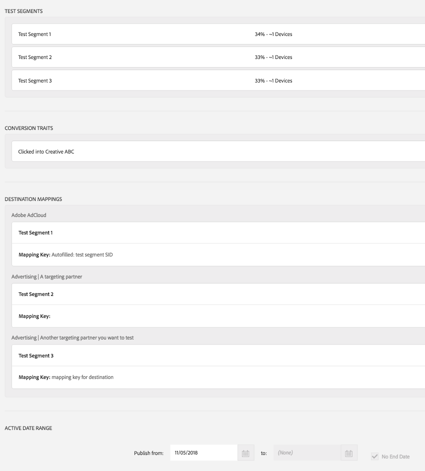
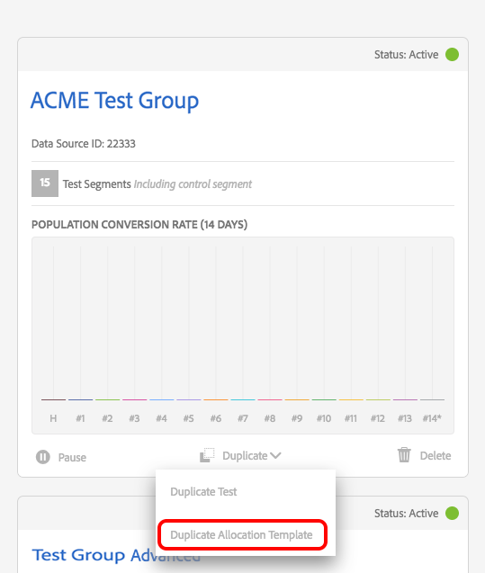
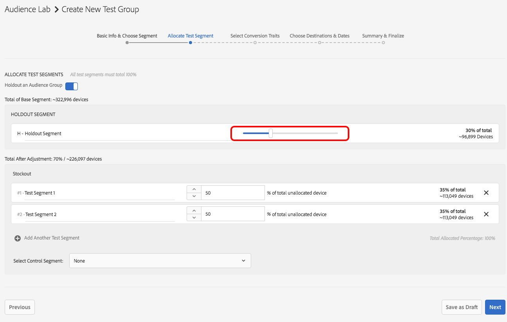

# Recursos avançados do [!DNL Audience Lab] {#audience-lab-advanced-functionality}

Este artigo descreve dois recursos que fornecem funcionalidade avançada para [!DNL Audience Lab]: [!DNL Duplicate Allocation Template] e [!DNL Segment Holdout].

## Modelo de Alocação Duplicado {#duplicate-allocation-template}

<!-- 

The <b>Allocation Template</b> represents how you split a test group into test segments and the way the test segments are mapped to destinations. 

 -->

Em [!DNL Audience Lab], o [!DNL Allocation Template] representa as várias seleções feitas ao criar um grupo de teste:

* A distribuição de dispositivos entre segmentos de ensaio;
* Mapeamento de segmentos de teste para destinos;
* As características de conversão que você usa para um grupo de teste;
* O intervalo de datas no qual o grupo de teste publica nos destinos selecionados.

Ao duplicar um template de alocação, você pode reutilizar a mesma distribuição de segmentos de teste e destinos para um segmento base diferente, em um novo grupo de teste. Um exemplo de modelo de alocação é ilustrado abaixo. A imagem foi retirada da etapa [!UICONTROL Summary & Finalize] do fluxo de trabalho **Criar Grupo de Teste**.

<!--
With the option to duplicate allocation templates, you can increase your productivity when running multivariate tests as part of multivariate campaigns.
-->

### Usando Modelo de Alocação Duplicado

Crie um grupo de teste inicial e selecione **[!UICONTROL Duplicate Allocation Template]** para reutilizar as mesmas configurações em vários grupos de teste. Por exemplo, você pode usar esse recurso se estiver executando um teste em que deseja determinar a eficácia de vários destinos para vários segmentos.

1. Na visualização principal do Audience Lab, pesquise pelo grupo de teste cujo modelo de alocação você deseja reproduzir em um novo grupo de teste. Na caixa suspensa, selecione **[!UICONTROL Duplicate Allocation Template]**.

   

2. No assistente [!UICONTROL Create Test Group], você pode especificar um segmento base e renomear seus segmentos de teste, se desejar.
3. Você *não pode* modificar:

   * A distribuição de dispositivos entre segmentos de ensaio;
   * As características de conversão;
   * O mapeamento de segmentos de teste para destinos. Você só pode preencher a chave de mapeamento, para os destinos que exigem uma.
   * O intervalo de datas no qual seu grupo de teste publicará nos destinos selecionados.

4. Revise as informações adicionadas nas etapas anteriores e selecione **[!UICONTROL Finalize Group]**.

## Retenção de segmento de teste {#test-segment-holdout}

>[!NOTE]
>
>[!UICONTROL Test Segment Holdout] é uma funcionalidade avançada, ativada mediante solicitação do cliente. Contate [!DNL Customer Care] ou [!DNL Adobe Consulting] para ativar este recurso.

Use esse recurso para impedir que parte do público-alvo seja incluído no teste. A porcentagem selecionada é deixada de fora do teste. Dessa forma, você pode medir e comparar o número de conversões de públicos-alvo direcionados (ativados em destinos) e não direcionados (grupo de controle).

<!--

Note that this option is different to the control segment because it subtracts the percentage ................. You can withhold an audience group and still use a control segment. 

-->

### Usar Retenção de Segmento de Teste

1. Crie um novo grupo de teste usando o assistente [!UICONTROL Create Test Group].
1. Na etapa **[!UICONTROL Allocate Test Segment]**, você pode selecionar uma parte do público-alvo que não poderá ser testado.

   

1. Use o controle deslizante para ajustar quantos dispositivos você deseja manter para fora do teste. Observe como o Segmento de teste 1 e o Segmento de teste 2 agora representam apenas 70% do total de dispositivos.

   

1. Percorra o restante das etapas no fluxo de trabalho **[!UICONTROL Create Test Group]** e selecione **[!UICONTROL Finalize Group]** quando estiver satisfeito com sua seleção. Agora você tem um grupo de teste com parte do público-alvo impedido de testar.
