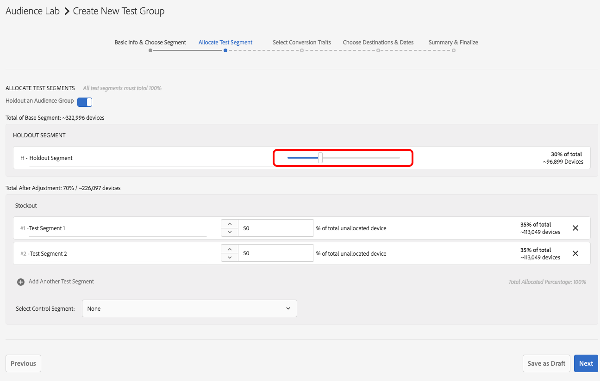

# [!DNL Audience Lab] Funcionalidade avançada  {#audience-lab-advanced-functionality}

Este artigo descreve dois recursos que fornecem funcionalidade avançada para [!DNL Audience Lab]: [!DNL Duplicate Allocation Template] e [!DNL Segment Holdout].

## Modelo de Alocação de duplicado {#duplicate-allocation-template}

<!-- 

The <b>Allocation Template</b> represents how you split a test group into test segments and the way the test segments are mapped to destinations. 

 -->

Em [!DNL Audience Lab], [!DNL Allocation Template] representa as várias seleções feitas ao criar um grupo de teste:

* A distribuição dos dispositivos entre os segmentos de ensaio;
* O mapeamento dos segmentos de ensaio para os destinos;
* As características de conversão usadas para um grupo de teste;
* O intervalo de datas no qual o grupo de teste publica para os destinos selecionados.

Ao duplicar um modelo de alocação, você pode reutilizar a mesma distribuição de segmentos de teste e destinos para um segmento base diferente, em um novo grupo de teste. Um exemplo de um modelo de alocação está ilustrado abaixo. A imagem é tirada da etapa [!UICONTROL Summary & Finalize] no fluxo de trabalho **Criar grupo de teste**.

<!--
With the option to duplicate allocation templates, you can increase your productivity when running multivariate tests as part of multivariate campaigns.
-->

### Uso do modelo de alocação de Duplicados

Crie um grupo de teste inicial e selecione **[!UICONTROL Duplicate Allocation Template]** para reutilizar as mesmas configurações em vários grupos de teste. Por exemplo, você pode usar esse recurso se estiver executando um teste onde deseja determinar a eficácia de vários destinos para vários segmentos.

1. Na visualização principal do Laboratório de Audiências, procure o grupo de teste cujo modelo de alocação você deseja reproduzir em um novo grupo de teste. Na caixa suspensa, selecione **[!UICONTROL Duplicate Allocation Template]**.

   

2. No assistente [!UICONTROL Create Test Group], você pode especificar um segmento base e renomear seus segmentos de teste, se desejar.
3. Você *não pode* modificar:

   * A distribuição dos dispositivos entre os segmentos de ensaio;
   * O(s) traço(s) de conversão;
   * O mapeamento de segmentos de teste para destinos. Você só pode preencher a chave de mapeamento para os destinos que exigem uma.
   * O intervalo de datas no qual seu grupo de teste será publicado nos destinos selecionados.

4. Revise as informações adicionadas nas etapas anteriores e selecione **[!UICONTROL Finalize Group]**.

## Testar Retenção do Segmento {#test-segment-holdout}

>[!NOTE]
>
>[!UICONTROL Test Segment Holdout] é uma funcionalidade avançada, ativada por solicitação do cliente. Entre em contato com [!DNL Customer Care] ou [!DNL Adobe Consulting] para ativar este recurso.

Use esse recurso para impedir que parte da audiência seja incluída no teste. A porcentagem selecionada fica fora do teste. Dessa forma, você pode medir e comparar o número de conversões de audiências direcionadas (ativadas em destinos) e não direcionadas (grupo de espera).

<!--

Note that this option is different to the control segment because it subtracts the percentage ................. You can withhold an audience group and still use a control segment. 

-->

### Uso da Retenção de Segmento de Teste

1. Crie um novo grupo de teste usando o assistente [!UICONTROL Create Test Group].
1. Na etapa **[!UICONTROL Allocate Test Segment]**, é possível selecionar uma parte da audiência que será omitida nos testes.

   

1. Use o controle deslizante para ajustar quantos dispositivos você deseja excluir do teste. Observe como o segmento de teste 1 e o segmento de teste 2 agora somente atingem 70% do total de dispositivos.

   

1. Siga as etapas restantes no fluxo de trabalho **[!UICONTROL Create Test Group]** e selecione **[!UICONTROL Finalize Group]** quando estiver satisfeito com sua seleção. Agora você tem um grupo de teste com parte da audiência retida dos testes.
