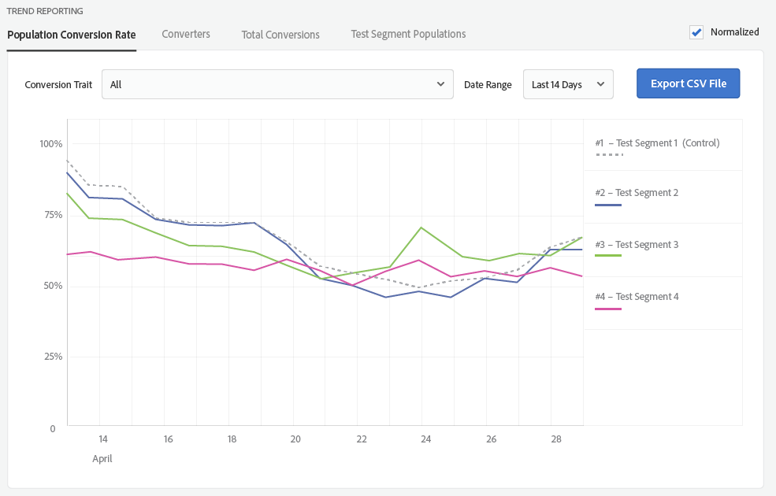

# Relatórios do grupo de teste {#test-group-reporting}

A seção de relatório do grupo de teste retorna informações sobre as conversões do grupo de teste, permitindo uma fácil comparação da eficácia do segmento de teste. Vários filtros e dimensões estão disponíveis para visualização de dados.

[!UICONTROL Audience Lab] retorna informações detalhadas de relatórios para os segmentos de teste criados e permite salvar os dados de relatório como  [!DNL CSV] arquivos. Você pode selecionar entre **[!UICONTROL Aggregate Reporting]** e **[!UICONTROL Trend Reporting]**.

**[!UICONTROL Aggregate Reporting]** retorna os números absolutos dos segmentos de teste. **[!UICONTROL Trend Reporting]** retorna um gráfico da tendência  *em um período* específico. Quatro guias permitem personalizar os relatórios:

<table id="table_446384AE9A36408A9C570CB7DB72C3D6"> 
 <thead> 
  <tr> 
   <th colname="col1" class="entry"> Parâmetro </th> 
   <th colname="col2" class="entry"> Descrição </th> 
  </tr> 
 </thead>
 <tbody> 
  <tr> 
   <td colname="col1"> 
 <b> Taxa de conversão de população</b> 
 </td> 
   <td colname="col2"> 
Retorna a porcentagem de dispositivos pertencentes a um segmento de teste específico, que foram convertidos. 
 </td> 
  </tr> 
  <tr> 
   <td colname="col1"> 
 <b> Conversores</b> 
 </td> 
   <td colname="col2"> 
Retorna o número de dispositivos que exibiram as características de conversão selecionadas nos grupos de teste. <a href="https://helpx.adobe.com/audience-manager/kt/using/creating-conversion-traits-feature-video-use.html" format="https" scope="external"> Assista a este </a> vídeo para saber como criar características de conversão. 
 </td> 
  </tr> 
  <tr> 
   <td colname="col1"> 
 <b> Total de conversões</b> 
 </td> 
   <td colname="col2"> 
Retorna o número de conversões geradas pelos segmentos de teste. 
 </td> 
  </tr> 
  <tr> 
   <td colname="col1"> 
 <b> Testar populações de segmentos</b> 
 </td> 
   <td colname="col2"> 
Retorna o número de dispositivos pertencentes aos segmentos de teste. Alternar entre <b> População total</b> ou <b> População em tempo real</b>. A diferença é explicada nas <a href="../../faq/faq-reporting.md"> Perguntas frequentes sobre relatórios</a> . 
 </td>
  </tr>
 </tbody>
</table>

Você pode selecionar uma característica de conversão específica para a qual gerar o relatório ou pode selecionar todas as características combinadas. Você pode definir um intervalo de datas no qual as informações devem ser retornadas e exportar o relatório como um arquivo [!DNL CSV].

>[!NOTE]
>
>* Os relatórios de um grupo de teste serão preenchidos no dia seguinte à data de início.
>* Uma conversão é contabilizada somente para um dispositivo após a data de início de um teste e após o dispositivo ter sido adicionado a um segmento de teste. Se uma conversão ocorrer para esse dispositivo antes que ele seja atribuído a um grupo de teste, a conversão não será contada.

Um gráfico **[!UICONTROL Aggregate Reporting]** retornado pode ter esta aparência:

Um gráfico **[!UICONTROL Trend Reporting]** retornado pode ser semelhante ao abaixo. Marque **[!UICONTROL Normalized]** na caixa de seleção se desejar ignorar os números absolutos e simplesmente se concentrar nas tendências dos segmentos de teste.

