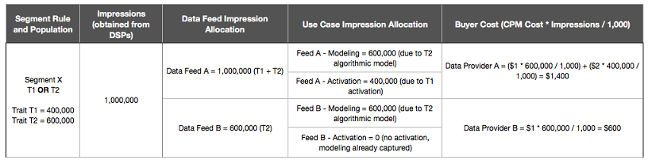

# Faturamento para compradores de feed de dados {#billing-for-data-feed-buyers}

Os compradores de dados de Audience Marketplace concordam em relatar todas as impressões de anúncios veiculadas usando características contidas no feed de dados com um preço por mil impressões de anúncio ([!DNL CPM]). [!DNL CPM] o uso é devido no quinto dia de cada mês e inclui dados do mês anterior. Os assinantes de taxa fixa não precisam relatar o uso.

  

## Como relatar o uso do CPM {#report-cpm-usage}

<!-- t_marketplace_report_cpm_usage.xml -->

[!UICONTROL Audience Marketplace] os compradores de dados concordam em relatar todas as impressões de anúncios veiculadas usando características contidas no feed de dados cujo preço é fixado com base no custo por mil impressões de anúncio ([!DNL CPM]). [!DNL CPM] O uso do deve ocorrer no dia 5 de cada mês e inclui dados do mês anterior. Os assinantes de taxa fixa não precisam relatar o uso.

[!UICONTROL Audience Marketplace] O oferece duas maneiras de  [!DNL CPM] usar relatórios:

* **Relatórios** em nível de segmento: esse é o método de relatório de  [!DNL CPM] uso recomendado. Ao relatar o uso [!DNL CPM] no nível do segmento, a seção de relatórios no nível do feed de dados é automaticamente preenchida com os valores de uso correspondentes, com base nos algoritmos descritos em [Atribuição de custo para feeds de dados CPM](#cost-attribution).
* **Relatórios** de nível de feed de dados: este método exige que você informe individualmente o  [!DNL CPM] uso de cada feed de dados, com base nos algoritmos descritos em Atribuição de  [custo para feeds](#cost-attribution) de dados CPM. No entanto, esse método é mais entediante e passível de erros do que os relatórios no nível do segmento.

  

## Relatar o uso do CPM no nível do segmento {#segment-level-report}

A guia [!UICONTROL Segment Usage] permite relatar o uso no nível do segmento, enquanto exibe os segmentos agrupados pelos destinos para os quais eles são mapeados.

Depois de relatar o uso [!DNL CPM] no nível do segmento, [!UICONTROL Audience Marketplace] atribui automaticamente os feeds de dados correspondentes ao uso correto, com base na [Atribuição de custo para Feeds de dados CPM](#cost-attribution).

Para relatar o uso de [!DNL CPM] no nível do segmento:

1. Vá para **[!UICONTROL Audience Marketplace > Payables]**.
1. Selecione a guia **[!UICONTROL Segment Usage]**.
1. Preencha o uso para seus segmentos. Você pode usar a caixa [!UICONTROL Search] para filtrar os segmentos se precisar apenas relatar o uso de alguns deles.
1. Clique em **[!UICONTROL Edit Segments Usage]**.
1. Insira o valor de uso [!DNL CPM] na coluna [!UICONTROL Usage].
1. Clique em **[!UICONTROL Save]** quando terminar e revise a caixa de diálogo de confirmação.

   

1. Clique em **[!UICONTROL Confirm]**.

Veja também nossa demonstração em vídeo de como você pode relatar o uso no nível do segmento:

>[!VIDEO](https://video.tv.adobe.com/v/25522/)

 

## Relatar o uso do CPM no nível do feed de dados {#feed-level-report}

O relatório no nível do feed de dados é um processo mais entediante e propenso a erros, já que é necessário calcular individualmente o uso de [!DNL CPM] para cada feed de dados. Em vez disso, recomendamos que você [Relate o uso do CPM no nível do segmento](#segment-level-report).

Para relatar o uso de [!DNL CPM] no nível do segmento:

1. Vá para **[!UICONTROL Audience Marketplace > Payables]**.
2. Selecione a guia **[!UICONTROL Feed Usage]**.
3. Use a caixa [!UICONTROL Search] para filtrar os feeds de dados e identificar aqueles para os quais você precisa relatar o uso.
4. Clique em **[!UICONTROL Edit Feeds Usage]**.
5. Calcule o uso de [!DNL CPM] para cada feed de dados com base na [Atribuição de custo para feeds de dados CPM](#cost-attribution) e insira-o na coluna [!UICONTROL Usage].
6. Clique em **[!UICONTROL Save]** quando terminar e revise a caixa de diálogo de confirmação.

   

7. Clique em **[!UICONTROL Confirm]**.

  

## Relatório em massa

Para reduzir erros e despesas gerais ao relatar o uso de [!DNL CPM], você pode usar a opção de relatório em massa para baixar um arquivo [!DNL CSV] contendo os feeds de dados e segmentos, preencher o uso e carregá-lo de volta para [!DNL Audience Manager]. Você pode usar relatórios em massa para relatar o uso de feed e segmento.

Para atualizar o uso de [!DNL CPM] em massa:

1. Vá para **[!UICONTROL Audience Marketplace > Payables]**.
1. Selecione a guia **[!UICONTROL Feed Usage]** ou **[!UICONTROL Segment Usage]** , dependendo do tipo de relatório que deseja atualizar.
1. Clique em **[!UICONTROL Edit Feeds Usage]** ou **[!UICONTROL Edit Segments Usage]**.
1. Clique em **[!UICONTROL download the current usage]** para verificar se você usa um arquivo CSV válido.
1. Abra o arquivo em seu computador e preencha o relatório de uso.
1. Clique em **[!UICONTROL Choose a CSV file]** para fazer upload do relatório de uso atualizado.

   

1. [!DNL Audience Manager] O valida o arquivo assim que você o carrega e solicita se ele detecta qualquer erro no arquivo.

  

### Erros de validação de relatório em massa

| Mensagem de erro | Descrição | Correção |
| ------------- | -------------| -----|
| Entrada inválida | [!DNL Audience Manager] detectou uma alteração no esquema de  [!DNL CSV] arquivo, como colunas ausentes ou alterações nos títulos das colunas. | Evite alterar a estrutura da tabela. |
| Não encontrada | Para [!UICONTROL Segment Level Reporting], [!DNL Audience Manager] não pôde identificar a combinação [!UICONTROL Segment ID] e [!UICONTROL Destination ID]. Para [!UICONTROL Feed Level Reporting], [!DNL Audience Manager] não pôde identificar a combinação [!UICONTROL Data Provider Name], [!UICONTROL Feed Name] e [!UICONTROL Use Case]. | Para [!UICONTROL Segment Level Reporting], verifique a validade da combinação [!UICONTROL Segment ID] e [!UICONTROL Destination ID]. Para [!UICONTROL Feed Level Reporting], verifique a validade da combinação [!UICONTROL Data Provider Name], [!UICONTROL Feed Name] e [!UICONTROL Use Case]. |
| Registros duplicados encontrados | [!DNL Audience Manager] foram detectados registros duplicados com valores de impressão diferentes. | Revise o relatório e verifique se você não relata valores de uso diferentes para o mesmo feed ou segmento de dados. |
| Valores não suportados | [!DNL Audience Manager] valores não numéricos detectados na  [!DNL Audience Manager] coluna . | Revise o relatório e verifique se você inseriu apenas valores numéricos na coluna [!DNL Audience Manager]. |
| Cabeçalhos para campos obrigatórios ausentes | [!DNL Audience Manager] foram detectados cabeçalhos de tabela ausentes para campos obrigatórios. Para [!UICONTROL Segment Level Reporting], os campos obrigatórios são: [!UICONTROL Segment ID], [!UICONTROL Destination ID]. Para [!UICONTROL Feed Level Reporting], os campos obrigatórios são: [!UICONTROL Data Provider Name], [!UICONTROL Data Feed Name], [!UICONTROL Use Case] | Revise o relatório e verifique se os cabeçalhos da tabela não foram adulterados. |

>[!NOTE]
>A remoção de linhas do relatório de uso [!DNL CSV] não afeta o relatório de uso existente. [!DNL Audience Manager] O processa apenas os campos incluídos no relatório.

  

## [!DNL CPM] Práticas recomendadas para relatórios

<table id="table_E68FA2130D1C495FAB8982DFB6A31FD9"> 
 <thead> 
  <tr> 
   <th colname="col1" class="entry"> Recomendações </th> 
   <th colname="col2" class="entry"> Descrição </th> 
  </tr>
 </thead>
 <tbody> 
  <tr> 
   <td colname="col1"> 
<b>Relatar sempre o número total de impressões</b> 
 </td> 
   <td colname="col2"> 
Para totais de impressão do CPM: 

   
 Relate o número total de impressões, sem usar decimais. O Audience Manager calcula automaticamente o CPM com base no número total do relatório.

Se precisar relatar 1.234.567 impressões, reporte exatamente assim. Não é necessário dividir o número total de impressões por 1.000 para calcular o CPM.

As características usadas para otimizar o conteúdo da Web ou do aplicativo (Otimização de conteúdo) usando ferramentas como o Adobe Target ou um destino do Analytics não contribuem para os totais de uso dos planos de CPM. Os provedores de dados geralmente são compensados pela Otimização de conteúdo usando planos de tarifas fixas.

Consulte <a href="#cost-attribution">Atribuição de custo para feeds de dados CPM</a> para obter mais informações. 
 </td>
  </tr>
  <tr> 
   <td colname="col1"> 
<b>Aderir ao intervalo de reporte mensal</b> 
 </td> 
   <td colname="col2"> 
O sistema de relatórios é fechado após o dia 5 de cada mês. Se você não relatar o uso do CPM por essa data, deverá adicionar esse valor ao relatório para o mês seguinte. Por exemplo, digamos que você tenha 1000 impressões em outubro, falhe o prazo do relatório de outubro e use 1000 impressões em novembro. Nesse caso, você relata o total de outubro e novembro (2000) em dezembro, entre o primeiro e o quinto.

<b>Dica</b>: Você sempre deve tentar relatar o uso do CPM no mês anterior entre o primeiro e o quinto dias do mês seguinte.

Você pode relatar o uso do CPM até o dia 5 do novo mês, mas isso não é recomendado. O relatório de uso do CPM antes do dia 5 de cada mês dá Audience Manager para verificar e processar os dados.
 </td>
  </tr> 
 </tbody> 
</table>

  

## Atribuição de custo para feeds de dados CPM {#cost-attribution}

Em [!UICONTROL Audience Marketplace] você deve relatar os valores de impressão a cada mês, para cada um dos segmentos. Recomendamos relatar o uso [!DNL CPM] no nível do segmento, para que a atribuição de custo seja feita automaticamente.

<!-- marketplace_cpm_billing.xml -->

### Resumo da cobrança {#billing-summary}

Você deve enviar [!DNL CPM] valores de impressões do feed de dados entre o primeiro e o quinto dias de cada mês. Para fazer isso corretamente, recomendamos que você [Report CPM Usage at Segment Level](#segment-level-report).

>[!TIP]
>Ao relatar o uso [!DNL CPM] no nível do segmento, a seção de relatórios no nível do feed de dados é automaticamente preenchida com as quantidades de uso correspondentes.

Caso precise [!UICONTROL Report CPM Usage at Data Feed Level], você deve compilar individualmente todas as impressões entregues para cada feed no mês anterior e relatá-las de acordo com a alocação de faturamento descrita neste artigo.

Depois de relatar o número [!DNL CPM] para o mês anterior, [!DNL Adobe] fará o seguinte:

* Crie uma fatura e cobrança com base na taxa [!DNL CPM] para cada feed de dados assinado.
* Pagar taxas aos provedores de dados (vendedores) com base no seu uso [!DNL CPM] relatado.

>[!IMPORTANT]
>
>Como comprador, todos os totais de impressões reportados devem ser verdadeiros e exatos. Se você não reportar os totais de impressão até o quinto dia de cada mês, deverá incluir os totais do mês não relatado no mês seguinte.

  

## Atribuir impressões no nível do feed com base nas regras de qualificação de características {#assign-impressions}

O caso de uso [!UICONTROL Activation] permite usar características no feed de dados correspondente para criar segmentos em [Construtor de segmentos](../../../features/segments/segment-builder.md) e mapear esses segmentos para um destino. Os operadores booleanos [!UICONTROL AND], [!UICONTROL OR] e [!UICONTROL NOT] permitem definir as condições para a qualificação de características e segmentos.

Ao [Relatar o uso do CPM no nível do feed de dados](#feed-level-report), você deve alocar impressões proporcionalmente para cada feed de dados, de acordo com os operadores [!DNL Boolean] usados nas regras de qualificação de característica. A tabela a seguir lista como alocar corretamente impressões por regra booleana ou tipo de característica.

>[!TIP]
>[Relate o uso do CPM no nível do segmento](#segment-level-report) para que o relatório no nível do feed de dados seja feito automaticamente pelo Audience Manager.

<table id="table_BF00FE6740D2459DAFA62F2478492586"> 
 <thead> 
  <tr> 
   <th colname="col1" class="entry"> Lógica ou tipo de qualificação de regra </th> 
   <th colname="col2" class="entry"> Distribuição de Faturamento </th> 
  </tr> 
 </thead>
 <tbody> 
  <tr> 
   <td colname="col1"> 
 E 
 </td> 
   <td colname="col2"> 
Aplique 100% dos totais de impressão entregues a todas as características do provedor em um segmento baseado em regras que use uma condição Booliana  AND. 
 </td> 
  </tr> 
  <tr> 
   <td colname="col1"> 
 OU 
 </td> 
   <td colname="col2"> 
Aplique alocação ponderada dos totais de impressão entregues a todas as características do provedor em um segmento baseado em regras que use uma condição Booliana OU. A alocação ponderada é calculada usando a seguinte fórmula:

<code>(Trait Population / Segment Population) * Number of Impressions * Cost of CPM</code>
 </td> 
  </tr>
  <tr> 
   <td colname="col1"> 
 NÃO 
 </td> 
   <td colname="col2"> 
Aplique 100% dos totais de impressão entregues a todas as características do provedor em um segmento baseado em regras que use uma condição Booliana  NOT. 
 </td> 
  </tr> 
  <tr> 
   <td colname="col1"> 
Segmentos algorítmicos 
 </td> 
   <td colname="col2"> 
Aplique 100% dos totais de impressão entregues a todos os feeds de provedor em um segmento que contenha características algorítmicas. 
 </td> 
  </tr>
 </tbody>
</table>

  

## Exemplos de cobrança {#billing-examples}

Os exemplos abaixo ilustram como a alocação de uso [!DNL CPM] é feita no nível do feed de dados.

>[!IMPORTANT]
>Recomendamos que você [Relate o uso do CPM no nível do segmento](#segment-level-report), em vez disso, faça esse processo automaticamente.

Vamos considerar o seguinte cenário:

  

### Caso 1: Segmentos com regras de qualificação AND

Esse segmento contém três características de provedores de dados separados. Como a qualificação de segmento é baseada em uma condição [!UICONTROL AND], os visitantes precisam perceber as características de todos os três feeds para se qualificarem para o segmento.

Com uma condição [!UICONTROL AND], você deve atribuir 100% das impressões recebidas durante o mês a todos os três provedores de dados. Na seção [!UICONTROL Audience Marketplace > Payables] , você credita cada provedor com 1.000.000 impressões.

Esse exemplo se aplica a segmentos que usam operadores [!DNL Boolean] [!UICONTROL NOT] ou a segmentos que contêm características algorítmicas.

  

### Caso 2: Segmentos com regras de qualificação OU

Esse segmento contém três características de provedores de dados separados. Como a qualificação de segmento é baseada em uma condição [!UICONTROL OR], os visitantes precisam realizar pelo menos uma das três características para se qualificarem para o segmento.

Não podemos saber qual característica é responsável por uma impressão, pois a qualificação se baseia em uma condição [!UICONTROL OR]. Como resultado, na seção [!UICONTROL Audience Marketplace > Payables], você credita cada provedor com uma alocação ponderada do total de impressões, com base na população de características.

  

### Caso 3: Segmentos com casos de uso de modelagem e ativação

Este exemplo descreve a atribuição baseada em dois casos de uso do Feed de dados - Modelagem e Ativação. No exemplo, estamos analisando dois provedores de dados, com as seguintes informações:

Na tabela abaixo, o Segmento X contém duas características, T1 e T2, com a regra de segmento T1 OU T2, onde:

* T1 é uma característica do Feed de dados A;
* T2 é uma característica algorítmica modelada após características de terceiros do Feed de dados A e do Feed de dados B.

O segmento é mapeado para um destino e 1.000.000 impressões são inseridas para esse segmento em um mês, usando [Relatórios no nível do segmento](#segment-level-report).

Dessas 1.000.000 impressões:

* T1 representa 40% da população do segmento, o que significa 400 mil impressões para o Feed A.
* O T2 representa 60% da população do segmento, o que significa 600 mil impressões para o Feed A e o Feed B.

Em um nível de feed de dados, a maneira como as impressões são alocadas é:

* O Feed de dados A recebe 600.000 impressões da característica T2 (que é modelada com base em características do Feed de dados A e do Feed de dados B, portanto, recebem as impressões) e 400.000 impressões da característica T1 (que é uma característica do Feed de dados A), totalizando 1.000.000 impressões.
* O Feed de dados B recebe 600.000 impressões da característica T2 (veja a explicação acima) e 0 impressões da característica T1.

O detalhamento instantâneo por feed de dados e caso de uso é o seguinte:

>[!NOTE]
>
>Para o caso de uso de modelagem, você só deve relatar o uso do CPM na ativação. Se você executar apenas um modelo, mas não ativá-lo, nenhum relatório de uso será necessário.

  

## Alocação de Faturamento e Impressão para Feeds de Dados de Taxa Simples {#billing-flat-fee}

Um feed de dados de taxa fixa cobra uma quantia fixa a cada mês, independentemente de quando a assinatura é iniciada ou de quantas impressões você usa. As tarifas não são rateadas para uso parcial de mês ou intervalos. Assim como com o faturamento do CPM, o Adobe gerará uma fatura e o faturará com uma taxa mensal fixa para os feeds de dados subscritos.

Por exemplo, digamos que você decidiu ativar certas características em um feed no meio do mês. Você ainda será cobrado à taxa mensal completa, independentemente de quando iniciou a assinatura ou ativou características específicas.
