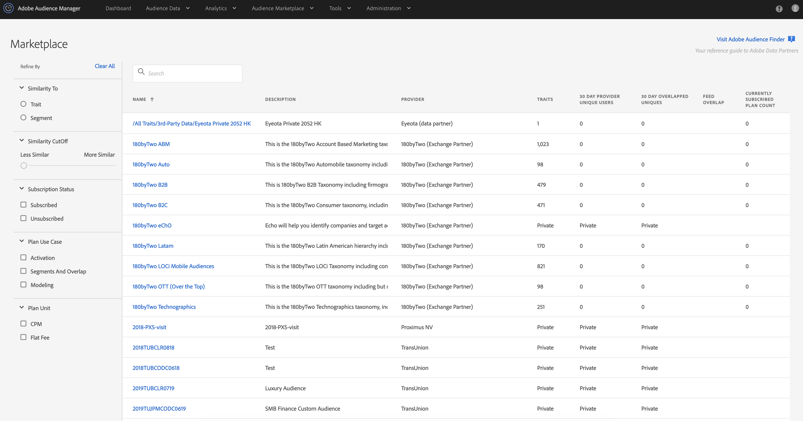

# [!UICONTROL Audience Marketplace] para Data Buyers  {#audience-marketplace-for-data-buyers}

Visão geral e fluxo de trabalho para compradores de dados que desejam comprar dados de terceiros em [!DNL Audience Manager].

>[!NOTE]
>[Permissões baseadas em funções](../../../reporting/reports-dashboard.md) controlam o acesso aos recursos [!UICONTROL Audience Marketplace].
>
>* Os administradores podem criar feeds de dados, gerenciar assinantes e assinar feeds de dados.
>* Os usuários podem pesquisar e visualização somente nos feeds.

## O [!UICONTROL Marketplace]: Sobre {#about-marketplace}

O [!UICONTROL Marketplace] é um recurso [!DNL Audience Manager] para compradores de dados ao qual você pode assinar os feeds de dados do lista. Ele lista feeds de dados privados, [!DNL CPM] e de taxa fixa. Esses feeds são fornecidos por fornecedores terceirizados que usam [!DNL Audience Manager] para vender dados.

Em [!UICONTROL Marketplace], as ferramentas de relatórios permitem que você rastreie o uso de feed e a sobreposição entre [!UICONTROL traits] e as em um feed de dados inscrito. Por fim, com [!UICONTROL Audience Marketplace], [!DNL Adobe] cuida de faturas e pagamentos de taxas (embora você tenha que relatar automaticamente o uso quando estiver inscrito em um feed [!DNL CPM]). Esses recursos permitem que você encontre fontes de dados eficazes sem perder tempo procurando um provedor de dados.

>[!TIP]
>
>Use o **[Localizador de Audiências de Adobe](https://www.adobe-audience-finder.com/)** para localizar feeds de dados de alta qualidade que você possa assinar. Em seguida, volte para a interface do usuário [!DNL Audience Manager] ou use a [API do Comprador de Audience Marketplace](https://bank.demdex.com/portal/swagger/index.html#/Audience_Marketplace_Buyer_API) para assinar os feeds encontrados.

A lista [!UICONTROL Marketplace] contém informações que você pode classificar e pesquisar para encontrar o feed de dados certo para você. Os itens na lista do comprador [!UICONTROL Marketplace] incluem:

* **[!UICONTROL Search]**: Encontre feeds de dados por nome ou descrição de texto.
* **[!UICONTROL Similar Traits]**: Mostra o número de semelhantes  [!UICONTROL traits] de um feed de dados. Esta coluna é mostrada depois que você insere um [!UICONTROL trait] ou [!UICONTROL segment] para filtrar na seção **[!UICONTROL Similarity To]**.
* **[!UICONTROL Name]**: Nome do feed de dados.
* **[!UICONTROL Description]**: Informações sobre o conteúdo de um feed de dados.
* **[!UICONTROL Provider]**: Nome do provedor de dados.
* **[!UICONTROL Traits]**: O número de  [!UICONTROL traits] em um feed de dados.
* **[!UICONTROL 30 Day Provider Unique Users]**: O número de usuários únicos vistos nos últimos 30 dias.
* **[!UICONTROL 30 Day Overlapped Uniques]**: O número de usuários em sua conta que se sobrepõem aos usuários na conta do provedor.
* **[!UICONTROL Feed Overlap]**: O valor único sobreposto de 30 dias, exibido em porcentagens, calculado como: Comprador de dados: 30 dias sobrepostos únicos / Comprador de dados, 30 dias únicos) x 100.
* **[!UICONTROL Private Feeds]**: Consulte Feeds [ de dados ](../../../features/audience-marketplace/marketplace-private-feeds.md)privados.
* **[!UICONTROL Currently Subscribed Plan Count]**: O número de subscrições que você tem com um provedor de dados.

 

Para encontrar facilmente os melhores feeds de dados para suas necessidades, use os seguintes filtros disponíveis no lado esquerdo da página [!UICONTROL Marketplace]:

* **[!UICONTROL Similarity To]**: Filtre os feeds de dados com base na semelhança deles com um  [!UICONTROL trait] ou  [!UICONTROL segment] de sua escolha. Ao inserir [!UICONTROL trait] ou o segmento para comparar, você pode usar a ID [!UICONTROL trait] ou [!UICONTROL segment] ou seus respectivos nomes.
* **[!UICONTROL Similarity Cutoff]**: Arraste o controle deslizante para filtrar os feeds de dados com base na semelhança que eles  [!UICONTROL traits] são com a sua seleção  [!UICONTROL trait] ou  [!UICONTROL segment]. Para saber mais sobre [!UICONTROL trait] pontuações de similaridade, consulte [Pontuação de semelhança de característica](../../segments/trait-recommendations.md#trait-similarity-score)
* **[!UICONTROL Subscription Status]**: Filtre os feeds de dados com base no status da subscrição.
* **[!UICONTROL Plan Use Case]**: Filtrar feeds de dados com base em seus casos de uso suportados:  **[!UICONTROL Activation]**,  **[!UICONTROL Segments and Overlap]** e  **[!UICONTROL Modelling]**.
* **[!UICONTROL Plan Unit]**: Filtrar feeds de dados com base em seu tipo de preço.

## Localizando Semelhante [!UICONTROL Traits] {#finding-similar-traits}

[!UICONTROL Audience Marketplace] oferece a opção de localizar  [!UICONTROL traits] de vários feeds de dados, com base na similaridade com seus segmentos  [!UICONTROL traits] ou segmentos existentes. Veja como fazer isso:

1. Vá para **[!UICONTROL Audience Marketplace]** > **[!UICONTROL Marketplace]**.
2. Use o seletor **[!UICONTROL Similarity To]** para escolher entre filtrar com base em [!UICONTROL trait] ou [!UICONTROL segment]. Você pode filtrar com base na ID ou no nome [!UICONTROL trait]/[!UICONTROL segment]. A caixa de pesquisa mostra automaticamente sugestões relevantes com base na sua entrada.
3. Depois de identificar a característica ou o segmento pelo qual deseja filtrar, clique nele na lista de sugestões.
4. Para restringir os resultados, use o controle deslizante **[!UICONTROL Similarity Cutoff]** para mover de [!UICONTROL traits] menos semelhantes, para outros mais semelhantes.

Quando a filtragem estiver concluída, você verá uma nova coluna na página de resultados: **[!UICONTROL Similar Traits]**. Esta coluna mostra o número de [!UICONTROL traits] semelhantes ao que você filtrou, de cada feed de dados que atende aos critérios de filtragem.

Para ver a lista completa de características semelhantes, clique no número na coluna **[!UICONTROL Similar Traits]**.

>[!NOTE]
>
> O Audience Marketplace exibe os 500 principais resultados semelhantes [!UICONTROL trait] de todos os feeds de dados.

Assista ao vídeo abaixo para obter uma visão geral completa de como encontrar [!UICONTROL traits] semelhantes.

>[!VIDEO](https://video.tv.adobe.com/v/29370/)

## Feeds de dados privados {#private-data-feeds}

Na lista [!UICONTROL Marketplace], às vezes o nome do provedor e os dados [!UICONTROL trait] são marcados como privados. Isso indica um [feed de dados privados](../../../features/audience-marketplace/marketplace-private-feeds.md). Um feed de dados privados permite que os vendedores limitem o acesso do comprador aos seus dados. Os vendedores podem tornar os feeds privados quando estão oferecendo negócios especiais, descontos ou quando privacidade e controle de acesso são importantes para eles. Como comprador, você tem que enviar uma solicitação de subscrição ao vendedor se quiser acessar um feed privado. Consulte [Assine um Feed de dados privados](../../../features/audience-marketplace/marketplace-data-buyers/marketplace-manage-subscriptions.md#subscript-private-data-feed) para obter detalhes.

>[!MORELIKETHIS]
>
>* [Como entender a página de detalhes do plano no Audience Marketplace](../../../features/audience-marketplace/marketplace-data-buyers/marketplace-manage-subscriptions.md#marketplace-buyer-details)
>* [Descontos para Data Buyers](../../../features/audience-marketplace/marketplace-data-buyers/marketplace-manage-subscriptions.md#buyer-discount)

