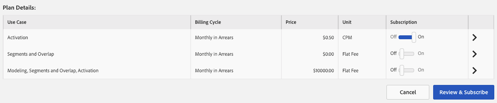

# Gerenciar assinaturas do feed de dados {#manage-data-feed-subscriptions}

O [!UICONTROL Marketplace] é onde os compradores de dados vão para pesquisar e assinar feeds de dados públicos e privados. Siga estas etapas para assinar um feed de dados público.

## Assinar um feed de dados público {#subscript-public-data-feed}

O [!UICONTROL Marketplace] é onde os compradores de dados vão para pesquisar e assinar feeds de dados públicos e privados. Siga estas etapas para assinar um feed de dados público.

<!-- t_subscribe_feed.xml -->

Para assinar um feed de dados público:

1. Ir para **[!UICONTROL Audience Marketplace > Marketplace]**. Use o recurso de pesquisa ou navegue pela lista para encontrar um feed de dados.

   

1. Clique no nome do feed de dados que deseja usar. Isso abre a [página de detalhes do plano](../../../features/audience-marketplace/marketplace-data-buyers/marketplace-manage-subscriptions.md#marketplace-buyer-details) do feed selecionado.

   

1. Escolha um caso de uso na tabela de assinaturas e:
   * Mova o controle deslizante de **[!UICONTROL Subscription]** para **[!UICONTROL On]**.
   * Clique em **[!UICONTROL Review & Subscribe]**. Isso abre a janela [!UICONTROL Terms and Conditions].

   

1. Na janela [!UICONTROL Terms and Conditions]:

   * **Importante:** deixe marcada a caixa de seleção **[!UICONTROL ID sync]**. Esta configuração ajuda a melhorar as taxas de correspondência com seu provedor de dados.
   * Marque a caixa de termos e condições e clique em **[!UICONTROL Accept]** para concluir o processo de assinatura.

   

### Próximas etapas

Depois de assinar um feed de dados:

* Verifique a assinatura verificando a pasta [!UICONTROL Traits]. Consulte [Armazenamento para Feeds de Dados Assinados](../../../features/audience-marketplace/marketplace-data-buyers/marketplace-manage-subscriptions.md#find-subscribed-data-fee).

* Revise a documentação de faturamento e pagamento. Consulte os links relacionados abaixo.

### Práticas recomendadas {#best-practices}

Este é um conjunto de práticas recomendadas que recomendamos que você siga ao trabalhar com o [!UICONTROL Audience Marketplace]:

Ao explorar novos conjuntos de dados de terceiros e secundários por meio do [!UICONTROL Audience Marketplace], a primeira etapa recomendada é habilitar os feeds de dados para [!UICONTROL Segments & Overlap]. Isso permite que os usuários explorem dados criando segmentos para avaliar o tamanho do público e executando relatórios de sobreposição para obter insights iniciais do público. A maioria dos provedores de dados oferece esse caso de uso gratuitamente, para que você possa realizar essa análise sem custo extra.

Ao executar relatórios de sobreposição, siga estas práticas recomendadas para garantir que você obtenha resultados úteis.

1. Certifique-se de que os conjuntos de dados sobrepostos sejam semelhantes em termos de tipo de dados e metodologias de coleta, como:
   * Geografia do visitante
   * Cookie vs. IDs móveis
   * Janela de lookback
   * Atividade offline vs. online
   * A frequência com que o provedor de dados atualiza os dados

1. A sobreposição pode aumentar um pouco ao longo do tempo, portanto, permita que até 30 dias se passem antes de executar relatórios de sobreposição para permitir que os dados sejam sincronizados.
1. A sobreposição pode aumentar se você usar dados de um provedor de dados em várias campanhas de marketing.
e iniciativas. Isso permite mais oportunidades para os usuários dos dois conjuntos de dados sincronizarem.
1. Não há garantia de que haverá uma sobreposição entre seus conjuntos de dados. Para que uma sobreposição seja válida, um usuário do conjunto de dados do cliente deve ser associado aos dados
dados do provedor definidos durante o intervalo de tempo do relatório. Se os dados de mídia do cliente não forem fornecidos aos usuários no conjunto de dados do provedor, nunca haverá uma sobreposição.
1. Não pense em baixa sobreposição como algo ruim. Aproveite uma baixa sobreposição para prospectar e atrair novos usuários.

## Assinar um feed de dados privado {#subscript-private-data-feed}

Os compradores assinam feeds e planos de dados privados em **[!UICONTROL Audience Marketplace > Marketplace]**.

<!-- t_private_feed.xml -->

>[!TIP]
>
>Às vezes, os provedores de dados podem oferecer um desconto em um feed de dados privado. Você pode querer perguntar sobre um possível desconto ao enviar sua solicitação de assinatura.

Para assinar um feed de dados privado:

1. Clique no nome do feed de dados no [!UICONTROL Marketplace].
1. Clique em **[!UICONTROL Request Access]**. Isso abre a caixa de diálogo de solicitação.
1. Na caixa de diálogo de solicitação, escreva para o provedor uma observação expressando seu interesse no feed de dados e clique em **[!UICONTROL Send]**. O vendedor revisará sua mensagem e aprovará ou rejeitará sua solicitação. Enquanto aguarda por aprovação, &quot;Solicitado&quot; aparece na lista [!UICONTROL Marketplace] para esse feed de dados.

   * **[!UICONTROL Request approved]**: O status na lista [!UICONTROL Marketplace] é alterado para &quot;Acesso concedido&quot; e você receberá uma notificação automática. Nesse ponto, é possível assinar o feed. Consulte [Assinar um Feed de Dados Público](../../../features/audience-marketplace/marketplace-data-buyers/marketplace-manage-subscriptions.md#subscript-public-data-feed) para obter instruções.
   * **[!UICONTROL Request denied]**: O texto &quot;Solicitado&quot; foi removido da lista [!UICONTROL Marketplace] para o feed. Você pode tentar se inscrever novamente ou escolher um feed diferente.

## Descontos de feed de dados para compradores {#buyer-discount}

No [!UICONTROL Audience Marketplace], os provedores podem oferecer aos compradores um desconto sobre o preço publicado de um feed de dados de taxa fixa ou [!DNL CPM]. No entanto, os valores de desconto não estão visíveis para compradores na lista de feeds do [!DNL Marketplace]. Mas você também pode solicitar um desconto ao assinar um feed de dados privado ou ao solicitar mais informações sobre um feed específico.

## Solicitar um desconto {#request-discount}

<!-- marketplace-buyer-discounts.xml -->

<table id="table_3C6E58F593BA48EC89ACBD9A26E4E74F"> 
 <thead> 
  <tr> 
   <th colname="col1" class="entry"> Status do comprador </th> 
   <th colname="col2" class="entry"> Descrição </th> 
  </tr> 
 </thead>
 <tbody> 
  <tr> 
   <td colname="col1"> 
 <b>Assinantes atuais</b> 
 </td> 
   <td colname="col2"> 
Se você já estiver inscrito em um feed de dados privado e quiser solicitar um desconto: 
 
    <ol id="ol_A58D419EBB9349E9B1225202535130F6"> 
     <li id="li_D0DDC8AC6E9C4675AA4630D63FE8F071"> <a href="../../../features/audience-marketplace/marketplace-data-buyers/marketplace-manage-subscriptions.md#unsubscribe"> Cancelar inscrição</a> do feed de dados. </li> 
     <li id="li_05A5379F2A944FB28AB39C196DDE3A1D">Entre em contato com o provedor de dados e solicite um preço com desconto. </li> 
     <li id="li_B1B5AA6F6CC64512A02D5E8861A5F266">Se o provedor conceder um desconto, inscreva-se novamente no feed no dia 1st do mês seguinte. </li> 
    </ol> </td> 
  </tr> 
  <tr> 
   <td colname="col1"> 
 <b>Novos Assinantes de Feed de Dados Privados</b> 
 </td> 
   <td colname="col2"> 
Solicite um desconto em sua solicitação de assinatura. Consulte <a href="../../../features/audience-marketplace/marketplace-data-buyers/marketplace-manage-subscriptions.md#subscript-private-data-feed"> Assinar um Feed de Dados Privado</a>. 
 </td>
  </tr> 
  <tr> 
   <td colname="col1"> 
 <b>Assinantes em Potencial</b> 
 </td> 
   <td colname="col2"> 
Um <a href="../../../features/audience-marketplace/marketplace-private-feeds.md"> assinante em potencial</a> é um comprador de dados que solicitou acesso a um feed de dados privado, recebeu aprovação do vendedor, mas não assinou o feed. Para solicitar um desconto como assinante em potencial: 
 
    <ol id="ol_9CECDA92E7894B20AC8A777D78962188"> 
     <li id="li_618B64160CF24549AFCA73E006DCA35A">Vá para <b> Audience Marketplace &gt; Marketplace</b>. </li> 
     <li id="li_FE52A06B30FC4858B48AF81954365FE9">Clique no nome do feed para o qual você foi aprovado. </li> 
     <li id="li_763C050AC9464BE380D00F6085B6E540">Clique Em <b> Solicitar Mais Detalhes</b>. Solicite um desconto em sua solicitação de detalhes ao vendedor. </li> 
    </ol> </td> 
  </tr> 
 </tbody> 
</table>

## Revisar feeds com desconto {#review-discounted-feeds}

Para revisar seus feeds com desconto, faça o seguinte:

1. Ir para **[!UICONTROL Audience Marketplace > Marketplace]**.
1. Clique no nome de um feed ao qual você já se inscreveu.
1. Examine as colunas [!UICONTROL Price] e [!UICONTROL Your Price] na tabela [!UICONTROL Plan Details]. Se o feed for descontado:

   * O preço original é marcado com uma linha vermelha.
   * A taxa na coluna [!UICONTROL Your Price] será menor que a taxa na coluna [!UICONTROL Price].

No exemplo, o comprador recebe um desconto de 10% no plano [!UICONTROL Segments and Overlap] em **[!UICONTROL Software Audience Feed]**.

## Localizando Dados do Feed Assinado {#find-subscribed-data-fee}

Os dados (características) dos feeds de dados aparecem em suas próprias pastas de armazenamento de características. Acesse **[!UICONTROL Audience Data > Traits]** e expanda a pasta **[!UICONTROL 3rd-Party Data]** para exibir e trabalhar com as características nos feeds que você assina. Procure a subpasta com o nome do seu provedor de dados. Eles contêm pastas chamadas com base no feed de dados individual e nas características de lista fornecidas pelo feed.

<!-- marketplace-feed-storage.xml -->

## Cancelar a assinatura de um feed de dados {#unsubscribe}

Os compradores de dados cancelam a inscrição dos feeds de dados e dos planos em **[!UICONTROL Audience Marketplace > Marketplace]**.

<!-- t_unsubscribe_feed.xml -->

Para cancelar a inscrição de um feed de dados:

1. Clique no nome do feed de dados no [!UICONTROL Marketplace].
1. Na seção [!UICONTROL Use Case], encontre o plano que deseja usar e mova o controle deslizante **[!UICONTROL Subscription]** para **[!UICONTROL Off]**.

## Desativação do feed de dados: por que acontece e como responder {#data-feed-deactivation-reasons}

No [!UICONTROL Audience Marketplace], os provedores de dados podem revogar o acesso aos feeds de dados que você assinou. Não se preocupe se isso acontecer com você. Nós temos você coberto. Consulte esta seção para obter os processos e procedimentos relacionados às desativações do feed de dados.

## Motivos comuns para a desativação do feed de dados {#reasons-for-deactivation}

<!-- marketplace-subscriber-deactivated.xml -->

Pode ser intrigante ou até mesmo perturbador se um feed que você assina estiver desligado. No entanto, os provedores de dados podem desativar um feed de dados por vários motivos. Alguns motivos comuns incluem:

* **Faturamento:** os provedores de dados desativarão um feed se você estiver consistentemente atrasado no pagamento de taxas ou se você não conseguir pagar suas taxas.
* **Atualizações de Feed:** Os provedores de dados precisam desativar os feeds ao atualizarem sua taxonomia de feed ou estruturas de custo.
* **Compradores inativos:** Os provedores de dados se reservam o direito de desativar feeds se os assinantes não mostrarem despesas durante um período estendido.
* **Vendedores inativos:** os provedores de dados que saírem de [!UICONTROL Audience Marketplace] desativarão e excluirão todos os seus feeds de dados.

>[!TIP]
>
>Entre em contato diretamente com seu provedor de dados se você achar que um feed de dados foi desativado por engano. O consultor do [!DNL Adobe] pode ajudá-lo com informações de contato ou suporte adicional.

## Email de desativação {#deactivation-email}

Quando um provedor de dados desativa um dos seus feeds de dados, o [!DNL Audience Manager] envia um email para os usuários da sua empresa que têm permissões do [!UICONTROL Administrator]. Às vezes, os filtros de email classificam essa mensagem como spam. Como resultado, você pode perder essa notificação importante. Para ajudar a identificar a mensagem de desativação, esse email contém os seguintes elementos:

* **De:** O email de desativação vem de `aam-noreply@adobe.com`. Dica profissional: não responda a este email.

* **Linha de assunto:** Assinatura de *nome do feed de dados aqui* foi cancelada.

* **Anexos:** O email inclui um anexo intitulado, &quot; `list-of-affected-entities-by-feed-revocation.csv`.&quot; Essa é uma maneira complicada de dizer que o anexo lista todas as características incluídas no feed cancelado. Como comprador de dados, você deve revisar este anexo. Ele ajudará você a encontrar e remover características desativadas de seus segmentos e [modelos algorítmicos](../../../features/algorithmic-models/understanding-models.md).

## Lista de características desativadas {#deactivation-trait-list}

A lista que acompanha um email de desativação contém os campos conforme mostrado abaixo.

<table id="table_5C3800F9D8AA43EFAB4690959A721F63"> 
 <thead> 
  <tr> 
   <th colname="col1" class="entry"> Campo </th> 
   <th colname="col2" class="entry"> Descrição </th> 
  </tr> 
 </thead>
 <tbody> 
  <tr> 
   <td colname="col1"> 
<b> ID do Feed de Dados</b> 
 </td> 
   <td colname="col2"> 
ID do feed de dados desativado. 
 </td> 
  </tr> 
  <tr> 
   <td colname="col1"> 
<b> Nome do Feed de Dados</b> 
 </td> 
   <td colname="col2"> 
Nome do feed de dados desativado. 
 </td> 
  </tr> 
  <tr> 
   <td colname="col1"> 
<b> SID da característica </b> 
 </td> 
   <td colname="col2"> 
IDs de característica desativadas. 
 </td> 
  </tr> 
  <tr> 
   <td colname="col1"> 
<b> Nome da característica</b> 
 </td> 
   <td colname="col2"> 
Nomes de características desativados. 
 </td> 
  </tr> 
  <tr> 
   <td colname="col1"> 
<b> SID do segmento </b> 
 </td> 
   <td colname="col2"> 
ID do segmento que contém características desativadas. 
 </td> 
  </tr> 
  <tr> 
   <td colname="col1"> 
<b> Nome do segmento</b> 
 </td> 
   <td colname="col2"> 
Nome do segmento que contém características desativadas. 
 </td> 
  </tr> 
  <tr> 
   <td colname="col1"> 
ID de Modelo <b> Algo </b> 
 </td> 
   <td colname="col2"> 
A ID do modelo algorítmico que contém características desativadas. 
 </td> 
  </tr> 
  <tr> 
   <td colname="col1"> 
<b> Algo Nome do Modelo</b> 
 </td> 
   <td colname="col2"> 
Os nomes dos modelos algorítmicos que contêm características desativadas. 
 </td> 
  </tr> 
 </tbody> 
</table>

## Remover características desativadas {#remove-deactivated-traits}

Como comprador de dados, você é responsável por remover as características em um feed cancelado de todos os segmentos ativos/em uso ou inativos. As opções de remoção incluem:

* Remoção em massa com as [APIs REST](../../../api/rest-api-main/rest-api-main.md) ou as [Ferramentas de Gerenciamento em Massa](../../../reference/bulk-management-tools/bulk-management-intro.md).

* Pesquise manualmente por segmentos afetados e remova características desativadas usando o [!UICONTROL Segment Builder]. Consulte [Remover características de um segmento](../../../features/segments/segment-builder.md#segment-builder-controls-traits).

>[!NOTE]
>
>A remoção de características de modelos ou destinos algorítmicos ativos afeta a escala e a precisão do direcionamento. Tente substituir as características revogadas por características novas e ativas, se possível.

[Cancelar a assinatura do feed de dados desativado](../../../features/audience-marketplace/marketplace-data-buyers/marketplace-manage-subscriptions.md#unsubscribe) depois de remover todas as características revogadas da conta. Se essa for uma desativação temporária, você poderá assinar novamente depois que o provedor de dados terminar de fazer as alterações necessárias e reativar o feed. Como na maioria dos casos, uma boa comunicação com seus parceiros (o provedor de dados e o [!DNL Adobe]) pode ajudá-lo a trabalhar nesse processo.

## Como entender a página de detalhes do plano no Audience Marketplace {#marketplace-buyer-details}

Quando você clica no nome de um plano de dados no [!UICONTROL Marketplace], o [!DNL Audience Manager] fornece informações que podem ajudá-lo a fazer escolhas informadas sobre a assinatura de um feed de dados.

<!-- marketplace-buyer-details.xml -->

Essa página fornece as seguintes informações:

1. **Informações Básicas sobre o Plano**. Isso inclui informações do feed, como:
   * Nome do feed de dados. Por exemplo, como mostrado acima, o nome deste feed é &quot;Feed de dados de amostra&quot;.
   * O nome do fornecedor dos dados;
   * ID do feed de dados;
   * Descrição;
   * Número de características no alimento para animais;

1. Botões de Informações do Plano.
   * Clique em **[!UICONTROL Explore All Traits]** para ver detalhes sobre todas as características no feed de dados selecionado.
   * Clique em **[!UICONTROL Request More Details]** para fazer perguntas ao provedor de dados sobre o feed de dados selecionado ou para solicitar um desconto. Esse recurso envia seus comentários e perguntas diretamente para o provedor de dados.

1. Métricas de relatório do feed de dados. O diagrama Venn (e métricas relacionadas) mostra os dados de sobreposição de característica dos últimos 30 dias. Consulte [O Marketplace: Sobre](marketplace-data-buyers.md#about-marketplace) para obter detalhes.
   * **[!UICONTROL 30 Day Overlapped Uniques]**: o número de usuários únicos em sua conta que se sobrepõem aos usuários na conta do provedor. Para obter uma definição de usuários únicos, consulte UUID do AAM no [Índice de IDs no Audience Manager](/help/using/reference/ids-in-aam.md).
   * **[!UICONTROL 30 Day Provider Unique Users]**: o número de usuários exclusivos provenientes da conta do provedor.
   * **[!UICONTROL Your Unique Users]**: O número de usuários únicos provenientes da sua conta.

1. Tabela **[!UICONTROL Plan Details]**. Esta tabela mostra os casos de uso para os quais você pode assinar o feed de dados, bem como seu modelo de preços. Consulte [Entendendo Casos De Uso Do Feed De Dados](#use-cases).

1. Botões de ação do plano.
   * Clique em **[!UICONTROL Cancel]** para sair da página sem fazer alterações.
   * Clique em **[!UICONTROL Review & Subscribe]** para assinar um feed de dados. Este botão fica esmaecido até que você alterne um [!UICONTROL Subscription] para [!UICONTROL On]. Consulte também [Assinar um Feed de Dados Público](#subscript-public-data-feed) e [Assinar um Feed de Dados Privado](#subscript-private-data-feed).

## Noções básicas sobre casos de uso do feed de dados {#use-cases}

Como comprador de dados do [!UICONTROL Audience Marketplace], você pode comprar dados para casos de uso de sobreposição, modelagem e ativação. Cada caso de uso é projetado para uma finalidade específica e limita o que você pode fazer com os dados. Essas descrições de casos de uso podem ajudá-lo a tomar a decisão certa sobre qual tipo de plano de dados comprar.

## Fazer Comparações com Segmentos e Planos de Sobreposição {#comparisons}

<!-- c_use_cases_for_buyers.xml -->

### Segmentos e sobreposição

Este caso de uso permite comparar suas características com as características do provedor em um relatório de sobreposição de [característica por característica.](../../../reporting/dynamic-reports/trait-trait-overlap-report.md#trait-to-trait-overlap-report) Além disso, você pode criar ou adicionar características de provedor a um segmento e fazer comparações adicionais com os relatórios [segmento-para-característica](../../../reporting/dynamic-reports/segment-trait-overlap-report.md) e [segmento-para-segmento](../../../reporting/dynamic-reports/segment-segment-overlap-report.md). As comparações de sobreposição podem ajudar a:

* **Estender alcance do público-alvo:** uma baixa sobreposição sugere que suas características contêm usuários que você não viu antes. Talvez você queira que essas características tentem alcançar novos usuários.
* **Aprimorar públicos-alvo existentes:** A alta sobreposição sugere que suas características sejam semelhantes às do provedor de dados. Talvez você queira que essas características ajudem a fazer melhorias direcionadas e incrementais em um público já desenvolvido.

### Modelos algorítmicos

Este caso de uso permite avaliar as características do fornecedor em relação às suas características com o [modelo algorítmico](../../../features/algorithmic-models/understanding-models.md#understanding-models). Por exemplo, nosso sistema de modelagem algorítmica usa uma de suas características como base de comparação com uma característica do fornecedor. Quando o modelo é executado, ele pode mostrar se os públicos-alvo nas características do fornecedor compartilham atributos de conversão semelhantes às suas características.

### Ativação

Este caso de uso permite enviar dados para um [destino](../../../features/destinations/destinations.md). No [!DNL Audience Manager], um destino é qualquer sistema de terceiros (servidor de anúncios, [!DNL DSP], [!DNL DMP], exchange, etc.) com o qual você deseja compartilhar dados. No entanto, com um caso de uso [!UICONTROL Activation], não é possível executar relatórios de sobreposição ou testar os dados em um modelo algorítmico.

>[!MORELIKETHIS]
>
>* [Alocação de impressão e cobrança para os feeds de dados do CPM](../../../features/audience-marketplace/marketplace-data-buyers/marketplace-buyer-billing.md#cost-attribution)
>* [Alocação de impressão e cobrança para feeds de dados de taxa fixa](../../../features/audience-marketplace/marketplace-data-buyers/marketplace-buyer-billing.md)
>* [Como relatar o uso do CPM](../../../features/audience-marketplace/marketplace-data-buyers/marketplace-buyer-billing.md#report-cpm-usage)
>* [Assinar um Feed de Dados Público](../../../features/audience-marketplace/marketplace-data-buyers/marketplace-manage-subscriptions.md#subscript-public-data-feed)
>* [Descontos para compradores de dados](../../../features/audience-marketplace/marketplace-data-buyers/marketplace-manage-subscriptions.md#buyer-discount)
>* [O Marketplace: Sobre](../../../features/audience-marketplace/marketplace-data-buyers/marketplace-data-buyers.md#about-marketplace)
