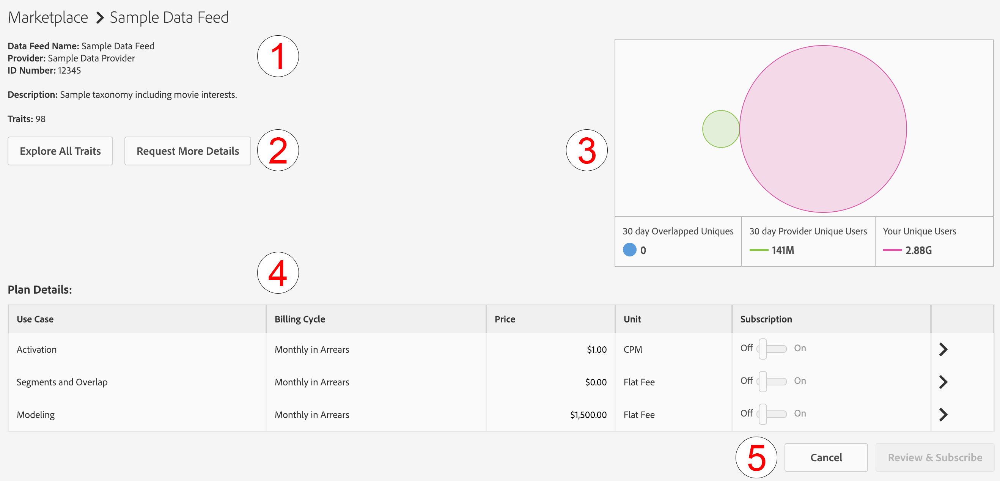

# Gerenciar assinaturas do feed de dados {#manage-data-feed-subscriptions}

O [!UICONTROL Marketplace] é onde os compradores de dados vão para a pesquisa e se inscrevem em feeds de dados públicos e privados. Siga estas etapas para se inscrever em um feed de dados público.

## Assinar um feed de dados público {#subscript-public-data-feed}

O [!UICONTROL Marketplace] é onde os compradores de dados vão para a pesquisa e se inscrevem em feeds de dados públicos e privados. Siga estas etapas para se inscrever em um feed de dados público.

<!-- t_subscribe_feed.xml -->

Para assinar um feed de dados público:

1. Vá para **[!UICONTROL Audience Marketplace > Marketplace]**. Use o recurso de pesquisa ou navegue pela lista para localizar um feed de dados.

   

1. Clique no nome do feed de dados que deseja usar. Isso abre a [página de detalhes do plano](../../../features/audience-marketplace/marketplace-data-buyers/marketplace-manage-subscriptions.md#marketplace-buyer-details) para o feed selecionado.

   

1. Escolha um caso de uso na tabela de assinaturas e:
   * Mova o controle deslizante **[!UICONTROL Subscription]** para **[!UICONTROL On]**.
   * Clique em **[!UICONTROL Review & Subscribe]**. Isso abre a janela [!UICONTROL Terms and Conditions].

   

1. Na janela [!UICONTROL Terms and Conditions]:

   * **Importante:** deixe a caixa de  **[!UICONTROL ID sync]** seleção marcada. Essa configuração ajuda a melhorar as taxas de correspondência com seu provedor de dados.
   * Marque a caixa de termos e condições e clique em **[!UICONTROL Accept]** para concluir o processo de assinatura.

   

### Próximas etapas

Depois de assinar um feed de dados:

* Verifique a assinatura marcando a pasta [!UICONTROL Traits]. Consulte [Armazenamento para feeds de dados subscritos](../../../features/audience-marketplace/marketplace-data-buyers/marketplace-manage-subscriptions.md#find-subscribed-data-fee).

* Revise a documentação de faturamento e pagamento. Consulte os links relacionados abaixo.

### Práticas recomendadas {#best-practices}

Este é um conjunto de práticas recomendadas que recomendamos que você siga ao trabalhar com [!UICONTROL Audience Marketplace]:

Ao explorar novos conjuntos de dados de terceiros e de terceiros por meio de [!UICONTROL Audience Marketplace], a primeira etapa que recomendamos é habilitar os feeds de dados para [!UICONTROL Segments & Overlap]. Isso permite que os usuários explorem dados criando segmentos para avaliar o tamanho do público-alvo e executando relatórios de sobreposição para obter insights iniciais do público-alvo. A maioria dos provedores de dados oferece esse caso de uso gratuitamente, para que você possa realizar essa análise sem custo extra.

Ao executar relatórios de sobreposição, siga estas práticas recomendadas para garantir que você esteja obtendo resultados úteis.

1. Certifique-se de que os conjuntos de dados sobrepostos sejam semelhantes em termos de tipo de dados e metodologias de coleta, como:
   * Geografia do visitante
   * Cookie versus IDs móveis
   * Janela de lookback
   * Atividade off-line vs. on-line
   * A frequência na qual o provedor de dados atualiza os dados

1. A sobreposição pode aumentar um pouco ao longo do tempo, portanto, deixe passar até 30 dias antes de executar relatórios de sobreposição para permitir a sincronização dos dados.
1. A sobreposição pode aumentar se você usar dados de um provedor de dados em várias campanhas de marketing.
e iniciativas. Isso permite que os usuários dos dois conjuntos de dados tenham mais oportunidades de sincronização.
1. Não há garantia de que haverá uma sobreposição entre os conjuntos de dados. Para que uma sobreposição seja válida, um usuário do conjunto de dados do cliente deve estar associado aos dados
conjunto de dados do provedor durante o período do relatório. Se os dados de mídia do cliente não forem fornecidos aos usuários no conjunto de dados do provedor de dados, nunca haverá uma sobreposição.
1. Não pense em baixa sobreposição como uma coisa ruim. Aproveite uma baixa sobreposição para prospecto e engajamento de novos usuários.

## Inscrever-se em um feed de dados privado {#subscript-private-data-feed}

Os compradores assinam feeds de dados privados e planos em **[!UICONTROL Audience Marketplace > Marketplace]**.

<!-- t_private_feed.xml -->

>[!TIP]
>
>Às vezes, os provedores de dados podem oferecer um desconto em um feed de dados privado. Talvez você queira perguntar sobre um possível desconto ao enviar sua solicitação de assinatura.

Para assinar um feed de dados privados:

1. Clique no nome do feed de dados no [!UICONTROL Marketplace].
1. Clique em **[!UICONTROL Request Access]**. Isso abre a caixa de diálogo de solicitação.
1. Na caixa de diálogo de solicitação, escreva ao provedor uma nota expressando seu interesse no feed de dados e clique em **[!UICONTROL Send]**. O vendedor revisará sua mensagem e aprovará ou rejeitará sua solicitação. Enquanto aguarda aprovação, &quot;Solicitado&quot; é exibido na lista [!UICONTROL Marketplace] desse feed de dados.

   * **[!UICONTROL Request approved]**: O status na  [!UICONTROL Marketplace] lista muda para &quot;Acesso concedido&quot; e você receberá uma notificação automatizada. Nesse ponto, você pode assinar o feed. Consulte [Assinar um feed de dados público](../../../features/audience-marketplace/marketplace-data-buyers/marketplace-manage-subscriptions.md#subscript-public-data-feed) para obter instruções.
   * **[!UICONTROL Request denied]**: O texto &quot;Solicitado&quot; é removido da  [!UICONTROL Marketplace] lista para o feed. Você pode tentar assinar novamente ou escolher um feed diferente.

## Descontos do feed de dados para compradores {#buyer-discount}

Em [!UICONTROL Audience Marketplace], os provedores podem oferecer aos compradores um desconto no preço publicado de um [!DNL CPM] ou feed de dados de taxa fixa. No entanto, os valores de desconto não estão visíveis para compradores na lista de feeds [!DNL Marketplace]. Mas também é possível solicitar um desconto ao assinar um feed de dados privados ou ao solicitar mais informações sobre um feed específico.

## Solicitar desconto {#request-discount}

<!-- marketplace-buyer-discounts.xml -->

<table id="table_3C6E58F593BA48EC89ACBD9A26E4E74F"> 
 <thead> 
  <tr> 
   <th colname="col1" class="entry"> Status do comprador </th> 
   <th colname="col2" class="entry"> Descrição </th> 
  </tr> 
 </thead>
 <tbody> 
  <tr> 
   <td colname="col1"> 
 <b>Assinantes atuais</b> 
 </td> 
   <td colname="col2"> 
Se você já estiver inscrito em um feed de dados privado e quiser solicitar um desconto: 
 
    <ol id="ol_A58D419EBB9349E9B1225202535130F6"> 
     <li id="li_D0DDC8AC6E9C4675AA4630D63FE8F071">  Cancelar a assinatura do feed de dados. </li> 
     <li id="li_05A5379F2A944FB28AB39C196DDE3A1D">Entre em contato com o provedor de dados e solicite um preço com desconto. </li> 
     <li id="li_B1B5AA6F6CC64512A02D5E8861A5F266">Se o provedor fornecer um desconto, assine novamente o feed no dia 1st do próximo mês. </li> 
    </ol> </td> 
  </tr> 
  <tr> 
   <td colname="col1"> 
 <b>Novos assinantes do feed de dados privados</b> 
 </td> 
   <td colname="col2"> 
Solicite um desconto na solicitação de assinatura. Consulte <a href="../../../features/audience-marketplace/marketplace-data-buyers/marketplace-manage-subscriptions.md#subscript-private-data-feed"> Assinar um feed de dados privado</a>. 
 </td>
  </tr> 
  <tr> 
   <td colname="col1"> 
 <b>Assinantes potenciais</b> 
 </td> 
   <td colname="col2"> 
Um <a href="../../../features/audience-marketplace/marketplace-private-feeds.md"> assinante potencial</a> é um comprador de dados que solicitou acesso a um feed de dados privado, recebeu aprovação de vendedor, mas não se inscreveu no feed. Para solicitar um desconto como um assinante potencial: 
 
    <ol id="ol_9CECDA92E7894B20AC8A777D78962188"> 
     <li id="li_618B64160CF24549AFCA73E006DCA35A">Vá para <b> Audience Marketplace &gt; Marketplace</b>. </li> 
     <li id="li_FE52A06B30FC4858B48AF81954365FE9">Clique no nome do feed para o qual você foi aprovado. </li> 
     <li id="li_763C050AC9464BE380D00F6085B6E540">Clique em <b> Solicitar mais detalhes</b>. Solicite um desconto em sua solicitação de detalhes ao vendedor. </li> 
    </ol> </td> 
  </tr> 
 </tbody> 
</table>

## Revisar feeds descontados {#review-discounted-feeds}

Para revisar seus feeds com desconto:

1. Vá para **[!UICONTROL Audience Marketplace > Marketplace]**.
1. Clique no nome de um feed que já tenha assinado.
1. Examine as colunas [!UICONTROL Price] e [!UICONTROL Your Price] na tabela [!UICONTROL Plan Details]. Se o feed for atualizado:

   * O preço original é marcado com uma linha vermelha.
   * A taxa na coluna [!UICONTROL Your Price] será menor que a taxa na coluna [!UICONTROL Price].

No exemplo, o comprador recebe um desconto de 10% no plano [!UICONTROL Segments and Overlap] no **[!UICONTROL Software Audience Feed]**.

## Localizar dados de feed de assinatura {#find-subscribed-data-fee}

Os dados (características) dos feeds de dados aparecem em suas próprias pastas de armazenamento de características. Vá para **[!UICONTROL Audience Data > Traits]** e expanda a pasta **[!UICONTROL 3rd-Party Data]** para visualizar e trabalhar com as características nos feeds subscritos. Procure a subpasta nomeada após o provedor de dados. Eles contêm pastas nomeadas após o feed de dados individual e listam características fornecidas pelo feed.

<!-- marketplace-feed-storage.xml -->

## Cancelar a assinatura de um feed de dados {#unsubscribe}

Os compradores de dados cancelam a assinatura dos feeds de dados e planos em **[!UICONTROL Audience Marketplace > Marketplace]**.

<!-- t_unsubscribe_feed.xml -->

Para cancelar a assinatura de um feed de dados:

1. Clique no nome do feed de dados no [!UICONTROL Marketplace].
1. Na seção [!UICONTROL Use Case], encontre o plano que deseja usar e mova o controle deslizante **[!UICONTROL Subscription]** para **[!UICONTROL Off]**.

## Desativação do feed de dados: Por que isso acontece e como responder {#data-feed-deactivation-reasons}

Em [!UICONTROL Audience Marketplace], os provedores de dados podem revogar o acesso aos feeds de dados subscritos. Não fique alarmado se isso acontecer com você. Nós te cobrimos. Consulte esta seção para ver os processos e procedimentos relacionados às desativações do feed de dados.

## Motivos comuns para a desativação do feed de dados {#reasons-for-deactivation}

<!-- marketplace-subscriber-deactivated.xml -->

Pode ser confuso ou até mesmo perturbador se um feed que você assina for desligado. No entanto, os provedores de dados podem desativar um feed de dados por vários motivos. Alguns motivos comuns incluem:

* **Faturamento:** os provedores de dados desativarão um feed se você estiver sempre atrasado com pagamentos de taxas ou se não pagar suas tarifas.
* **Atualizações de feed:** os provedores de dados precisam desativar os feeds ao atualizar a taxonomia do feed ou as estruturas de custo.
* **Compradores inativos:** os provedores de dados reservam o direito de desativar feeds se os assinantes não mostrarem nenhum gasto por um período estendido.
* **Vendedores inativos:** os provedores de dados que saírem  [!UICONTROL Audience Marketplace] desativarão e excluirão todos os seus feeds de dados.

>[!TIP]
>
>Entre em contato diretamente com seu provedor de dados se achar que um feed de dados foi desativado por engano. Seu consultor [!DNL Adobe] pode ajudá-lo com informações de contato ou suporte adicional.

## Email de desativação {#deactivation-email}

Quando um provedor de dados desativa um de seus feeds de dados, [!DNL Audience Manager] envia um email para os usuários da sua empresa que têm [!UICONTROL Administrator] permissões. Às vezes, os filtros de email classificam essa mensagem como spam. Como resultado, você pode perder essa notificação importante. Para ajudar você a identificar a mensagem de desativação, esse email contém os seguintes elementos:

* **De:** o email de desativação vem de  `aam-noreply@adobe.com`. Dica: Não responda a este email.

* **Linha de assunto:** Assinatura do  *nome do feed de dados* aqui Cancelada.

* **Anexos:** O email inclui um anexo intitulado, &quot;  `list-of-affected-entities-by-feed-revocation.csv`.&quot; Essa é uma forma complicada de dizer que o anexo lista todas as características incluídas no feed cancelado. Como comprador de dados, você deve revisar esse anexo. Isso ajudará a encontrar e remover características desativadas de seus segmentos e [modelos algorítmicos](../../../features/algorithmic-models/understanding-models.md).

## Lista de características desativada {#deactivation-trait-list}

A lista que acompanha um email de desativação contém os campos, como mostrado abaixo.

<table id="table_5C3800F9D8AA43EFAB4690959A721F63"> 
 <thead> 
  <tr> 
   <th colname="col1" class="entry"> Campo </th> 
   <th colname="col2" class="entry"> Descrição </th> 
  </tr> 
 </thead>
 <tbody> 
  <tr> 
   <td colname="col1"> 
<b> ID do feed de dados</b> 
 </td> 
   <td colname="col2"> 
ID do feed de dados desativado. 
 </td> 
  </tr> 
  <tr> 
   <td colname="col1"> 
<b> Nome do feed de dados</b> 
 </td> 
   <td colname="col2"> 
Nome do feed de dados desativado. 
 </td> 
  </tr> 
  <tr> 
   <td colname="col1"> 
<b> SID da característica</b> 
 </td> 
   <td colname="col2"> 
IDs de característica desativadas. 
 </td> 
  </tr> 
  <tr> 
   <td colname="col1"> 
<b> Nome da característica</b> 
 </td> 
   <td colname="col2"> 
Nomes de características desativados. 
 </td> 
  </tr> 
  <tr> 
   <td colname="col1"> 
<b> SID do segmento</b> 
 </td> 
   <td colname="col2"> 
ID do segmento que contém características desativadas. 
 </td> 
  </tr> 
  <tr> 
   <td colname="col1"> 
<b> Nome do segmento</b> 
 </td> 
   <td colname="col2"> 
Nome do segmento que contém características desativadas. 
 </td> 
  </tr> 
  <tr> 
   <td colname="col1"> 
<b> ID do modelo algo</b> 
 </td> 
   <td colname="col2"> 
A ID do modelo algorítmico que contém características desativadas. 
 </td> 
  </tr> 
  <tr> 
   <td colname="col1"> 
<b> Nome do Modelo do Algo</b> 
 </td> 
   <td colname="col2"> 
Os nomes de modelos algorítmicos que contêm características desativadas. 
 </td> 
  </tr> 
 </tbody> 
</table>

## Remover características desativadas {#remove-deactivated-traits}

Como comprador de dados, você é responsável por remover as características em um feed cancelado de todos os seus segmentos ativos/em uso ou inativos. As opções de remoção incluem:

* Remoção em massa com as [REST APIs](../../../api/rest-api-main/rest-api-main.md) ou [Ferramentas de gerenciamento em massa](../../../reference/bulk-management-tools/bulk-management-intro.md).

* Pesquise manualmente segmentos afetados e remova características desativadas usando [!UICONTROL Segment Builder]. Consulte [Remover características de um segmento](../../../features/segments/segment-builder.md#segment-builder-controls-traits).

>[!NOTE]
>
>A remoção de características de modelos ou destinos algorítmicos ativos afeta a precisão da escala e do direcionamento. Tente substituir características revogadas por características novas e ativas, se possível.

[Cancele a assinatura do ](../../../features/audience-marketplace/marketplace-data-buyers/marketplace-manage-subscriptions.md#unsubscribe) feed de dados desativado depois de remover todas as características revogadas de sua conta. Se essa for uma desativação temporária, você poderá assinar novamente depois que o provedor de dados terminar de fazer as alterações necessárias e reativar o feed. Assim como na maioria das coisas, uma boa comunicação com seus parceiros (o provedor de dados e [!DNL Adobe]) pode ajudá-lo a trabalhar nesse processo.

## Como entender a página de detalhes do plano no Audience Marketplace {#marketplace-buyer-details}

Quando você clica no nome de um plano de dados no [!UICONTROL Marketplace], [!DNL Audience Manager] fornece informações que podem ajudá-lo a fazer escolhas informadas sobre a assinatura de um feed de dados.

<!-- marketplace-buyer-details.xml -->

Esta página fornece as seguintes informações:

1. **Informações básicas do plano**. Isso inclui informações de feed, como:
   * Nome do feed de dados. Por exemplo, como mostrado acima, o nome desse feed é &quot;Feed de dados de amostra&quot;.
   * O nome do fornecedor de dados;
   * ID do feed de dados;
   * Descrição;
   * Número de características no feed;

1. Botões Informações do Plano.
   * Clique em **[!UICONTROL Explore All Traits]** para ver detalhes sobre todas as características no feed de dados selecionado.
   * Clique em **[!UICONTROL Request More Details]** para fazer perguntas ao provedor de dados sobre o feed de dados selecionado ou solicitar um desconto. Esse recurso envia seus comentários e perguntas diretamente para o provedor de dados.

1. Métricas de relatório do feed de dados. O diagrama Venn (e métricas relacionadas) mostra os dados de sobreposição de característica dos últimos 30 dias. Consulte [O Marketplace: Sobre](marketplace-data-buyers.md#about-marketplace) para obter detalhes.
   * **[!UICONTROL 30 Day Overlapped Uniques]**: O número de usuários únicos em sua conta que se sobrepõem aos usuários na conta do provedor. Para obter uma definição de usuários únicos, consulte AAM UUID no [Índice de IDs no Audience Manager](/help/using/reference/ids-in-aam.md).
   * **[!UICONTROL 30 Day Provider Unique Users]**: O número de usuários únicos provenientes da conta do provedor.
   * **[!UICONTROL Your Unique Users]**: O número de usuários únicos provenientes de sua conta.

1. **[!UICONTROL Plan Details]** Tabela. Esta tabela mostra os casos de uso para os quais você pode assinar o feed de dados, bem como seu modelo de preços. Consulte [Entendendo os casos de uso do feed de dados](#use-cases).

1. Botões de Ação do Plano.
   * Clique em **[!UICONTROL Cancel]** para sair da página sem fazer alterações.
   * Clique em **[!UICONTROL Review & Subscribe]** para assinar um feed de dados. Este botão fica esmaecido até você alternar um [!UICONTROL Subscription] botão para [!UICONTROL On]. Consulte também [Assinar um feed de dados público](#subscript-public-data-feed) e [Assinar um feed de dados privado](#subscript-private-data-feed).

## Como entender os casos de uso do feed de dados {#use-cases}

Como um [!UICONTROL Audience Marketplace] comprador de dados, você pode comprar dados para casos de uso de sobreposição, modelagem e ativação. Cada caso de uso é projetado para uma finalidade específica e limita o que você pode fazer com os dados. Essas descrições de casos de uso podem ajudar você a tomar a decisão correta sobre qual tipo de plano de dados comprar.

## Fazer comparações com segmentos e planos de sobreposição {#comparisons}

<!-- c_use_cases_for_buyers.xml -->

### Segmentos e sobreposição

Esse caso de uso permite comparar suas características com as características do provedor em um relatório de sobreposição de característica por característica [.](../../../reporting/dynamic-reports/trait-trait-overlap-report.md#trait-to-trait-overlap-report) Além disso, você pode criar ou adicionar características do provedor a um segmento e fazer comparações adicionais com os relatórios  [segmento a ](../../../reporting/dynamic-reports/segment-trait-overlap-report.md) segmento e  [segmento a ](../../../reporting/dynamic-reports/segment-segment-overlap-report.md) segmento. Comparações de sobreposição podem ajudar você a:

* **Estender o alcance do público-alvo:** a sobreposição baixa sugere que suas características contêm usuários que você não viu antes. Talvez você queira que essas características tentem alcançar novos usuários.
* **Aprimorar públicos-alvo existentes:** a alta sobreposição sugere que suas características são semelhantes àquelas de propriedade do provedor de dados. Você pode desejar que essas características ajudem a fazer melhorias direcionadas e incrementais para um público-alvo já desenvolvido.

### Modelos algorítmicos

Esse caso de uso permite avaliar características do fornecedor em relação a suas características com [modelagem algorítmica](../../../features/algorithmic-models/understanding-models.md#understanding-models). Por exemplo, nosso sistema de modelagem algorítmica usa uma de suas características como base para comparação com uma característica do fornecedor. Quando o modelo é executado, ele pode mostrar se os públicos-alvo nas características do fornecedor compartilham atributos de conversão semelhantes às suas características.

### Activation

Esse caso de uso permite enviar dados para um [destination](../../../features/destinations/destinations.md). Em [!DNL Audience Manager], um destino é qualquer sistema de terceiros (servidor de anúncios, [!DNL DSP], [!DNL DMP], exchange etc.) com o qual você deseja compartilhar dados. No entanto, com um caso de uso [!UICONTROL Activation], não é possível executar relatórios de sobreposição ou testar os dados em um modelo algorítmico.

>[!MORELIKETHIS]
>
>* [Faturamento e alocação de impressão para feeds de dados CPM](../../../features/audience-marketplace/marketplace-data-buyers/marketplace-buyer-billing.md#cost-attribution)
>* [Faturamento e alocação de impressões para feeds de dados de taxa fixa](../../../features/audience-marketplace/marketplace-data-buyers/marketplace-buyer-billing.md)
>* [Como relatar o uso do CPM](../../../features/audience-marketplace/marketplace-data-buyers/marketplace-buyer-billing.md#report-cpm-usage)
>* [Assinar um feed de dados público](../../../features/audience-marketplace/marketplace-data-buyers/marketplace-manage-subscriptions.md#subscript-public-data-feed)
>* [Descontos para compradores de dados](../../../features/audience-marketplace/marketplace-data-buyers/marketplace-manage-subscriptions.md#buyer-discount)
>* [O Marketplace: Sobre](../../../features/audience-marketplace/marketplace-data-buyers/marketplace-data-buyers.md#about-marketplace)

