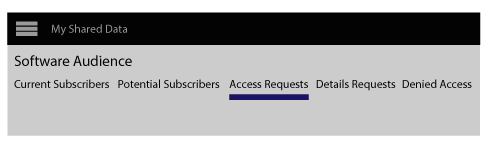
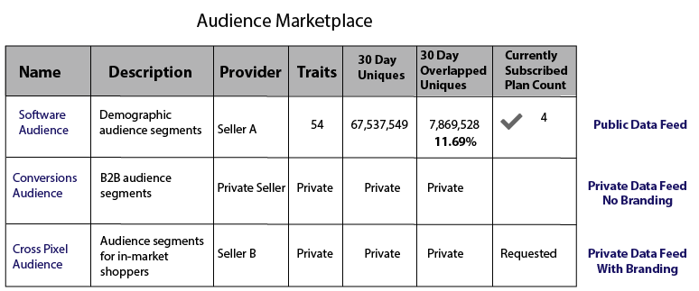

# os feeds de dados privados {#private-data-feeds}

Um feed de dados privado é uma opção que permite que os provedores limitem o acesso do comprador aos seus dados. Os provedores de dados e compradores devem revisar essas informações antes de criar e assinar feeds de dados privados.

<!-- c_marketplace_privatefeed.xml -->

## Feeds de dados privados para provedores {#private-data-feeds-providers}

Como provedor, seus feeds de dados podem ser públicos ou privados. Um feed de dados privado permite limitar o acesso do comprador aos seus dados, incluindo o nome do vendedor de dados. Você pode criar um feed de dados privado para oferecer ofertas e descontos especiais ou quando a privacidade e o controle de acesso forem importantes. Com um feed de dados privado, você pode revisar e aprovar solicitações do comprador. Depois de aprovar uma solicitação, o feed é semelhante a um feed de dados público para o comprador. Você pode exibir e gerenciar todos os seus feeds no **[!UICONTROL Audience Marketplace > My Shared Data]**. Como mostrado abaixo, esse tipo de feed é marcado como &quot;Privado&quot; na coluna de status.

### Gerenciar solicitações do feed

Ao clicar no nome de um feed de dados privado de [!UICONTROL My Shared Data], você será direcionado a uma página que contém várias guias. Clique em uma guia para gerenciar suas solicitações privadas de feed de dados.

A tabela a seguir define a função ou as funções fornecidas por cada guia de ação.

<table id="table_AFB429CA52A34658859448D9A5215F9F"> 
 <thead> 
  <tr> 
   <th colname="col1" class="entry"> Tabulação </th> 
   <th colname="col2" class="entry"> Descrição </th> 
  </tr> 
 </thead>
 <tbody> 
  <tr> 
   <td colname="col1"> 
 <b> Assinantes Atuais</b> 
 </td> 
   <td colname="col2"> 
Lista compradores aprovados que assinaram um feed de dados privado. 
 </td> 
  </tr> 
  <tr> 
   <td colname="col1"> 
 <b> Assinantes em Potencial</b> 
 </td> 
   <td colname="col2"> 
Lista compradores aprovados que não assinaram um feed de dados privado. 
 
Uma aprovação permite que os compradores visualizem um feed de dados como se ele fosse público. Isso lhes dá a chance de revisar e avaliar seus feeds antes de assinar. Você também pode oferecer descontos em feeds de dados para compradores listados como assinantes em potencial. Depois que o comprador assinar, seu perfil será movido para <b> Assinantes Atuais</b>. 
 </td>
  </tr> 
  <tr> 
   <td colname="col1"> 
 <b> Solicitações de acesso</b> 
 </td>
   <td colname="col2"> 
Lista novas solicitações de assinatura para um feed de dados privado. Clique nessa guia para revisar, aprovar ou rejeitar solicitações do comprador. 

    <ul id="ul_BE0A835A90B14C05B3F63226B79D052D"> 
     <li id="li_2C5686CEB6F4430BA18AED5AD75C330A">Compradores aprovados migram para <b> Assinantes em Potencial</b>. </li>
     <li id="li_929591FCF81E43A3881813BDBD3AC278">Compradores rejeitados mudam para <b> Acesso Negado</b>. </li>
    </ul> </td>
  </tr>
  <tr> 
   <td colname="col1"> 
 <b> Detalhes das Solicitações</b> 
 </td>
   <td colname="col2"> 
Lista compradores aprovados que ainda não se inscreveram em um feed de dados e solicitaram mais informações sobre seus feeds. 
 
Uma aprovação permite que os compradores visualizem um feed de dados como se ele fosse público. Isso lhes dá a chance de revisar e avaliar seus feeds antes de assinar. Você também pode oferecer descontos nos feeds de dados para compradores que solicitem acesso. Responder a uma solicitação de detalhes remove o perfil do comprador desta guia. Se ainda não se inscreveram, o perfil de comprador ainda é de <b> assinantes em potencial</b>. 
 </td>
  </tr>
  <tr> 
   <td colname="col1"> 
 <b> Acesso Negado</b> 
 </td> 
   <td colname="col2"> 
Lista solicitações de assinatura rejeitadas para um feed de dados privado. 
 
Para aprovar novamente os compradores negados, altere o  Status de Rejeição para <b> Permitir</b>. O comprador será movido para <b> Assinantes em Potencial</b>. 
 </td> 
  </tr> 
 </tbody> 
</table>

### Próximas etapas

A documentação a seguir pode ajudar você a começar a usar os feeds de dados privados.

* [Criar um Feed de Dados Público ou Privado](../../features/audience-marketplace/marketplace-data-providers/marketplace-create-manage-feeds.md#create-public-private-data-feed)
* [Revisar, Aprovar ou Rejeitar Solicitações de Feed Privado](../../features/audience-marketplace/marketplace-data-providers/marketplace-create-manage-feeds.md#manage-private-requests)
* [Feeds de dados privados para compradores](../../features/audience-marketplace/marketplace-private-feeds.md#private-data-feeds-for-buyers)

## Feeds de dados privados para compradores {#private-data-feeds-for-buyers}

Como comprador, os feeds de dados privados aparecem no [Marketplace](../../features/audience-marketplace/marketplace-data-buyers/marketplace-data-buyers.md#about-marketplace) como qualquer outra oferta. No entanto, nesse caso, a lista de feeds não mostra informações de resumo para características, usuários únicos e sobreposição de usuário. Além disso, o vendedor de dados tem a opção de mostrar ou ocultar seu nome na coluna [!UICONTROL Provider] da lista [!UICONTROL Marketplace]. Depois que o vendedor aprovar sua solicitação de assinatura, todos os dados em um feed privado ficarão disponíveis para você (funciona como um feed público). O exemplo de [!UICONTROL Marketplace] abaixo lista os 3 tipos de feed diferentes disponíveis para você como comprador.

Os tipos de feed incluem:

A tabela descreve como esses diferentes tipos de feed mostram ou ocultam dados.

<table id="table_41D4A798ACF548A3A03ACB427CA4652D"> 
 <thead> 
  <tr> 
   <th colname="col1" class="entry"> Tipo de feed </th> 
   <th colname="col2" class="entry"> Descrição </th> 
  </tr> 
 </thead>
 <tbody> 
  <tr> 
   <td colname="col1"> 
<b> Público</b> 
 </td> 
   <td colname="col2"> 
O nome, a característica e os dados exclusivos do provedor são exibidos na lista. 
 </td> 
  </tr> 
  <tr> 
   <td colname="col1"> 
<b> Privado Sem Marca</b> 
 </td> 
   <td colname="col2"> 
O nome do provedor é definido como "Vendedor privado", e você não pode ver as contagens de características, os dados exclusivos e os dados de sobreposição de características. 
 </td> 
  </tr> 
  <tr> 
   <td colname="col1"> 
<b> Particular Com Identidade Visual</b> 
 </td> 
   <td colname="col2"> 
O nome do provedor é exibido na lista, mas você não pode ver as contagens de características, os dados exclusivos e os dados de sobreposição de características. 
 </td> 
  </tr> 
 </tbody> 
</table>

### Próximas etapas

Consulte [Assinar um Feed de Dados Privado](../../features/audience-marketplace/marketplace-data-buyers/marketplace-manage-subscriptions.md#subscript-private-data-feed) para solicitar acesso.

## Como configurar a relação de compartilhamento entre o provedor de dados e o comprador de dados {#set-up-sharing-relationship}

### Etapa 1 - Ativação - Provedor de dados e Comprador de dados

A primeira etapa do processo requer a intervenção da Adobe Consulting ou do Atendimento ao cliente. O provedor e o comprador de dados devem entrar em contato com a Adobe Consulting ou com o Atendimento ao cliente para solicitar a ativação.

### Etapa 2 - Provedor de dados - Criar novo Source de dados

Na sua conta Audience Manager, crie uma nova fonte de dados de cookie com:

* **Audience Manager ID** como chave de entrada;
* Opção **Compartilhamento Habilitado** marcada.

Depois de clicar em **Salvar**, uma nova subpasta será criada automaticamente em **Armazenamento de características > Dados de terceiros**.

### Etapa 3 - Provedor de dados - Identificar características para compartilhamento

Nesta etapa, você identifica as características que deseja compartilhar com seu parceiro. Você pode criar novas características ou editar características existentes. Em qualquer caso, você precisa das características:

* Para ser associado à fonte de dados criada como parte da etapa 2.
* Para ser armazenado na subpasta recém-criada, em dados de terceiros.

Leia mais sobre [criação de características](/help/using/features/traits/create-onboarded-rule-based-traits.md) e [edição de características](/help/using/features/traits/manage-trait-rules.md#edit-trait).

### Etapa 4 - Provedor de dados - Criar feed de dados

Em seguida, crie um feed de dados para compartilhar suas características com o comprador de dados. Consulte [Criar um Feed de Dados Público ou Privado](/help/using/features/audience-marketplace/marketplace-data-providers/marketplace-create-manage-feeds.md) para obter instruções sobre como criar um feed de dados.

>[!IMPORTANT]
>
>Em Configurações, selecione a opção Privado. Se você definir esse campo como Público, qualquer cliente do Audience Marketplace poderá assinar seu feed.

### Etapa 5 - Comprador de dados - Solicitar acesso

Vá para **Audience Marketplace > Marketplace**. Procure o feed de dados criado pelo provedor de dados na etapa anterior. Clique em **Solicitar Acesso**. O contato designado do lado do provedor de dados agora receberá uma notificação por email. Consulte também [Assinar um Feed de Dados Privado](/help/using/features/audience-marketplace/marketplace-data-buyers/marketplace-manage-subscriptions.md#subscript-private-data-feed).

### Etapa 6 - Provedor de dados - Conceder acesso

Vá para **Audience Marketplace > Meus dados compartilhados** e procure pelo feed criado na etapa 4. Clique na nova solicitação de acesso e em **Permitir acesso** para aprovar a solicitação. Consulte também [Revisar, Aprovar ou Rejeitar solicitações de feed privado](/help/using/features/audience-marketplace/marketplace-data-providers/marketplace-create-manage-feeds.md#manage-private-requests).

### Etapa 7 - Comprador De Dados - Ativar Assinatura

Depois que o provedor de dados conceder acesso ao feed de dados, você poderá ver o feed em sua conta em **Audience Marketplace > Marketplace**. Revise os detalhes, ative o botão Assinatura e clique em **Revisar e Assinar**. Consulte [Armazenamento para feeds de dados assinados](/help/using/features/audience-marketplace/marketplace-data-buyers/marketplace-manage-subscriptions.md#find-subscribed-data-fee) para obter informações sobre onde encontrar as características de terceiros.

Observe que essas características só podem ser editadas na conta do provedor de dados.
