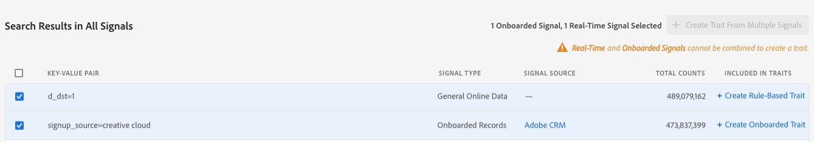

# Criar características de sinais

Crie novas características de todos os sinais, incluindo aqueles que já estão em características, e capturam públicos futuros que se qualificam após a criação de características. Assista ao vídeo para obter uma demonstração rápida ou ler para obter informações detalhadas:

>[!VIDEO](https://video.tv.adobe.com/v/25169/?quality=12&captions=por_br)

## Create Traits from Signal Dashboard {#create-traits-from-signal-dashboard}

The [!UICONTROL Signal Dashboard] allows you to create new traits from the [!UICONTROL Top Unused Signals], [!UICONTROL New Unused Signals], and your saved searches.

Quando você cria uma nova característica, o tipo de característica é pré-definido com base no tipo de sinal:

* **[!UICONTROL Rule-based]** características para sinais em tempo real, arquivos de registro acionáveis e [!DNL Adobe Analytics] sinais;

* **[!UICONTROL Onboarded]** características para sinais integrados.

To create new traits from the **[!UICONTROL Signal Dashboard]**, identify the signal that you want to use in the trait, then click the corresponding **[!UICONTROL Create Rule-Based Trait]** or **[!UICONTROL Create Onboarded Trait]** link.

You&#39;ll be redirected to the **[Trait Builder](../../features/traits/about-trait-builder.md)** to create your new trait(s).

## Create Traits from Signal Search {#create-traits-from-signal-search}

Create traits based on used or unused signals that are not shown in the [!UICONTROL Signal Dashboard].

Pesquise sinais específicos e crie características baseadas em regras ou em regras com base nos resultados. Veja como fazer isso:

1. Go to **[!UICONTROL Audience Data > Signals > Search]** and run a search based on the key-value pairs that you are looking for, or click **[!UICONTROL Search]** without entering any key-value pair to display all results.
2. Identifique os sinais que deseja usar na característica, na lista de resultados.
   * To create a trait from one signal, click the corresponding **[!UICONTROL Create Rule-Based Trait]** or **[!UICONTROL Create Onboarded Trait]** link.
   * To create a trait from multiple signals, click the corresponding check box of each signal, then click **[!UICONTROL Create Trait from Multiple Signals]**.
   >[!NOTE]
   >Só é possível criar características de sinais do mesmo tipo. Não é possível criar uma característica com base em uma combinação de um sinal em tempo real e uma opção de onboard.
   >
   > 
   >Também é possível criar características de sinais usados. Signals that are already used in traits have the number of traits displayed in the **[!UICONTROL Included in Traits]** column. Clique na seta para ver as características que incluem o sinal.
   >
   >

3. Use the **[Trait Builder](../../features/traits/about-trait-builder.md)** to create your new traits.
