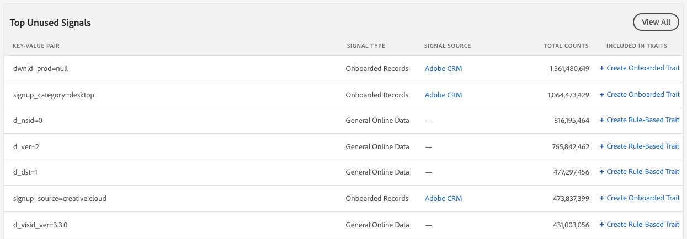

# Painel de sinais {#signals-dashboard}

Obtenha uma visão geral dos sinais não utilizados recebidos pelo Audience Manager nos últimos sete dias e identifique novas características em potencial. Os sinais não utilizados atingem o Audience Manager das suas propriedades online, mas não são usados em nenhuma das suas características existentes. Para exibir o [!UICONTROL Signals Dashboard], vá para [!UICONTROL Audience Data] > [!UICONTROL Signals]. O [!UICONTROL Signals Dashboard] mostra insights acionáveis com base nos sinais não usados mais ativos.

>[!IMPORTANT]
>
>As seções **[!UICONTROL Top Unused Signals]** e **[!UICONTROL New Unused Signals]** exibem apenas registros com mais de **100 ocorrências/hora**. Os sinais abaixo desse limite estão incluídos em [!UICONTROL Signals Search].

## Principais sinais não utilizados {#top-unused-signals}

Esta seção mostra os 50 principais sinais não utilizados (novos e antigos) enviados a [!DNL Audience Manager] nos últimos 7 dias, com base em sua contagem total. Dependendo dos dados recebidos por [!DNL Audience Manager], esta tabela pode incluir algumas ou todas as entradas da tabela **Novos sinais não utilizados**.

## Novos sinais não utilizados {#new-unused-signals}

Esta seção mostra os 50 novos sinais não usados recebidos nos últimos 7 dias.

## Pesquisas salvas {#saved-searches}

[!DNL Audience Manager] mostra todas as suas [pesquisas salvas](../../features/data-explorer/data-explorer-signals-search/data-explorer-save-search.md) no [!UICONTROL Dashboard] e as recarrega sempre que você carrega o [!UICONTROL Dashboard].

As pesquisas salvas exibem os 50 principais resultados para os critérios correspondentes.

Assista ao vídeo abaixo para saber como usar o [!UICONTROL Signals Dashboard].
>[!VIDEO](https://video.tv.adobe.com/v/25151/)
