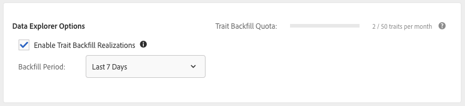
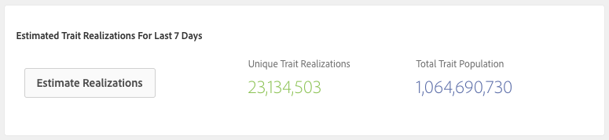

# Realizações de características de preenchimento retroativo {#backfill-trait-realizations}

Realizações de características de preenchimento retroativo para capturar públicos-alvo históricos e evitar a perda de dados relevantes antes de uma data de criação de características.

>[!IMPORTANT]
>
>O [!UICONTROL Data Explorer Trait Backfill] é um recurso premium que melhora a experiência do Audience Manager ao desbloquear casos de uso adicionais. O preenchimento retroativo requer capacidade de processamento adicional e está disponível para todos os clientes da Audience Manager a um custo incremental. Entre em contato com o representante de vendas da Adobe para obter mais detalhes.

Ao criar características a partir de sinais não utilizados, é possível optar por preencher retroativamente as realizações de características em um período específico. [!DNL Audience Manager] captura os dados históricos sobre públicos qualificados para a nova característica e os armazena no perfil correspondente. Você pode ver o **[!UICONTROL Backfill Options]** na seção [!UICONTROL Trait Expression] do **[Construtor de características](../../features/traits/about-trait-builder.md)**.

>[!NOTE]
>
>Você pode preencher retroativamente realizações de características com base em regras e características integradas.

Veja como preencher retroativamente realizações de características:

1. Vá para o [!UICONTROL Audience Data > Signals > Search] e execute uma Pesquisa de Sinais ou use o [Painel de Sinais](../../features/data-explorer/data-explorer-signals-dashboard.md) para identificar os sinais a serem usados na nova característica.
1. Crie uma nova característica com base nos sinais desejados.
1. Use o **[!UICONTROL Backfill Options]** na seção **[!UICONTROL Trait Expression]** para selecionar o intervalo de tempo no qual você deseja preencher retroativamente as realizações de características. Os intervalos de preenchimento retroativo predefinidos incluem 1, 7, 14 e 30 dias. Você também pode escolher um intervalo de datas personalizado de até 30 dias.

   

1. (Opcional) Clique em **[!UICONTROL Estimate Realizations]** na seção **[!UICONTROL Estimated Trait Realizations]** para ver os valores estimados de [!UICONTROL Unique Trait Realizations] e [!UICONTROL Total Trait Population] para a característica de preenchimento retroativo dos últimos 7 dias.

   

   >[!IMPORTANT]
   >
   >O preenchimento retroativo de características e a estimativa não estão disponíveis para características com expressões que usam os seguintes operadores:
   >    * `!=`
   >    * `matchesregex`
   >    * `matcheswords`
1. Crie a característica.

Quando terminar de criar a característica, você verá suas realizações preenchidas retroativamente incluídas nas estatísticas de realização.

Assista ao vídeo abaixo para obter uma apresentação em vídeo sobre como preencher características.

>[!VIDEO](https://video.tv.adobe.com/v/25169/)

## Latência de preenchimento retroativo de característica {#trait-backfilling-latency}

As características recém-criadas começam a capturar públicos duas a três horas após a criação. No entanto, devido ao grande volume de dados que o [!DNL Audience Manager] executa diariamente, a população preenchida retroativamente não é refletida imediatamente nos gráficos [!UICONTROL Unique Trait Realizations] e [!UICONTROL Total Trait Population].

O Audience Manager atualiza o [!UICONTROL Trait Graph] com a população preenchida retroativamente dentro de 48 horas após a criação da característica.

## Limite de preenchimento retroativo de característica {#trait-backfilling-limit}

O [!UICONTROL Data Explorer] permite o preenchimento retroativo de até 50 características por mês, com o contador de preenchimento retroativo sendo redefinido no dia 1 de cada mês.

>[!NOTE]
>
>A cota de preenchimento retroativo de características não é transferida dos meses anteriores. Por exemplo, se você preencher retroativamente 30 características este mês, a cota de preenchimento retroativo de característica para o próximo mês será redefinida como 50, não 70.

## Impacto nos relatórios {#reporting-impact}

As realizações de características com preenchimento retroativo são refletidas nas métricas [!UICONTROL Unique Trait Realizations] e [!UICONTROL Total Trait Population], já que [!DNL Audience Manager] transforma sinais históricos em realizações de características.

No entanto, [!UICONTROL Trait Graph], [!UICONTROL General Reports] e [!UICONTROL Trend Reports] não são atualizados retroativamente com métricas históricas preenchidas retroativamente antes da data de criação da característica.
