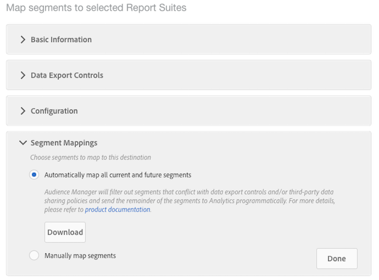

# Configurar um destino do Analytics

## Requisitos {#requirements}

Para configurar um destino do Analytics, o usuário do Audience Manager deve ter permissões de Administrador. Consulte [Criar usuários](/help/using/features/administration/administration-overview.md#create-users) no Guia de administração. Observe que ter a `CREATE_DESTINATIONS` [permissão curinga](/help/using/features/administration/administration-overview.md#wild-card-permissions) não é suficiente para criar destinos do Analytics.
Para obter mais requisitos, consulte Pré-requisitos em [Audience Analytics](https://docs.adobe.com/content/help/en/analytics/integration/audience-analytics/mc-audiences-aam.html).

## Seu destino padrão do Analytics e novos destinos do Analytics

| Tipo de destino do Analytics | Descrição |
|---|---|
| Padrão | O nome desse destino padrão é &quot;Adobe Analytics&quot;, que pode ser editado. As IDs de conjunto de relatórios mapeadas aparecem no armazenamento de pastas para suas características e segmentos do Audience Manager.    O Audience Manager cria um destino automaticamente se sua conta tiver:     <ul><li>Satisfaz os requisitos descritos na documentação [Audience Analytics](https://docs.adobe.com/content/help/en/analytics/integration/audience-analytics/mc-audiences-aam.html).</li><li>Um [conjunto de relatórios](https://docs.adobe.com/content/help/en/analytics/admin/manage-report-suites/report-suites-admin.html) no Analytics.</li><li>[Mapeado um conjunto de relatórios para uma organização](https://docs.adobe.com/content/help/en/core-services/interface/about-core-services/report-suite-mapping.html).</li></ul> |
| Novo | Para criar novos destinos do Analytics, vá para Dados de público-alvo > Destinos > Criar novo destino e siga as etapas para cada seção descrita abaixo. |

## Etapa 1: Fornecer informações básicas

Esta seção contém campos e opções que iniciam o processo de criação de destino do Analytics. Para concluir esta seção:

1. Clique em **Informações básicas** para expor os controles.
2. Nomeie o destino. Evite abreviações e caracteres especiais.
3. *(Opcional)* Descreva o destino. Uma descrição concisa é uma maneira eficaz de definir ou fornecer mais informações sobre um destino.
4. *(Opcional)* Na  **** lista Plataforma, deixe o padrão definido como  **Todos**. Atualmente, essas opções não fazem nada. Eles foram projetados para oferecer suporte a recursos que podem ser adicionados posteriormente.
5. Na lista **Category**, selecione **Adobe Experience Cloud**.
6. Na lista **Type**, selecione **Adobe Analytics**.
7. Clique em **Salvar** para ir para as Configurações ou clique em **Rótulos de exportação de dados** para aplicar controles de exportação ao destino.

>[!NOTE]
>
>Para um destino do Analytics, as caixas de seleção **Mapeamento de destino de preenchimento automático** e **ID de segmento** são selecionadas por padrão. Não é possível alterar essas configurações.

## Etapa 2: Configurar controles da exportação de dados

Esta seção contém opções que se aplicam [Controles da exportação de dados](/help/using/features/data-export-controls.md) a um destino do Analytics. Ignore esta etapa se você não usar controles de exportação de dados. Para concluir esta seção:

1. Clique em **Data Export Controls** para expor os controles.
1. Selecione um rótulo que corresponda ao controle de exportação de dados aplicado ao destino (consulte [Adicionar rótulos de exportação de dados a um destino](/help/using/features/destinations/add-data-export-labels.md) ). Para destinos do Analytics, a caixa de seleção PII é selecionada por padrão.
1. Clique em **Salvar**.

## Etapa 3: Mapear conjuntos de relatórios

A seção Configuração lista seus Conjuntos de relatórios do Analytics que foram habilitados para encaminhamento pelo lado do servidor. Se você tiver vários destinos do Analytics, os conjuntos de relatórios atribuídos a esses destinos serão mutuamente exclusivos e aplicados pelo Audience Manager. Para concluir esta seção:

1. Clique em **Configuration** para expor os controles.
1. Selecione um (ou mais) conjunto de relatórios para o qual você deseja enviar segmentos.
1. Clique em **Salvar**.

## Etapa 4: Mapeamentos de segmento

Esta seção fornece opções que permitem mapear segmentos automaticamente ou manualmente.

| Opção de mapeamento | Descrição |
|---|---|
| Mapear automaticamente todos os segmentos atuais e futuros | Selecionado por padrão, esse recurso envia todos os segmentos para os quais um visitante está qualificado, em uma base por ocorrência, para o Analytics.    Se um visitante pertencer a mais de 150 segmentos de Audience Manager em uma única ocorrência, somente os 150 segmentos qualificados mais recentemente serão enviados ao Analytics, enquanto a lista restante ficará truncada. Um sinalizador adicional é enviado ao Analytics, o que significa que a lista de segmentos foi truncada. Essa ação é exibida como &quot;Limite de público-alvo atingido&quot; na dimensão Nome de públicos-alvo e &quot;1&quot; na dimensão ID de públicos-alvo. Consulte as [Perguntas frequentes](https://docs.adobe.com/content/help/en/analytics/integration/audience-analytics/audience-analytics-workflow/mc-audiences-faqs.html) para obter detalhes.    Além disso, essa opção afeta a disponibilidade de destino no  [Construtor de segmentos](/help/using/features/segments/segment-builder.md). Por exemplo, se um segmento é mapeado automaticamente para um destino do Analytics, esse destino não está disponível para seleção na seção [mapeamentos de destino](/help/using/features/segments/segment-builder.md#segment-builder-controls-destinations) do Construtor de segmentos. O destino do Analytics aparece esmaecido e mostra &quot;Analytics&quot; na coluna Tipo do navegador de destino. |
| Mapear segmentos manualmente | Essa opção expõe os controles de pesquisa e navegação que permitem escolher quais segmentos você deseja enviar para o Analytics.    Para procurar um segmento:     <ol><li>Digite o nome ou a ID do segmento no campo de pesquisa.</li><li>Clique em <b>Adicionar.</b></li><li>Continue a pesquisar e adicionar segmentos ou clique em <b>Concluído</b>.</li></ol>   Para procurar um segmento: <ol><li>Clique em <b>Procurar todos os segmentos</b>. Isso expõe uma lista de segmentos disponíveis.</li><li>Na lista, marque a caixa de seleção do segmento que deseja usar e clique em <b>Adicionar segmentos selecionados</b>.</li><li>Clique em <b>Save</b> na janela Adicionar Mapeamentos. Não é possível alterar os mapeamentos, datas de início ou término durante a versão beta.</li><li>Continue a navegar e adicionar segmentos ou clique em <b>Concluído</b>.</li></ol>  |

## Próximas etapas

Depois de criar e salvar um destino, você pode trabalhar com esses dados no Analytics. No entanto, pode levar algumas horas até que os dados estejam disponíveis nos conjuntos de relatórios selecionados. Consulte [Usar os dados de público-alvo no Analytics](https://docs.adobe.com/content/help/en/analytics/integration/audience-analytics/audience-analytics-workflow/use-audience-data-analytics.html).
