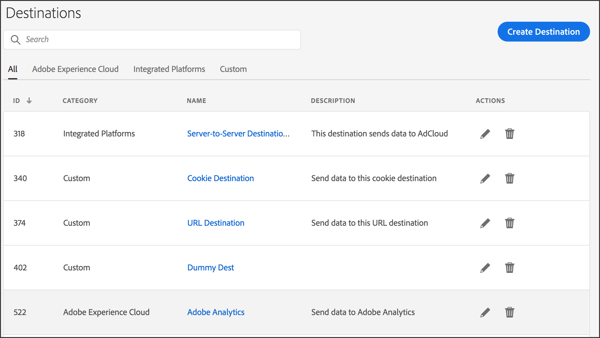

# Página inicial Destinos {#destinations-home}

A página de aterrissagem do [!UICONTROL Destination] lista todos os seus destinos do [!DNL URL], cookie e servidor para servidor. Ele fornece recursos que permitem criar, editar, pesquisar e relatar destinos. A página de aterrissagem está localizada em **[!UICONTROL Audience Data > Destinations]**.

## Página inicial padrão {#default-landing-page}

<!-- destinations-home.xml -->

A landing page padrão lista seus destinos de acordo com o tipo. Você pode filtrar os destinos usando as quatro guias disponíveis:

* **Todos**: mostra todos os tipos de destinos.
* **Adobe Experience Cloud**: mostra destinos que enviam dados para outras soluções da Adobe Experience Cloud. Atualmente, a única opção compatível é o Adobe Analytics. Consulte [Configurar um destino do Analytics](/help/using/features/destinations/create-analytics-destination.md).
* **Plataformas integradas**: mostra destinos com base em pessoas e em dispositivos (também chamados de destinos de servidor para servidor).
* **Personalizado**: mostra destinos de cookies e URL.

## Página de aterrissagem de públicos-alvo endereçáveis {#audiences-landing-page}

Para ver os dados de público-alvo e as taxas de correspondência do seu destino de servidor para servidor, selecione **[!UICONTROL Integrated Platforms > Device-Based]**.

Para obter mais informações sobre as informações exibidas, consulte [Interface de Públicos Endereçáveis](/help/using/features/addressable-audiences.md#addressable-audience-interface).

