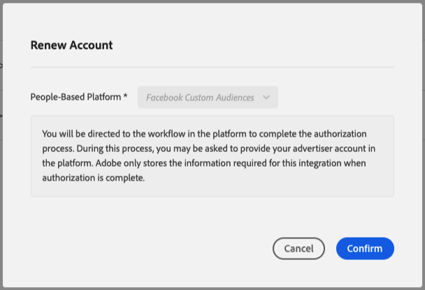

# Autenticação com plataformas com base em pessoas {#authentication-with-people-based-platforms}

>[!IMPORTANT]
>Este artigo contém a documentação do produto destinada a orientá-lo pela configuração e pelo uso desse recurso. Nada contido aqui é aconselhamento jurídico. Consulte seu próprio serviço jurídico para obter orientação jurídica.

Esta página contém orientação sobre como configurar e gerenciar a integração
entre plataformas baseadas em Audience Manager e pessoas.

>[!NOTE]
>Essa é uma etapa obrigatória para Destinos com base em pessoas, independentemente do cenário de implementação.

## Configurar a autenticação da plataforma baseada em pessoas {#configure-authentication}

1. Faça logon em sua conta Audience Manager e vá para **[!UICONTROL Administration]** > **[!UICONTROL Integrated Accounts]**. Se você tiver uma integração configurada anteriormente com uma plataforma social, deverá vê-la listada nesta página. Caso contrário, a página ficará vazia.
   
2. Clique em **[!UICONTROL Add Account]**.
3. Use o menu suspenso **[!UICONTROL People-Based Platform]** para selecionar a plataforma com a qual deseja configurar a integração.
   
4. Clique em **[!UICONTROL Confirm]** para ser redirecionado para a página de autenticação da plataforma selecionada.
5. Depois de autenticar em sua conta da plataforma social, você é redirecionado para o Audience Manager, onde deve ver suas contas de anunciante associadas. Selecione a conta de anunciante que deseja usar e clique em **[!UICONTROL Confirm]**.
6. O Audience Manager exibe uma notificação na parte superior da página para que você saiba se a conta foi adicionada com êxito. A notificação também permite adicionar um endereço de email de contato para receber notificações do Adobe quando a autenticação da plataforma social estiver prestes a expirar.

## Expiração do token de autenticação e gerenciamento de notificações {#token-expiration-notification}

O Audience Manager lida com sua integração com plataformas sociais por meio de tokens de autenticação que expiram após um determinado período. A duração da validade do token está sujeita às regras de integração de cada plataforma social. Depois que o token de autenticação expira, o Audience Manager não pode enviar os segmentos de público-alvo para o destino. Para evitar esse cenário, recomendamos adicionar pelo menos um endereço de email de contato à integração, para que você seja notificado assim que o token de autenticação estiver prestes a expirar. Quando isso acontece, você pode autenticar novamente para garantir que o destino continue a receber os segmentos de público-alvo.

Veja como adicionar endereços de email a integrações existentes:

1. Faça logon em sua conta Audience Manager e vá para **[!UICONTROL Administration]** > **[!UICONTROL Integrated Accounts]**.
1. Identifique a integração para a qual você deseja receber notificações de expiração de token e clique no ícone **[!UICONTROL Edit]**.
1. Insira os endereços de email nos quais você deseja receber notificações de expiração de token, separados por vírgulas.
1. Clique em **[!UICONTROL Save]**.

## Renovação do token de autenticação {#token-renewal}

Quando um token de autenticação expira, a integração entre o Audience Manager e a plataforma social correspondente é interrompida, de modo que o Audience Manager não pode mais enviar segmentos de público-alvo para o destino. A página [!UICONTROL Integrated Accounts] mostra o status de expiração de cada integração na coluna [!UICONTROL Expiration] e permite que você renove a autenticação a qualquer momento.

Veja a seguir como renovar uma autenticação expirada ou prestes a expirar:
1. Faça logon em sua conta Audience Manager e vá para **[!UICONTROL Administration]** > **[!UICONTROL Integrated Accounts]**.
1. Identifique a integração para a qual você precisa renovar a autenticação. Autenticações expiradas são marcadas como [!UICONTROL Expired], enquanto autenticações que estão prestes a expirar em breve mostram o número restante de dias autenticados.
1. Clique no ícone **[!UICONTROL Renew]** correspondente na coluna [!UICONTROL Expiration]. Isso aciona o fluxo de trabalho **[!UICONTROL Renew Account]**, que orienta você pela página de autenticação da plataforma social. Depois de autenticado, o token é renovado com a nova data de expiração.
   
