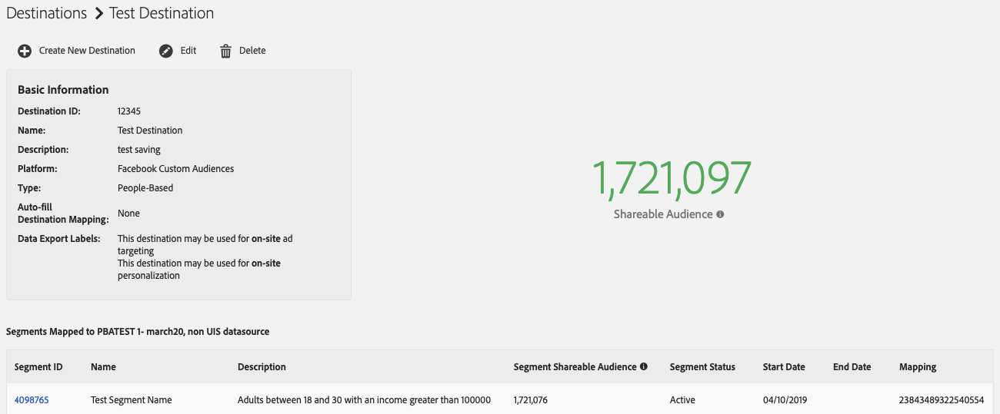

# Públicos compartilháveis {#shareable-audiences}

>[!IMPORTANT]
>Este artigo contém a documentação do produto destinada a orientá-lo pela configuração e pelo uso desse recurso. Nada contido aqui é aconselhamento jurídico. Consulte seu próprio serviço jurídico para obter orientação jurídica.

[!DNL People-Based Destinations] trazer a noção de [!DNL Shareable Audiences] para Audience Manager. Essa métrica ajuda você a entender quantos dos endereços de email com hash do Audience Manager podem compartilhar com a plataforma de destino.

[!DNL Shareable Audiences] é uma métrica que ajuda a interpretar os dados do público-alvo no contexto de [!DNL People-Based Destinations]. É possível ver essa métrica na variável [!UICONTROL Destinations] página e no [!UICONTROL Segment] página.

## Segmentar públicos compartilháveis {#segment-shareable-audiences}

A variável [!DNL Segment Shareable Audience] métrica na página segmento indica o número de endereços de email com hash da fonte de dados com correspondência [DPUUIDs](../../reference/ids-in-aam.md), que também se qualificam para o segmento definido no período de retrospectiva determinado, considerando a regra de mesclagem de perfis aplicada a ele e esse Audience Manager pode compartilhar com a plataforma de destino.

Essa métrica tem um período retroativo de um dia. Isso ajuda você a entender o alcance do público-alvo para o segmento em um destino específico.

## Público-alvo compartilhável de destino {#destination-shareable-audience}

A variável [!DNL Destination Shareable Audience] métrica em uma página de destino baseada em pessoas indica o número total de endereços de email com hash da fonte de dados com correspondência [DPUUIDs](../../reference/ids-in-aam.md), esse Audience Manager pode compartilhar com a plataforma de destino, a partir de todos os segmentos mapeados para esse destino.

Essa métrica tem um período de retrospectiva de vida útil. Isso ajuda você a entender a escala do público-alvo que pode ser acessado a partir da fonte de dados de endereços de email com hash.

## Exemplo

Um cliente Audience Manager tem uma fonte de dados com 110.000 [DPUUIDs](../../reference/ids-in-aam.md) (IDs de CRM). Eles assimilam 100.000 endereços de email com hash no Audience Manager, para usá-los com vários destinos com base em pessoas, e executam uma sincronização de ID para os 100.000 endereços de email com hash nas IDs do CRM. O cliente pode usar o [!DNL All Cross-Device Profiles] regra de mesclagem para criar três segmentos de público-alvo:

* Segmento A com uma contagem de população de 10.000, mapeado para o Destino A;
* Segmento B com uma contagem de população de 20.000, mapeado para o Destino A;
* Segmento C com uma contagem de população de 50.000, mapeado para o Destino B.

Neste cenário:

* Público-Alvo Compartilhável Do Segmento A = 10.000;
* Público-alvo compartilhável do segmento B = 20.000;
* Público-alvo compartilhável do segmento C = 50.000;
* Público-Alvo Compartilhável Do Destino A = Público-Alvo Compartilhável Do Segmento A + Público-Alvo Compartilhável Do Segmento B = 30.000;
* Público-alvo compartilhável do Destino B = Público-alvo compartilhável do Segmento C = 50.000.

>[!NOTE]
>
>No exemplo acima, isso não significa que todos os 80.000 endereços de email com hash dos três segmentos correspondam às contas existentes nas plataformas de destino. Isso significa apenas que o Audience Manager envia os identificadores com hash dos três segmentos para seus respectivos destinos. Ao enviar segmentos de público-alvo para destinos com base em pessoas, a correspondência de públicos-alvo ocorre no lado do parceiro. O Destino A pode ter até 30.000 contas de usuário correspondentes, enquanto o Destino B pode ter até 50.000 contas de usuário correspondentes, mas não há garantia de taxas de correspondência. O Adobe não tem acesso a métricas específicas do parceiro. Consulte [Taxas de correspondência](../../faq/faq-people-based-destinations.md#match-rates) para perguntas frequentes sobre a visibilidade de Destinos com base em pessoas nas taxas de correspondência.
