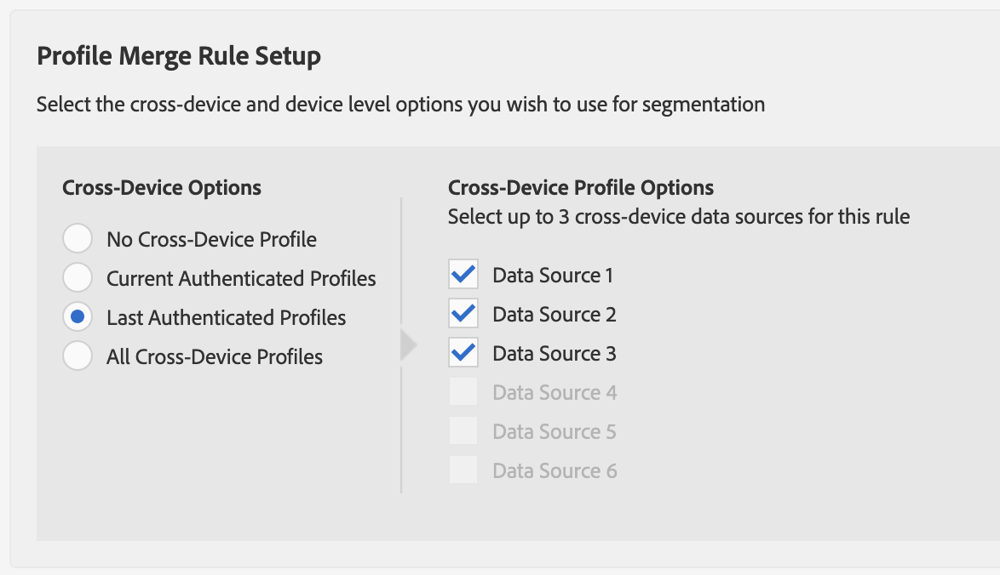

# Fluxo de trabalho C - Personalização baseada na Atividade autenticada combinada com dados offline {#workflow-c}

>[!IMPORTANT]
>Este artigo contém a documentação do produto destinada a orientá-lo durante a configuração e o uso deste recurso. Nada aqui contido é aconselhamento jurídico. Consulte o seu próprio advogado para obter orientação jurídica.

Esta página inclui orientações passo a passo sobre como combinar dados offline [!DNL CRM] com dados comportamentais em tempo real para usuários autenticados criarem segmentos de audiência e, em seguida, enviarem esses segmentos de audiência para [!DNL People-Based Destinations].

## Etapa 1 - Definir configurações da fonte de dados {#configure-data-source-settings}

Dependendo de seus [DPUUIDs](../../reference/ids-in-aam.md) serem endereços de email com hash e minúsculas, talvez seja necessário configurar a fonte de dados que armazenará os endereços de email com hash.

 

**Cenário 1: seus[DPUUIDs](../../reference/ids-in-aam.md)já têm endereços de email com hash em minúsculas.**

Nesse caso, pule para a [Etapa 5 - Configurar a autenticação](#configure-authentication)do Platform baseada em pessoas.

 

**Cenário 2: seus[DPUUIDs](../../reference/ids-in-aam.md)não são endereços de email com hash em minúsculas.**

Nesse caso, é necessário criar uma nova fonte de dados entre dispositivos que armazene seus endereços de email com hash. Veja como fazer isso:

1. Faça logon na sua conta do Audience Manager, vá para **[!UICONTROL Audience Data]** -> **[!UICONTROL Data Sources]** e clique em **[!UICONTROL Add New]**.
1. Insira um **[!UICONTROL Name]** e **[!UICONTROL Description]** para sua nova fonte de dados.
1. No menu **[!UICONTROL ID Type]** suspenso, selecione **[!UICONTROL Cross Device]**.
1. Na **[!UICONTROL Data Source Settings]** seção, selecione as opções **[!UICONTROL Inbound]** e **[!UICONTROL Outbound]** e ative a **[!UICONTROL Share associated cross-device IDs in people-based destinations]** .
1. Use o menu suspenso para selecionar o **[!UICONTROL Emails(SHA256, lowercased)]** rótulo dessa fonte de dados.
   >[!IMPORTANT]
   >
   >Essa opção rotula somente a fonte de dados como contendo dados com hash com esse algoritmo específico. Audience Manager não hash os dados nesta etapa. Verifique se os endereços de email que você planeja armazenar nessa fonte de dados já estão com hash com o [!DNL SHA256] algoritmo. Caso contrário, você não poderá usá-lo para [!DNL People-Based Destinations].

   

   >[!NOTE]
   >
   > Consulte Integração de [dados](people-based-destinations-prerequisites.md#data-onboarding) para obter perguntas frequentes sobre como você deve colocar seus dados offline no Audience Manager para destinos baseados em pessoas.

Assista ao vídeo abaixo para ver um tutorial em vídeo sobre como criar uma fonte de dados para [!UICONTROL People-Based Destinations].

>[!VIDEO](https://video.tv.adobe.com/v/29006/)

## Etapa 2 - Usar IDs declaradas para corresponder DPUUIDs a endereços de email com hash por meio de chamadas HTTP em tempo real {#match-email-addresses}

Para qualificar usuários autenticados para características com base em regras, é necessário enviar a qualificação de característica por meio de IDs declaradas.

### Exemplo

Digamos que você tenha criado as duas fontes de dados a seguir.

| ID da fonte de dados | Conteúdo da fonte de dados |
| -------------- | -------------------------- |
| 999999 | DPUUIDs existentes (IDs CRM) |
| 987654 | Endereços de email em hash |

 

Em seguida, você deseja qualificar as IDs de CRM abaixo para a característica na tabela.

| DPUUID (CRM ID) | Seu endereço de email | Endereço de email com hash | Característica |
| -------------------------------------- | --------------------- | ---------------------------------------------------------------- | ------------- |
| 68079982765673198504052656074456196039 | `johndoe@example.com` | 55e79200c1635b37ad31a378c39feb12f120f116625093a19bc32fff15041149 | localização = EUA |

 

Sua ID declarada deve seguir esta sintaxe:

`https://yourDomain.demdex.net/event?d_cid_ic=HashedEmailDataSourceIntegrationCode%01myHashedEmail&d_cid_ic=CRMDataSourceIntegrationCode%01myCRMID&key=value`

 

No exemplo acima, a chamada de ID declarada deve ter a seguinte aparência:

`https://yourDomain.demdex.net/event?d_cid_ic=MyHashedEmailDataSource%0155e79200c1635b37ad31a378c39feb12f120f116625093a19bc32fff15041149&d_cid_ic=MyCRMDataSource%0168079982765673198504052656074456196039&location=US`

## Etapa 3 - Criar uma regra de união de Perfis para segmentação {#create-profile-merge-rule-segmentation}

A próxima etapa é criar uma nova regra de mesclagem que ajudará a criar os segmentos de audiência a serem enviados para o site [!DNL People-Based Destinations].

>[!IMPORTANT]
>
>Se você já tiver uma regra definida com as opções **[!UICONTROL Current Authenticated Profiles]** ou **[!UICONTROL Last Authenticated Profiles]** , poderá pular para a [Etapa 4 - Criar segmentos](#create-audience-segments)de Audiência.

1. Faça logon na sua conta do Audience Manager e vá para **[!UICONTROL Audience Data]** -> **[!UICONTROL Profile Merge Rules]**.
2. Clique em **[!UICONTROL Add New Rule]**.
3. Insira uma regra de união de perfis **[!UICONTROL Name]** e **[!UICONTROL Description]**.
4. Na **[!UICONTROL Profile Merge Rule Setup]** seção, selecione a regra **[!UICONTROL Current Authenticated Profiles]** ou **[!UICONTROL Last Authenticated Profiles]** a partir da **[!UICONTROL Cross-Device Options]** lista.
5. Na **[!UICONTROL Cross-Device Profile Options]** lista, selecione as fontes de dados nas quais deseja executar a segmentação. Essas devem ser as fontes de dados que contêm seus DPUUIDs existentes.
   

## Etapa 4 - Criar segmentos de Audiência {#create-audience-segments}

Para criar novos segmentos, use o Construtor [de](../segments/segment-builder.md)segmentos. Se você tiver segmentos de audiência para os quais deseja enviar [!DNL People-Based Destinations], pule para a [Etapa 5 - Configurar a autenticação](#configure-authentication)do Platform baseada em pessoas.

## Etapa 5 - Configurar a autenticação do Platform baseada em pessoas {#configure-authentication}

1. Faça logon em sua conta do Audience Manager e vá para **[!UICONTROL Administration]** > **[!UICONTROL Integrated Accounts]**. Se você tiver uma integração previamente configurada com uma plataforma social, deverá vê-la listada nesta página. Caso contrário, a página estará vazia.
   
2. Clique em **[!UICONTROL Add Account]**.
3. Use o menu **[!UICONTROL People-Based Platform]** suspenso para selecionar a plataforma com a qual você deseja configurar a integração.
   
4. Clique em **[!UICONTROL Confirm]** para ser redirecionado para a página de autenticação da plataforma selecionada.
5. Depois de autenticado em sua conta da plataforma social, você é redirecionado para o Audience Manager onde deve ver suas contas de anunciante associadas. Selecione a conta do anunciante que deseja usar e clique em **[!UICONTROL Confirm]**.
6. O Audience Manager exibe uma notificação na parte superior da página para informar se a conta foi adicionada com êxito. A notificação também permite que você adicione um endereço de email de contato para receber notificações quando a autenticação da plataforma social estiver prestes a expirar.

>[!IMPORTANT]
>
>O Audience Manager lida com a integração com plataformas sociais por meio de tokens de autenticação que expiram após um determinado período de tempo. Consulte Renovação de token de autenticação para obter detalhes sobre como renovar os tokens expirados.

## Etapa 6 - Criar um destino baseado em pessoas {#create-destination}

1. Faça logon em sua conta do Audience Manager, vá para **[!UICONTROL Audience Data]** > **[!UICONTROL Destinations]** e clique em **[!UICONTROL Create Destination]**.
1. Na **[!UICONTROL Basic Information]** seção, digite um **[!UICONTROL Name]** e **[!UICONTROL Description]** para sua nova fonte de dados e use as seguintes configurações:
   * **[!UICONTROL Category]**: Plataformas integradas;
   * **[!UICONTROL Type]**: Baseado em pessoas;
   * **[!UICONTROL Platform]**: selecione a plataforma baseada em pessoas para a qual deseja enviar segmentos de audiência;
   * **[!UICONTROL Account]**: selecione a conta do anunciante desejada associada à plataforma selecionada.
      
1. Clique em **[!UICONTROL Next]**.
1. Escolha o destino **[!UICONTROL Data Export Labels]** que deseja definir.
1. Na **[!UICONTROL Configuration]** seção, selecione a fonte de dados que contém suas fontes de dados com hash.
1. Na **[!UICONTROL Segment Mappings]** seção, selecione os segmentos que deseja enviar para esse destino. Esses seriam os segmentos criados na [Etapa 4 - Criar segmentos](#create-audience-segments)de Audiência.
1. Salve o destino.
