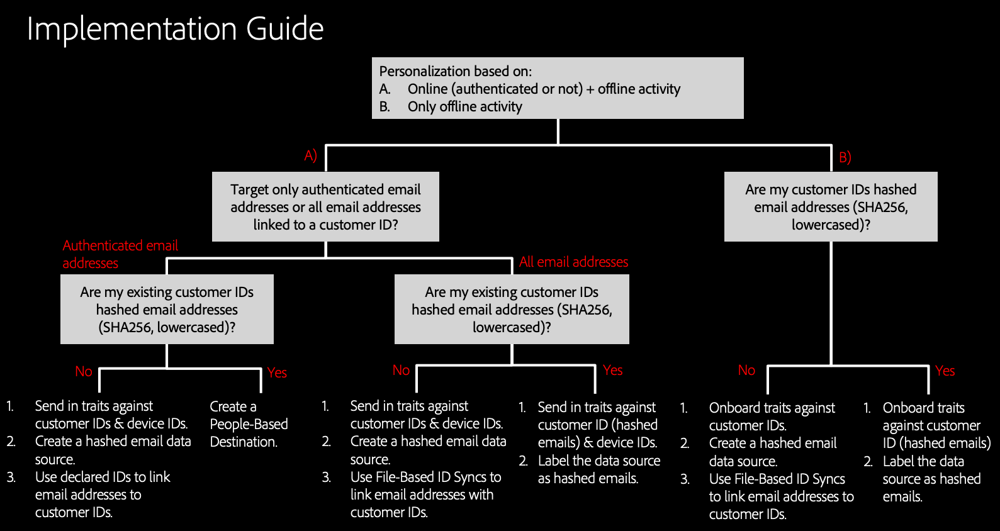

# Orientação de implementação {#implementation-guidance}

[!DNL People-Based Destinations] oferece várias estratégias de implementação, dependendo de como os dados do cliente são estruturados. Este artigo fornece uma visão geral das etapas de implementação que você precisa [!DNL People-Based Destinations]seguir, dependendo do seu cenário.

## Visão geral {#overview}

A configuração de [!DNL People-Based Destinations] orientá-lo por várias seções do Audience Manager e requer configurações diferentes e métodos de integração de dados, dependendo do tipo de dados do cliente que você já possui no Audience Manager e que tipo de direcionamento de público-alvo você deseja executar.

>[!IMPORTANT]
> Antes de configurar [!DNL People-Based Destinations], leia este artigo cuidadosamente e completamente. Depois de ler este guia, você deve ter uma compreensão clara do cenário que [!DNL People-Based Destinations]será ativado.

Há seis aspectos de implementação que você precisa esclarecer antes de usar [!DNL People-Based Destinations]. Este artigo ajudará você a entender qual é a configuração atual, para que você possa seguir corretamente as etapas de implementação do cenário.

## 1. Definição do caso de uso {#defining-your-use-case}

Antes de começar a implementar [!DNL People-Based Destinations], é necessário definir claramente o caso de uso para o qual você estará usando este recurso. Você pode usar [!DNL People-Based Destinations] para direcionar públicos de duas formas, com base na atividade do público-alvo:

**A) Segmentação de público-alvo com base em atividade** combinada do usuário e offline. Neste cenário, você deseja combinar os dados de público-alvo existentes do Audience Manager com dados do seu sistema interno [!DNL CRM] e enviar os segmentos de público-alvo resultantes [!DNL People-Based Destinations]para. Veja um exemplo que ilustra este cenário:

Sua empresa, uma companhia aérea, tem diferentes níveis de clientes (Bronze, Silver e Gold) e você deseja fornecer cada um dos níveis com ofertas personalizadas por plataformas sociais. Você usa o Audience Manager para analisar a atividade do cliente em seu site. No entanto, nem todos os clientes usam o aplicativo para dispositivos móveis da companhia aérea, e alguns deles nunca fizeram logon no site da empresa. Os dados do cliente estão limitados principalmente às IDs de associação e aos endereços de email.

Para direcioná-los em redes sociais e canais similares baseados em pessoas, você pode trazer os endereços de email [com hash](people-based-destinations-prerequisites.md) para o Audience Manager e combiná-los com características existentes de atividades online, para criar novos segmentos do público-alvo. Em seguida, você pode usar esses segmentos para direcionar seu público- [!DNL People-Based Destinations]alvo.

**B) Segmentação de público-alvo com base exclusivamente na atividade do usuário offline**. Neste cenário, o [!DNL CRM] sistema contém endereços de email do cliente e outros atributos do cliente, mas os clientes não interagiram com seu site, portanto, você não tem nenhuma atividade do cliente no Audience Manager. Veja um exemplo que ilustra este cenário:

Sua empresa, um provedor de serviços de telecomunicações, mantém os dados do cliente como endereços de email e compraram planos de telecomunicações em um interno [!DNL CRM]. Você deseja direcionar os clientes existentes nas plataformas sociais para oferecer os pacotes de atualização com base nas assinaturas existentes. Para fazer isso, você pode assimilar endereços de email do cliente com hash no Audience Manager e criar segmentos com base nas assinaturas existentes do cliente. Em seguida, você pode enviar esses segmentos [!DNL People-Based Destinations] para direcionar seus clientes com ofertas personalizadas.

## 2. Definir o tipo de endereços de email direcionados {#define-target-email}

A segunda etapa na definição da estratégia de implementação é decidir que tipo de endereços de email do cliente você deseja direcionar.

**A) Segmentação de público-alvo com base em endereços de email autenticados**. Neste cenário, os usuários têm várias contas associadas a vários endereços de email e deseja direcioná-los com ofertas personalizadas, com base apenas no endereço de email que eles autenticam em seu site, em tempo real.

**B) Segmentação de público-alvo com base em todos os endereços de email associados**. Nesse cenário, os usuários têm várias contas associadas a vários endereços de email e deseja direcioná-las em todos os endereços de email associados, independentemente da atividade autenticada.

## 3. Identificar o Tipo de IDs do cliente (IDs CRM) que Você tem {#identify-customer-id}

A definição de metas de público-alvo exige [!DNL People-Based Destinations] que você envie [SHA 256](people-based-destinations-prerequisites.md) versões com hash de seus endereços de email do cliente. Dependendo da configuração existente do Audience Manager, você pode encontrar uma das seguintes situações:

**R) As IDs do cliente do Audience Manager ([dpuuids](../../reference/ids-in-aam.md)) já estão em minúsculas e endereços de email com hash**. Neste cenário, você pode usar essas IDs existentes para direcionar seus públicos-alvo [!DNL People-Based Destinations].

**B) As IDs do cliente do Audience Manager ([dpuuids](../../reference/ids-in-aam.md)) não são minúsculas e endereços de email com hash**. Neste cenário, não é possível enviar as IDs atuais do cliente [!DNL People-Based Destinations]. Para usar [!DNL People-Based Destinations], é necessário realizar uma sincronização de ID entre as IDs do cliente existentes e as versões minúsculas e com hash dos endereços de email do cliente. Isso é feito por meio da [sincronização de ID baseada em arquivo](../../integration/sending-audience-data/batch-data-transfer-explained/id-sync-file-based.md) ou usando [IDs declaradas](../declared-ids.md).

## 4. Qualificação de características {#trait-qualification}

Para direcionar com precisão seu público-alvo, [!DNL People-Based Destinations]seus usuários precisam se qualificar para características baseadas em regras ou em cada boar, dependendo do tipo de direcionamento de público-alvo que você deseja executar.

**R) Qualificar IDs do cliente e IDs de dispositivo em tempo real para características baseadas em regras**. Esta opção aplica-se a caso de uso A de [1. Definindo seu caso de uso](people-based-destinations-workflow.md#defining-your-use-case). Se o seu plano é direcionar públicos-alvo com base na atividade online e offline, você provavelmente já está qualificado para seu público-alvo para características [baseadas em regras](../traits/trait-qualification-reference.md).

**B) Características de onboard contra IDs do cliente por meio de arquivos de dados de entrada**. Esta opção aplica-se a casos de uso B a partir [de 1. Definindo seu caso de uso](people-based-destinations-workflow.md#defining-your-use-case). Ao direcionar seu público-alvo com base em atividades meramente offline, é necessário qualificar as IDs do cliente para características integradas por [meio de arquivos de dados de entrada](../../integration/sending-audience-data/batch-data-transfer-explained/inbound-file-contents.md).

## 5. Criar ou rotular fontes de dados e endereços de email com hash em hash {#create-label-data-sources}

Dependendo do tipo de IDs do cliente que você possui no Audience Manager (consulte [3. Identifique o Tipo de IDs do cliente (IDs CRM) que você possui](people-based-destinations-workflow.md#identify-customer-id), você se encontra em um dos seguintes cenários:

**A) Rotular uma fonte de dados existente**. Essa opção se aplica ao cenário em que as IDs do cliente do Audience Manager ([dpuuids](../../reference/ids-in-aam.md)) já são minúsculas e endereços de email com hash. Nessa situação, o que você precisa fazer é rotular a fonte de dados armazenada nas IDs como uma fonte [!DNL PII] de dados. Consulte [Configurações de fonte de dados](../datasources-list-and-settings.md) para obter detalhes sobre as configurações de fonte de dados. O que você precisa fazer é garantir que a opção de informações de identificação pessoal não esteja marcada.

**B) Crie uma nova fonte de dados**. Essa opção se aplica ao cenário em que as IDs do cliente do Audience Manager ([dpuuids](../../reference/ids-in-aam.md)) não são endereços de email com hash. Nesse caso, é necessário criar uma nova fonte de dados entre dispositivos e incluir os endereços de email com hash em relação a ele. Você pode fazer isso de duas formas:

* Use a sincronização de ID com base em arquivo. Consulte [Requisitos de nome e conteúdo para arquivos de sincronização de ID](../../integration/sending-audience-data/batch-data-transfer-explained/id-sync-file-based.md) para obter detalhes sobre quais arquivos de sincronização de ID devem ser semelhantes. Ao usar esse método, você pode direcionar todos os endereços de email com hash do [!DNL CRM] banco de dados.
* Use [IDs declaradas](../declared-ids.md) para declarar endereços de email com hash ao passar em IDs autenticadas do cliente. Ao usar esse método, o Audience Manager somente direciona os endereços de email com hash de usuários que têm autenticado online. Os endereços de email direcionados por meio do Facebook são apenas aqueles nas chamadas declaradas do evento de ID. Outros endereços de email associados à ID do cliente não são ativados em tempo real.

## 6. Usar uma regra de mesclagem de perfil para segmentação {#use-profile-merge-rules}

Dependendo do caso de uso (consulte [1. Como definir seu caso de uso](people-based-destinations-workflow.md#defining-your-use-case)), há duas maneiras de usar [!DNL Profile Merge Rules] a segmentação.

**R) Use existente[!DNL Profile Merge Rules]**. Essa opção se aplica ao primeiro caso de uso (direcionamento de público-alvo com base em atividade combinada do usuário e offline). Neste cenário, você tem uma atividade existente do cliente no Audience Manager e já definiu pelo menos uma Regra de mesclagem de perfil que usou na segmentação. Nesse caso, não é necessário criar novas [!DNL Profile Merge Rules].

**B) Crie uma nova regra[!DNL All Cross-Device Profiles]** de mesclagem. Essa opção se aplica ao segundo caso de uso (direcionamento de público-alvo com base exclusivamente na atividade do usuário offline). Neste cenário, você está trazendo dados de clientes offline de seu [!DNL CRM] Into Manager e deseja criar segmentos a partir desses dados. Para fazer isso, [!DNL People-Based Destinations] apresenta uma nova Regra de mesclagem de perfil, chamada **[!DNL All Cross-Device Profiles]**. Essa é a regra que você precisa usar ao segmentar dados offline.
