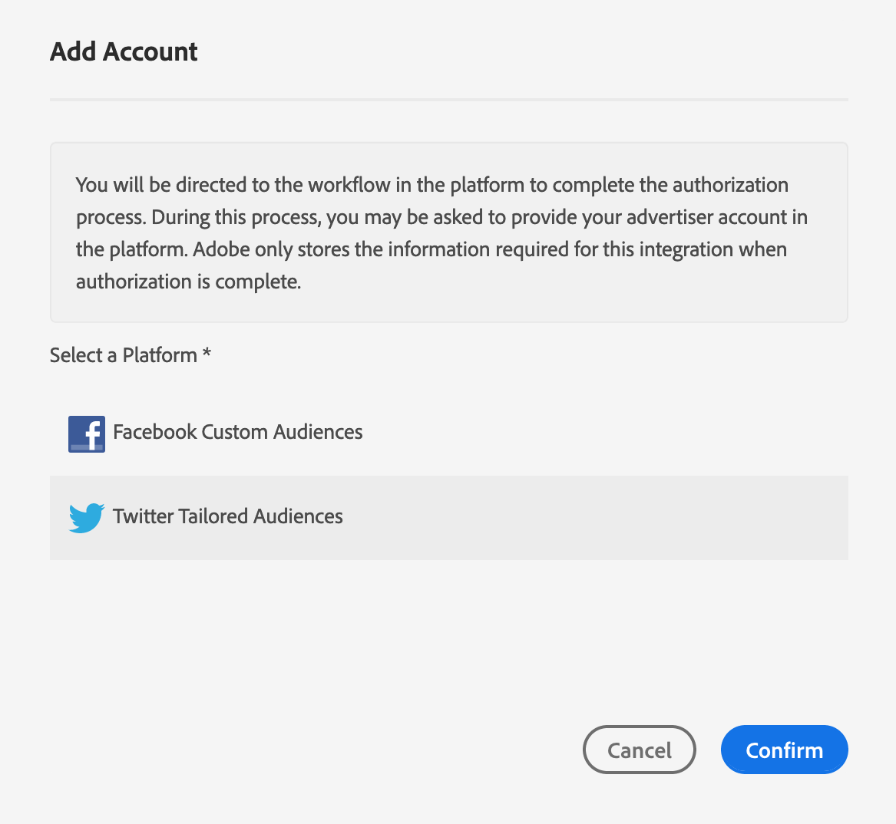

# Configure [!DNL Twitter Custom Audiences] como um destino baseado em dispositivo de autoatendimento {#configure-twitter}

Este artigo explica como configurar uma integração com [Twitter Custom Audiences](https://business.twitter.com/en/help/campaign-setup/campaign-targeting/custom-audiences.html).

## Pré-requisitos {#prerequisites}

Antes de configurar o destino [!DNL Twitter Custom Audiences], verifique os pré-requisitos do Twitter a seguir que você precisa atender.

1. Sua conta [!DNL Twitter Ads] deve estar qualificada para publicidade. Novas contas [!DNL Twitter Ads] não são qualificadas para publicidade nas primeiras 2 semanas após a criação.
2. Sua conta de usuário [!DNL Twitter] para a qual você autorizou o acesso no Audience Manager deve ter a permissão [Partner audience manager](https://business.twitter.com/en/help/troubleshooting/multi-user-login-faq.html#accesslevels) ativada.
3. Ao criar o primeiro destino [!DNL Twitter Custom Audiences] em sua instância do Audience Manager, entre em contato com a Adobe Consulting ou com o Atendimento ao cliente para habilitar a [!DNL Twitter] sincronização de ID (ID da fonte de dados = 1123) para sua conta. Isso é necessário para a sincronização correta entre o Audience Manager e [!DNL Twitter].

## Adicionar um novo destino [!DNL Twitter Custom Audiences] {#add-new-twitter-destination}

Esta seção descreve as etapas que você precisa seguir ao configurar um novo destino baseado em dispositivo para [!DNL Twitter Custom Audiences]. Esse cenário pressupõe que você não tenha nenhum destino [!DNL Twitter Custom Audiences] existente configurado por meio do consultor do Adobe ou do Atendimento ao cliente.

### Etapa 1. Autentique com [!DNL Twitter Custom Audiences] {#step1-authenticate-with-twitter}

Antes de adicionar o destino baseado em dispositivo, é necessário vincular o Audience Manager e a conta [!DNL Twitter Custom Audiences]. Veja como fazer isso:

1. Faça logon na sua conta do Audience Manager e vá para **[!DNL Administration > Integrated Accounts]**. Se você tiver uma integração configurada anteriormente com uma plataforma de destino, ela deverá ser exibida nesta página. Caso contrário, a página ficará vazia.
1. Clique em **[!DNL Add Account]**.
1. Selecione [!DNL Twitter Custom Audiences] e clique em **[!DNL Confirm]** para ser redirecionado para a página de autenticação.

   

1. Depois de autenticar, você será redirecionado para o Audience Manager, onde deverá ver suas contas de anunciante associadas. Selecione a conta do anunciante que deseja usar e clique em **[!DNL Confirm]**.

### Etapa 2: Criar um novo destino com base em dispositivo {#step2-create-new-destination}

Depois de vincular o Audience Manager e seu [!DNL Twitter Custom Audiences], você pode criar o novo destino. Veja como fazer isso:

>[!NOTE]
>
>Não é possível alterar o nome de um destino baseado em dispositivo existente. Certifique-se de fornecer um nome que ajudará a identificar o destino corretamente.

1. Faça logon na sua conta do Audience Manager, vá para **[!DNL Audience Data > Destinations]** e clique em **[!DNL Create Destination]**.
1. Na seção **[!DNL Basic Information]** , digite um **[!DNL Name]** e **[!DNL Description]** para o novo destino e use as configurações abaixo: 
1. Clique em **[!DNL Next]**.
1. Escolha os [Rótulos de Exportação de Dados](/help/using/features/data-export-controls.md#controls-labels) que deseja definir para este destino.
1. Clique em **[!DNL Save]**.
1. Na seção **[!DNL Segment Mappings]**, selecione os segmentos de público-alvo que deseja enviar para esse destino.
1. Salve o destino.

## Considerações sobre o mapeamento de segmentos {#segment-mapping-considerations}

Ao mapear segmentos de público-alvo para [!UICONTROL Twitter], atenda aos seguintes requisitos de nomenclatura de segmento:

* Forneça nomes de mapeamento de segmentos legíveis ao ser humano. Recomendamos o uso do mesmo nome usado para os segmentos do Audience Manager.
* Não use caracteres especiais (`+` `&` `,` `%` `:` `;` `@` `/` `=` `?` `$`) em nomes de mapeamento de segmentos e segmentos. Se o nome do segmento Audience Manager contém esses caracteres, remova-os antes de mapear o segmento para um destino [!UICONTROL Twitter].

### Exemplo

* Nome correto de segmento ou mapeamento: &quot;Compradores dos EUA e da Europa&quot;;
* Nome de segmento ou mapeamento incorreto: &quot;US, European 5h0pP3rs&quot;.

>[!IMPORTANT]
>
>Não é possível alterar os nomes dos segmentos já mapeados. O Audience Manager usa os nomes de segmento para identificar corretamente os segmentos na integração.

## Considerações sobre taxas de correspondência {#match-rates-considerations}

* A integração entre o Audience Manager e [!UICONTROL Twitter Custom Audiences] oferece suporte a preenchimentos retroativos de público-alvo histórico. Todas as qualificações de segmento são enviadas para [!UICONTROL Twitter] ao criar o destino.
