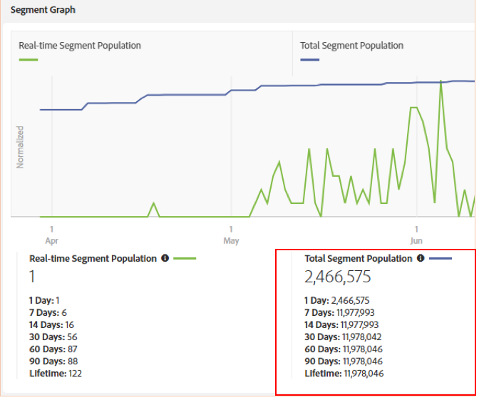

# Considerações importantes para regras de mesclagem de perfil com gráficos de dispositivo {#important-considerations-for-profile-merge-rules-with-device-graphs}

Evite usar [!UICONTROL Profile Merge Rules] com um [!UICONTROL Device Graph] para segmentos que têm pouca ou nenhuma população de segmentos em tempo real.

>[!IMPORTANT]
>
>Se o segmento [!UICONTROL Profile Merge Rule] estiver configurado incorretamente, a população de segmentos exportada para destinos em lote pode ser significativamente menor do que o esperado.

Segmentos que usam uma Regra de mesclagem de [perfil com um Gráfico](../../features/profile-merge-rules/merge-rule-targeting-options.md#device-graph-options) de dispositivos são avaliados somente em dispositivos vistos em tempo real nos Servidores [de borda do](../../reference/system-components/components-edge.md) Audience Manager após a criação do segmento.

Lembre-se de que um dispositivo [!UICONTROL Profile Merge Rule] com uma [!UICONTROL Device Graph] das opções de dispositivo a seguir está selecionado, conforme mostrado abaixo.

Os dispositivos que se qualificam para um segmento em tempo real são medidos pela população [em tempo real do](../../features/segments/segment-builder-data.md#segment-populations)segmento.

Uma população de segmentos em tempo real baixa significa que muito poucos dos dispositivos qualificados para o segmento estão sendo vistos em tempo real. Para obter o melhor desempenho, os segmentos com pouca ou nenhuma população em tempo real devem usar um [!UICONTROL Profile Merge Rule] conjunto para avaliar o *[!UICONTROL Current Device]*, como na imagem abaixo.

A configuração [!UICONTROL Profile Merge Rule] para avaliar o *[!UICONTROL Current Device]* garante que todos os dispositivos (não apenas os visualizados em tempo real) sejam avaliados para o segmento. Todos os dispositivos qualificados para o segmento são definidos pela população total do segmento, como mostrado abaixo.

