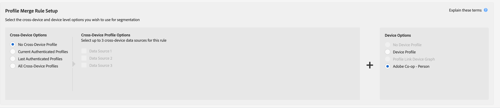

# Casos de uso do gráfico do dispositivo externo {#external-device-graph-use-cases}

Recommendations e casos de uso para prospecção, redirecionamento e personalização para usuários desconhecidos com um gráfico de dispositivos externo. Um gráfico de dispositivos externo é definido como um gráfico de dispositivos separado do Audience Manager. Isso inclui o [!DNL Adobe Experience Cloud Device Co-op] e outras integrações que o Adobe tem com empresas de gráficos de dispositivos determinísticos ou probabilísticos de terceiros.

## Recomendações {#recommendations}

Considere as [!DNL Experience Cloud Device Co-op] e as opções de gráfico de dispositivos de terceiros para campanhas que:

* Ter um baixo nível de autenticação em suas propriedades digitais. Use o [!UICONTROL Profile Link Device Graph option] se tiver um grande número de usuários autenticados.
* Direcione grandes públicos-alvo. Os [!DNL Experience Cloud Device Co-op] e os gráficos de dispositivos de terceiros contêm dados autenticados e não autenticados.
* Segmentar visitantes autenticados e/ou não autenticados no nível individual e doméstico.

<!-- 
## Prospecting/Branding Use Case {#prospecting-branding-use-cases}

A branding campaign is designed to reach as many people as possible. It places few limits on segment qualification. But, these campaigns can waste budget and impressions by constantly targeting people who see your content multiple times and don't convert. A [!UICONTROL Profile Merge] rule that uses the [!DNL Device Co-op] or third-party option can help you create an efficient branding campaign. For example, you can add these unknown users to a "not in-market" segment after seeing them across multiple devices for your set frequency cap.

<table id="table_00F6EED172574E80A38CADA8A92A23B1"> 
 <thead> 
  <tr> 
   <th colname="col1" class="entry"> Use Case </th> 
   <th colname="col2" class="entry"> Description </th> 
  </tr> 
 </thead>
 <tbody> 
  <tr> 
   <td colname="col1"> 
 <b>Conditions</b> 
 </td> 
   <td colname="col2">This use case assumes these conditions: 
 
     <ul id="ul_F5CA7EE525774F7EBA5FBB5F94E4EDC8"> 
      <li id="li_81AE304924724146A24FAB5B6533AD8E">You want to deliver a maximum of 10 impressions to an anonymous user for a specific ad campaign. </li> 
      <li id="li_E371F989735245B0B82433DE240D56D0">A user has 4 devices and may or may not have authenticated on your site. </li> 
      <li id="li_9231ABE15CA249E6B79D8BF0E511FD33">An anonymous user sees the ad a total of 10 times while browsing in an unauthenticated state on their current device and 3 devices linked to the current device by an external device graph. </li> 
      <li id="li_8C276C07019C49EFA3A0D0D54CF73C31">You have defined an  Audience Manager segment to qualify anonymous users after they have seen 10 impressions. </li> 
     </ul> 
 </td> 
  </tr> 
  <tr> 
   <td colname="col1"> 
 <b>Results</b> 
 </td> 
   <td colname="col2"> 
Given these conditions,  Audience Manager: 
 
 
     <ul id="ul_8E988B1005324526BC6DC6637BBACCFB"> 
      <li id="li_C9DD546754914BACB8F4C92C7D4ED70E">Merges the anonymous, unauthenticated activity collected from the current device and the 3 devices linked by the external device graph (the ad impressions from each device). </li> 
      <li id="li_FB55CB9116074525BA30FF062D1136AE">Evaluates the unauthenticated user for segment qualification based on a combination of anonymous activity across all 3 devices linked by the external device graph and the current device. </li> 
      <li id="li_B28EB32F718145A7ABBDAC0AF75E2AFC">Sends the segment to any real-time destination for use as a suppression segment on the current device and all 3 devices linked by the external device graph. </li> 
     </ul> 
 </td> 
  </tr> 
 </tbody> 
</table>

## Retargeting or Site Personalization Use Case {#retargeting-use-case}

These strategies are designed to bring an unauthenticated or unknown user back to your site or personalize their browsing experience while they're on-site.

<table id="table_0EE2052AA3E744B3B76036FC06B5A453"> 
 <thead> 
  <tr> 
   <th colname="col1" class="entry"> Use Case </th> 
   <th colname="col2" class="entry"> Description </th> 
  </tr> 
 </thead>
 <tbody> 
  <tr> 
   <td colname="col1"> 
 <b>Conditions</b> 
 </td> 
   <td colname="col2">This use case assumes these conditions: 
 
     <ul id="ul_FD0B869B4AF3453FAEC9BA3A45ABF039"> 
      <li id="li_8E30BAED42E94AB3B81FCB1C7464E5FC">You want to deliver a personalized on-site and/or off-site experience to an anonymous user based on their activity on your site while in an unauthenticated state. </li> 
      <li id="li_3DBE53BA94324F1BA1C52A37AD4E426C">A user has multiple devices and may or may not have authenticated to your site. </li> 
      <li id="li_F867AFBDC1A54CD6A68AB0EC196E27C9">A user views multiple pages on your site while browsing in an unauthenticated state on their current device and 3 other devices linked by an external device graph. </li> 
      <li id="li_7E35D77949CE4E69BD51655AA4C40BEE">You have defined an  Audience Manager segment to qualify users after they have viewed multiple pages on your site while browsing in an unauthenticated state.</li>
     </ul> 
 </td> 
  </tr> 
  <tr> 
   <td colname="col1"> 
 <b>Results</b> 
 </td> 
   <td colname="col2"> 
Given these conditions,  Audience Manager: 
 
 
     <ul id="ul_301339426B0643B295DC5B17E1939CFB"> 
      <li id="li_7E8BC3B179804F4A929497DE81E76911">Merges the anonymous, unauthenticated activity collected from the current devices and the 3 devices linked by the external device graph (the multiple page views from each device). </li> 
      <li id="li_803EFD58AA124A5BBC8279C4DC695544">Evaluates the unauthenticated user for segment qualification based on a combination of anonymous activity across all 3 devices linked by the external device graph and the current device. </li> 
      <li id="li_98D749268CC5456CBC9CF3BF5EB91BA8">Sends the segment to any real-time destination to deliver a personalized on-site and/or off-site experience across the current device and all 3 devices linked by the external device graph. </li>
     </ul> 
 </td>
  </tr>
 </tbody>
</table> -->

## Direcionamento de dispositivo expandido {#audience-expansion}

Este caso de uso exemplifica como você pode expandir o tamanho do seu público endereçável com personalização precisa entre dispositivos, por meio do [!DNL Adobe Co-Op Device Graph] ou outro [!DNL External Device Graphs].

Digamos que Jane tenha três dispositivos que usa regularmente para procurar por ofertas de pacotes de férias: seu laptop ([!DNL Device 1]), seu smartphone ([!DNL Device 2]) e seu tablet ([!DNL Device 3]). Ao usar o laptop, Jane procurou voos, hotéis e tours guiados. Ao usar o smartphone e o tablet, ela só visitou a página inicial da agência de viagens.

Ao usar a regra [!UICONTROL No Cross-Device Profile] + [!UICONTROL Adobe Co-op Device Graph], a agência de viagens pode mesclar todos os três perfis de dispositivos, já que eles estão vinculados ao mesmo proprietário por meio do [!UICONTROL Adobe Co-op Device Graph].

No nosso exemplo, as características necessárias para se qualificar para o segmento foram coletadas em [!DNL Device 1]. Como o Audience Manager qualifica cada perfil de dispositivo que participou da mesclagem de perfil para um segmento, todos os três perfis de dispositivo da Jane agora são segmentados.

Por meio desta regra, o gráfico de dispositivos expandiu o número de perfis de dispositivos qualificados para o segmento de um a três e permitiu que a agência de viagens enviasse uma mensagem consistente para todos os três dispositivos de propriedade da Jane.

## Direcionamento avançado entre dispositivos {#advanced-graph-expansion}

Este caso de uso mostra como você pode expandir o direcionamento de público-alvo para visitantes autenticados com dispositivos de um gráfico de dispositivos externo ou do [!DNL Adobe Co-Op Device Graph], usando a regra **[!UICONTROL Last Authenticated Profiles]** + **[!UICONTROL Adobe Co-Op Device Graph]**.

No exemplo abaixo, a empresa Acme Inc. deseja direcionar todos os domicílios com rendimentos acima de US$ 100.000/ano, que têm [!DNL Acme Inc.] assinantes em [!DNL Data Plan A], que usam um dispositivo [!DNL iPhone 7].

John usa seu iPhone 7 no Data Plan A para autenticar no site da Acme Inc. Ao mesmo tempo, o cluster [!DNL Co-Op Device Graph] de John contém dois dispositivos adicionais que ele usa regularmente: Seu laptop ([!DNL Device 1]) e seu smartphone secundário, [!DNL Device 2] (um [!DNL Samsung S7] em [!DNL Data Plan B]).

Ao usar **[!UICONTROL Last Authenticated Profiles]** + **[!UICONTROL Adobe Co-Op Device Graph]**, [!DNL Acme Inc.] é capaz de enviar mensagens personalizadas para todos os três dispositivos do cluster de gráficos de dispositivos John, mesmo que apenas um deles se qualifique inicialmente para o segmento.

>[!MORELIKETHIS]
>
>* [Casos de uso do gráfico de dispositivo de link de perfis](profile-link-use-case.md)
>* [Casos de uso gerais para regras de mesclagem de perfis](merge-rule-targeting-options.md)
>* [Perguntas frequentes sobre as regras de mesclagem de perfis](../../faq/faq-profile-merge.md)

