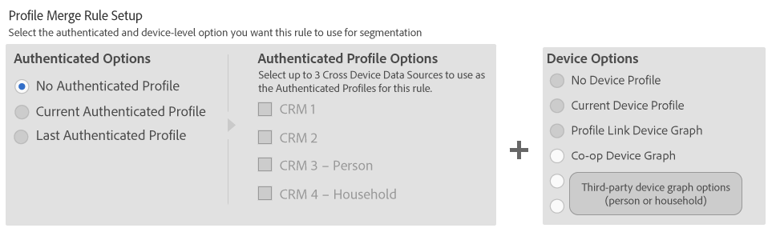

# Casos de uso do gráfico do dispositivo externo {#external-device-graph-use-cases}

Recomendações e casos de uso para prospecção, redefinição de metas e personalização para usuários desconhecidos com um gráfico de dispositivo externo. Um gráfico de dispositivo externo é definido como um gráfico de dispositivo separado do Audience Manager. Isso inclui as [!DNL Adobe Experience Cloud Device Co-op] e outras integrações que a Adobe tem com empresas de gráficos de dispositivos determinísticos ou probabilísticos de terceiros.

## Recomendações {#recommendations}

Considere as opções de gráficos de dispositivos [!DNL Experience Cloud Device Co-op] e de terceiros para campanhas que:

* Tenha um nível baixo de autenticação em suas propriedades digitais. Use a opção [de gráfico de dispositivo Link de](../../features/profile-merge-rules/merge-rule-definitions.md#device-options) perfil se você tiver um grande número de usuários autenticados.
* Direcione públicos grandes. Os gráficos de dispositivos [!DNL Experience Cloud Device Co-op] e de terceiros contêm dados autenticados e não autenticados.
* Segmentar visitantes autenticados e/ou não autenticados no nível individual e doméstico.

## Caso de uso de perspectiva/marca {#prospecting-branding-use-cases}

Uma campanha de marca foi projetada para atingir o maior número possível de pessoas. Ela coloca poucos limites na qualificação de segmentos. Mas essas campanhas podem desperdiçar orçamento e impressões, sempre direcionando pessoas que veem seu conteúdo várias vezes e não convertem. Uma [!UICONTROL Profile Merge] regra que usa a opção [!DNL Device Co-op] ou de terceiros pode ajudá-lo a criar uma campanha de marca eficiente. Por exemplo, você pode adicionar esses usuários desconhecidos a um segmento "não no mercado" depois de vê-los em vários dispositivos para o limite de frequência definido.

<table id="table_00F6EED172574E80A38CADA8A92A23B1"> 
 <thead> 
  <tr> 
   <th colname="col1" class="entry"> Caso de uso </th> 
   <th colname="col2" class="entry"> Descrição </th> 
  </tr> 
 </thead>
 <tbody> 
  <tr> 
   <td colname="col1"> 
 <b>Condições</b> 
 </td> 
   <td colname="col2">Este caso de uso assume estas condições: 
 
     <ul id="ul_F5CA7EE525774F7EBA5FBB5F94E4EDC8"> 
      <li id="li_81AE304924724146A24FAB5B6533AD8E">Você deseja enviar no máximo 10 impressões para um usuário anônimo para uma campanha de publicidade específica. </li> 
      <li id="li_E371F989735245B0B82433DE240D56D0">Um usuário tem vários dispositivos e pode ou não ter sido autenticado em seu site. </li> 
      <li id="li_9231ABE15CA249E6B79D8BF0E511FD33">Um usuário anônimo visualiza o anúncio no total 10 vezes enquanto navega em um estado não autenticado em seu dispositivo atual e até três dispositivos vinculados por um gráfico de dispositivo externo. </li> 
      <li id="li_8C276C07019C49EFA3A0D0D54CF73C31">Você definiu um segmento do  Audience Manager para qualificar usuários anônimos depois de 10 impressões. </li> 
     </ul> 
 </td> 
  </tr> 
  <tr> 
   <td colname="col1"> 
 <b>Resultados</b> 
 </td> 
   <td colname="col2"> 
Dadas essas condições,  o Audience Manager: 
 
 
     <ul id="ul_8E988B1005324526BC6DC6637BBACCFB"> 
      <li id="li_C9DD546754914BACB8F4C92C7D4ED70E">Une a atividade anônima e não autenticada coletada do dispositivo atual e os três dispositivos vinculados pelo gráfico do dispositivo externo (as impressões do anúncio de cada dispositivo). </li> 
      <li id="li_FB55CB9116074525BA30FF062D1136AE">Avalia o usuário não autenticado para qualificação de segmento com base em uma combinação de atividade anônima em todos os três dispositivos vinculados pelo gráfico de dispositivo externo e pelo dispositivo atual. </li> 
      <li id="li_B28EB32F718145A7ABBDAC0AF75E2AFC">Envia o segmento para qualquer destino em tempo real para uso como um segmento de supressão no dispositivo atual e em todos os três dispositivos vinculados pelo gráfico de dispositivos externos. </li> 
     </ul> 
 </td> 
  </tr> 
 </tbody> 
</table>

## Caso de uso de redefinição de metas ou personalização do site {#retargeting-use-case}

Essas estratégias são projetadas para trazer um usuário não autenticado ou desconhecido de volta ao seu site ou personalizar sua experiência de navegação enquanto ele estiver no site.

<table id="table_0EE2052AA3E744B3B76036FC06B5A453"> 
 <thead> 
  <tr> 
   <th colname="col1" class="entry"> Caso de uso </th> 
   <th colname="col2" class="entry"> Descrição </th> 
  </tr> 
 </thead>
 <tbody> 
  <tr> 
   <td colname="col1"> 
 <b>Condições</b> 
 </td> 
   <td colname="col2">Este caso de uso assume estas condições: 
 
     <ul id="ul_FD0B869B4AF3453FAEC9BA3A45ABF039"> 
      <li id="li_8E30BAED42E94AB3B81FCB1C7464E5FC">Você deseja fornecer uma experiência personalizada no site e/ou fora dele a um usuário anônimo com base em suas atividades no site enquanto estiver em um estado não autenticado. </li> 
      <li id="li_3DBE53BA94324F1BA1C52A37AD4E426C">Um usuário tem vários dispositivos e pode ou não ter sido autenticado em seu site. </li> 
      <li id="li_F867AFBDC1A54CD6A68AB0EC196E27C9">Um usuário exibe várias páginas em seu site enquanto navega em um estado não autenticado em seu dispositivo atual e até três dispositivos vinculados por um gráfico de dispositivo externo. </li> 
      <li id="li_7E35D77949CE4E69BD51655AA4C40BEE">Você definiu um segmento do  Audience Manager para qualificar usuários depois que eles visualizaram várias páginas em seu site enquanto navegavam em um estado não autenticado. </li> 
     </ul> 
 </td> 
  </tr> 
  <tr> 
   <td colname="col1"> 
 <b>Resultados</b> 
 </td> 
   <td colname="col2"> 
Dadas essas condições,  o Audience Manager: 
 
 
     <ul id="ul_301339426B0643B295DC5B17E1939CFB"> 
      <li id="li_7E8BC3B179804F4A929497DE81E76911">Une a atividade anônima e não autenticada coletada dos dispositivos atuais e os três dispositivos vinculados pelo gráfico de dispositivos externos (as várias exibições de página de cada dispositivo). </li> 
      <li id="li_803EFD58AA124A5BBC8279C4DC695544">Avalia o usuário não autenticado para qualificação de segmento com base em uma combinação de atividade anônima em todos os três dispositivos vinculados pelo gráfico de dispositivo externo e pelo dispositivo atual. </li> 
      <li id="li_98D749268CC5456CBC9CF3BF5EB91BA8">Envia o segmento para qualquer destino em tempo real para fornecer uma experiência personalizada no site e/ou fora dele no dispositivo atual e em todos os três dispositivos vinculados pelo gráfico de dispositivos externos. </li>
     </ul> 
 </td>
  </tr>
 </tbody>
</table>

## Opções de Regra de Mesclagem de Perfil para Casos de Uso do Gráfico de Dispositivos Externos {#profile-merge}

Suas opções de regras de mesclagem para esses casos de uso seriam semelhantes às opções disponíveis mostradas abaixo. As [!UICONTROL Authenticated Profile] opções são desativadas porque essas configurações só estão disponíveis quando você seleciona **[!UICONTROL Current Authenticated Profile]** ou **[!UICONTROL Last Authenticated Profile]**. Sua opção [!UICONTROL Device Options] varia dependendo do tipo de configuração de gráfico de dispositivo que você deseja usar ou que está disponível para você.

Para obter mais informações sobre como esses processos de gráficos de dispositivos funcionam, baixe nosso PDF, [Audience Manager e Gráficos](https://marketing.adobe.com/resources/help/en_US/aam/downloads/AAM_Device_Graphs.pdf)de dispositivos externos.

>[!MORE_LIKE_THIS]
>
>* [Casos de uso do gráfico de dispositivo de link de perfil](../../features/profile-merge-rules/profile-link-use-case.md)
>* [Casos de uso gerais para regras de mesclagem de perfil](../../features/profile-merge-rules/merge-rule-targeting-options.md)
>* [Perguntas frequentes sobre as regras de mesclagem de perfil](../../faq/faq-profile-merge.md)

