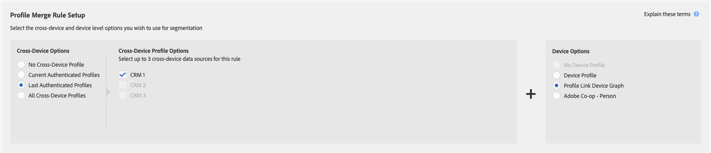

# Regras de mesclagem de perfis e processos de dessegmentação de dispositivos {#profile-merge-rules-and-device-un-segmentation-processes}

O cancelamento de segmentos descreve processos que desqualificam e removem perfis de dispositivos de segmentos. Sua capacidade de remover um perfil de dispositivo de um segmento depende da opção de dispositivo usada para criar um [!UICONTROL Profile Merge Rule].

## Opções de dispositivo disponíveis {#device-options}

Como lembrete, os [!UICONTROL Device Options] estão disponíveis na seção [!UICONTROL Profile Merge Rules Setup] ao criar ou editar um [!UICONTROL Profile Merge Rule].

## Opção de perfil do dispositivo atual e cancelamento de segmentação do dispositivo {#current-device-profile-options}

**[!UICONTROL Device Profile]** é a opção de perfil de dispositivo padrão para [!UICONTROL Profile Merge Rule]. [!DNL Audience Manager] pode remover um perfil de dispositivo de um segmento quando [!UICONTROL Profile Merge Rule] usa a opção **[!UICONTROL Device Profile]**. Nessas condições, o cancelamento de segmentação acontece quando:

* O perfil do dispositivo ficou inativo por 120 dias. Um processo semanal de limpeza de dados remove perfis de dispositivos inativos de seus segmentos.
* O dispositivo não se qualifica mais para um segmento porque as atualizações ou alterações no perfil do dispositivo o desqualificam. Isso acontece quando os critérios de qualificação de segmento são alterados, quando você aplica um operador [!DNL AND NOT] a uma regra de segmento ou especifica condições de [recenticidade e frequência](../segments/recency-and-frequency.md) que usam as configurações menor que/igual a. Os casos de uso são descritos na documentação da [Supressão instantânea entre dispositivos](instant-cross-device-suppression.md).

## Sem opção de dispositivo e Cancelamento de segmentação de dispositivo {#no-device-option}

O [!DNL Audience Manager] pode remover uma identificação entre dispositivos de um segmento quando o [!UICONTROL Profile Merge Rule] usa a opção **[!UICONTROL Current Authenticated Profiles]** + **[!UICONTROL No Device Profile]**. Sob essas condições, o cancelamento de segmentação acontece quando a ID entre dispositivos não se qualifica mais para um segmento, pois as atualizações ou alterações no perfil entre dispositivos o desqualificam. Isso acontece quando os critérios de qualificação de segmento são alterados, quando você aplica um operador [!UICONTROL AND NOT] a uma regra de segmento ou especifica condições de [recenticidade e frequência](../segments/recency-and-frequency.md) que usam as configurações menor que/igual a. Os casos de uso são descritos na documentação da [Supressão instantânea entre dispositivos](instant-cross-device-suppression.md).

## Opções de gráfico de dispositivos e cancelamento de segmentação de dispositivo {#device-graph-options-unsegmentation}

O [!DNL Audience Manager] pode remover vários perfis de dispositivo de um segmento quando o [!UICONTROL Profile Merge Rule] usa uma opção de gráfico de dispositivo. O cancelamento de segmentos acontece quando o perfil mesclado do dispositivo no gráfico de dispositivos não se qualifica mais para o segmento, pois as atualizações ou alterações nesse perfil mesclado o desqualificam do segmento. Isso acontece quando os critérios de qualificação de segmento são alterados, quando você aplica um operador [!UICONTROL AND NOT] a uma regra de segmento ou especifica condições de [recenticidade e frequência](../segments/recency-and-frequency.md) que usam as configurações menor que/igual a. Os casos de uso são descritos na documentação da [Supressão instantânea entre dispositivos](instant-cross-device-suppression.md).

>[!NOTE]
>
>**Limite de 100 dispositivos para avaliação e desqualificação de segmentos**.
>&#x200B;>O Audience Manager mescla até 100 dispositivos ao avaliar segmentos com uma Regra de mesclagem de perfis que usa um gráfico de dispositivos. O Audience Manager avalia o dispositivo atual e até 99 dispositivos vinculados ao dispositivo atual por um [perfil autenticado](../../reference/visitor-authentication-states.md) (ID entre dispositivos). Se o sinal de cancelamento de segmento for emitido, o dispositivo atual e os dispositivos adicionais serão removidos do segmento no destino.

>[!MORELIKETHIS]
>
>* [Perguntas frequentes sobre regras de mesclagem de perfis e gráfico de dispositivos](../../faq/faq-profile-merge.md)
>* [Supressão instantânea entre dispositivos](instant-cross-device-suppression.md)
