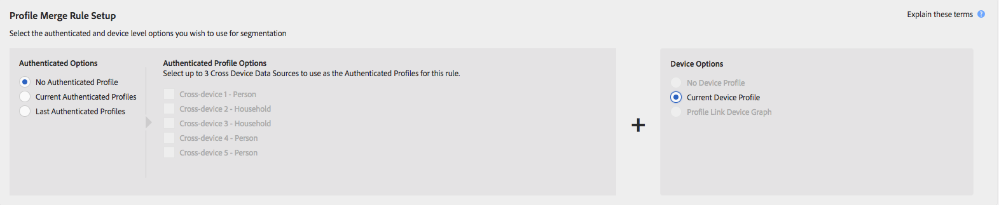

# Profile Merge Rules and Device Un-Segmentation Processes {#profile-merge-rules-and-device-un-segmentation-processes}

A segmentação descreve processos que desqualificam e removem perfis de dispositivo dos segmentos. Your ability to remove a device profile from a segment depends on the device option used to create a [!UICONTROL Profile Merge Rule].

## Available Device Options {#device-options}

As a reminder, the [!UICONTROL Device Options] are available in the [!UICONTROL Profile Merge Rules Setup] section when you create or edit a [!UICONTROL Profile Merge Rule].

## Current Device Profile Option and Device Unsegmentation {#current-device-profile-options}

**[!UICONTROL Current Device Profile]** é a opção padrão do perfil do dispositivo para a [!UICONTROL Profile Merge Rule]. [!DNL Audience Manager] pode remover um perfil de dispositivo de um segmento quando a [!UICONTROL Profile Merge Rule] opção usa a **[!UICONTROL Current Device Profile]** opção. Sob essas condições, a segmentação ocorre quando:

* O perfil do dispositivo permaneceu inativo por 120 dias. Um processo de limpeza de dados semanal remove perfis de dispositivo inativos dos seus segmentos.
* O dispositivo não é mais adequado para um segmento porque as atualizações ou alterações no perfil do dispositivo o desqualificam. This happens when segment qualification criteria change, or you apply an [!DNL AND NOT] operator to a segment rule, or specify [recency and frequency](../../features/segments/recency-and-frequency.md) conditions that use the less than/equal to settings. Use cases are described in the [Instant Cross-Device Suppression](../../features/profile-merge-rules/instant-cross-device-suppression.md) documentation.

<!-- 

  Audience Manager can remove a device profile from a segment when your  Profile Merge Rule uses the <b> Current Device Profile</b> option. Under these conditions, unsegmentation happens when: 
 

 
 <ul id="ul_596501272A224228BD330DD56E01D973"> 
  <li id="li_E4FA1A5C722748CD82AE3A49FCBE86F6">The device profile has been inactive for 120-days. A weekly data cleanup process removes inactive device profiles from your segments. </li> 
  <li id="li_DB0CCD28425048D5B35309B8C2C384F9">The device no longer qualifies for a segment because updates or changes to the device profile disqualify it. This happens when segment qualification criteria change, or you apply an AND NOT operator to a segment rule, or specify <a href="../../features/segments/recency-and-frequency.md"> recency and frequency</a> conditions that use the less than/equal to settings. </li> 
 </ul> 
 

  

 -->

## No Device Option and Device Unsegmentation {#no-device-option}

[!DNL Audience Manager] pode remover uma ID de dispositivo cruzado de um segmento quando usa [!UICONTROL Profile Merge Rule] a **[!UICONTROL No Device Profile]****[!UICONTROL Current Authenticated]** opção +. Sob essas condições, a segmentação ocorre quando a ID de dispositivo cruzado não é mais qualificada para um segmento porque as atualizações ou alterações no perfil de dispositivo cruzado o desqualificam. This happens when segment qualification criteria change, or you apply an [!UICONTROL AND NOT] operator to a segment rule, or specify [recency and frequency](../../features/segments/recency-and-frequency.md) conditions that use the less than/equal to settings. Use cases are described in the [Instant Cross-Device Suppression](../../features/profile-merge-rules/instant-cross-device-suppression.md) documentation.

## Device Graph Options and Device Unsegmentation {#device-graph-options-unsegmentation}

[!DNL Audience Manager] pode remover vários perfis de dispositivo de um segmento quando os usuários usarem [!UICONTROL Profile Merge Rule] uma opção de gráfico de dispositivo. A segmentação ocorre quando o perfil mesclado do dispositivo a partir do gráfico de dispositivos não é mais qualificado para o segmento porque as atualizações ou alterações neste perfil mesclado o desqualificam do segmento. This happens when segment qualification criteria change, or you apply an [!UICONTROL AND NOT] operator to a segment rule, or specify [recency and frequency](../../features/segments/recency-and-frequency.md) conditions that use the less than/equal to settings. Use cases are described in the [Instant Cross-Device Suppression](../../features/profile-merge-rules/instant-cross-device-suppression.md) documentation.

>[!NOTE]
>
>**O limite de quatro dispositivos para a avaliação e a desqualificação** [!DNL Audience Manager] de segmentos mescla até quatro dispositivos ao avaliar segmentos com [!UICONTROL Profile Merge Rule] um gráfico de dispositivos. [!DNL Audience Manager] avalia o dispositivo *atual e três dispositivos adicionais vistos pela última vez em tempo real*. Se o sinal de dessegmento for emitido, o dispositivo atual e três dispositivos adicionais vistos em tempo real serão removidos do segmento no destino. Por exemplo, em um cluster de seis dispositivos, até quatro dispositivos são mesclados, avaliados e qualificados para um segmento. Da mesma forma, até quatro dispositivos são mesclados, avaliados e não segmentados.

<!-- 

Currently,  Audience Manager <i>cannot </i> remove a device profile from a segment when your  Profile Merge Rule uses a device graph option. This applies to rules created with these  Device Options settings: 
 

 
 <ul id="ul_0923834C984F464E9AB12FF5A8773214"> 
  <li id="li_731F67B7A07342988B13D7F91ECA5A9E">Profile Link Device Graph. </li> 
  <li id="li_D1EFC6F124124E64A0732DD060F788BE">The  Adobe device graph. </li> 
  <li id="li_CFD4189D4488432D92732532D23B30C7">Other third-party device graph options available that are available to you. </li> 
 </ul> 
 

 Unlike the previous case above, using the AND NOT operator or less than/equal to settings won't remove all of the devices from a segment profile. However, you can unsegment device profiles if you create simple segment rules and apply unsegment logic in the destination that receives your data. The following sections walks you through different unsegmentation use cases. 

 -->

<!-- 

This workaround shows you how to unsegment with Boolean  AND NOT logic when your  Profile Merge Rule uses a device graph option. This procedure uses separate, simple segments mapped to the same destination. In this case, you apply AND NOT logic on the destination rather than creating rules in Segment Builder. To set up unsegment rules for this use case: 
 

 
 <ol id="ol_677F0F9E6CB640079D9021DE66819916"> 
  <li id="li_95F898FDFB2D4F5395201FEA2E60A3AF">Create separate, single-trait segments as shown in the following example. 
 
 </li> 
  <li id="li_3A9F6D8B3CBB4F65B9A06EEC3B265158">Map the segments to the same destination. In this case, we're sending these to  Media Optimizer. </li> 
  <li id="li_092BB5887D0D4EE4B09F4B1C6703D454">Set AND NOT logic on the destination ( Media Optimizer) rather than in  Audience Manager. 
 
 </li> 
 </ol> 
 

 If you're not using  Media Optimizer, apply AND NOT logic on whatever destination receives these segments. 

 -->

<!-- 

This workaround shows you how to unsegment with the < = (less than/equal to) recency and frequency settings when your  Profile Merge Rule uses a device graph option. To set up unsegment rules for this use case: 
 

 
 <ol id="ol_DCBEE004B9FE40A881E4EC17FAEA50C2"> 
  <li id="li_DB8C1B6D5C5546E68769902A4F367966">Create a segment that contains a single trait and apply a > = (greater than/equal to) recency and frequency rule to the trait. 
 
 </li> 
  <li id="li_0DC50960D83B4B27A40F0BC76B944E0B">Map the segment to a destination. In this case, we're sending the segment to  Media Optimizer. </li> 
  <li id="li_FC23194A9FE54296914393F8067A6672">Set NOT logic on the destination ( Media Optimizer) rather than in  Audience Manager. Use NOT logic to exclude all devices that qualify for this segment from your campaign. 
 
 </li> 
 </ol> 
 

 If you're not using  Media Optimizer, apply NOT logic on whatever destination receives these segments. 

 -->

>[!MORE_ LIKE_ THIS]
>
>* [Regras de mesclagem de perfil e perguntas frequentes sobre o gráfico de dispositivos](../../faq/faq-profile-merge.md)
>* [Supressão instantânea entre dispositivos](../../features/profile-merge-rules/instant-cross-device-suppression.md)
>* [Considerações importantes para Regras de mesclagem de perfil com gráficos de dispositivo](../../features/profile-merge-rules/considerations-pmr-device-graph.md)

