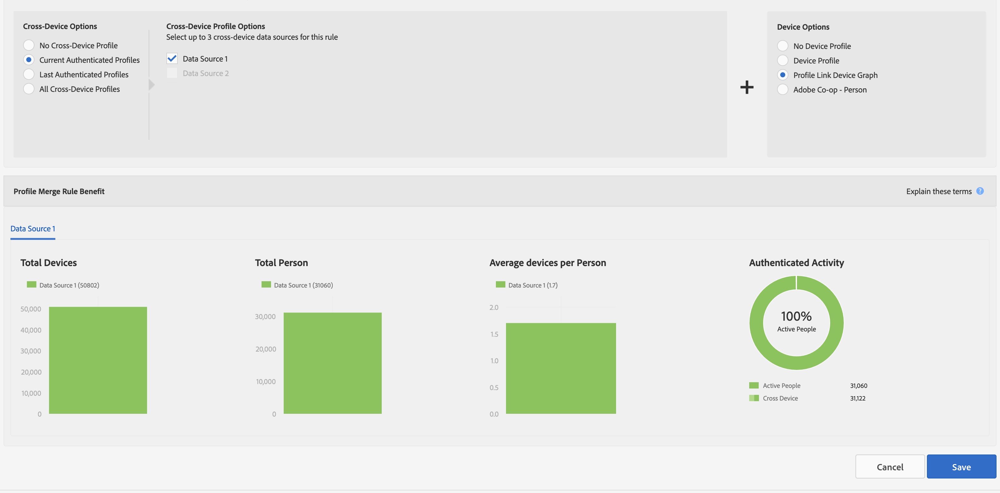

# Métricas de relatório para regras de mesclagem de perfis {#report-metrics-for-profile-merge-rules}

[!UICONTROL Profile Merge Rule] as métricas fornecem dados sobre pessoas e dispositivos que se autenticam em seu site. Os dados e gráficos em [!UICONTROL Profile Merge Rule Reports] atualize dinamicamente ao criar uma regra de mesclagem ou ao clicar em uma regra existente na [!UICONTROL Profile Merge Rules] painel. Essas métricas podem incluir gráficos de dispositivos de outras fontes de gráficos de dispositivos de terceiros.

## Métricas de Regra de Mesclagem {#merge-rule-metrics}

Os relatórios retornam dados em gráficos de barras lado a lado quando as regras de mesclagem usam dados de gráficos de dispositivos de terceiros aos quais você pode ter acesso no [!DNL Audience Manager]. Isso permite comparar seus dados autenticados e primários com os dados entre dispositivos fornecidos por gráficos de dispositivos de terceiros. Esses dados são atualizados diariamente.

<table id="table_A7FB2F9804F84AC8A6DD05C0E6EE7555"> 
 <thead> 
  <tr> 
   <th colname="col1" class="entry"> Métrica </th> 
   <th colname="col2" class="entry"> Descrição </th> 
  </tr> 
 </thead>
 <tbody> 
  <tr> 
   <td colname="col1"> 
 <b> Atividade autenticada</b> 
 </td> 
   <td colname="col2"> 
Mostra: 
 
    <ul id="ul_7F7373919A4A49028EF4BF7B28D9F8E9"> 
     <li id="li_FE2F93C496D64ED8928B3E522C9585EA">  Pessoas ativas: o número de pessoas que se autenticaram em seu site nos últimos 60 dias. </li> 
     <li id="li_60CFD26EE68B442683C0ED5FED1A79C8">  Cross Device: o número total de <a href="merge-rules-start.md#create-data-source"> IDs entre dispositivos</a> armazenados no <a href="https://experienceleague.adobe.com/docs/audience-manager/user-guide/features/data-sources/manage-datasources.html"> Fonte de dados</a> do selecionado <a href="merge-rule-definitions.md"> Perfil autenticado</a> pelo tempo de vida em que a fonte de dados existiu. </li> 
     <li id="li_F2F07B6A326C4A18B79A0CF2C47D9677">  % de Pessoas Ativas: Shows  Pessoas ativas como %. </li> 
    </ul> 
  Atividade autenticada permite comparar fontes de dados por atividade, volume e porcentagem. Ele pode ajudar você a encontrar uma fonte de dados que tenha muitas pessoas e uma alta porcentagem de usuários ativos. Ou você pode encontrar valor ao comparar fontes de dados com a alta proporção de usuários ativos em comparação ao tamanho total do público-alvo. Por exemplo, às vezes, uma fonte de dados com números de tempo de vida total baixos e alta atividade são mais valiosas do que aquelas com resultados de tempo de vida altos e números de atividade baixos. 
 
 
Observação: a variável  Atividade autenticada métricas contêm  Link de perfil somente dados. Este relatório não inclui  Gráfico de dispositivos dados. 
 
 </td> 
  </tr> 
  <tr> 
   <td colname="col1"> 
 <b> Média de dispositivos por pessoa</b> 
 </td> 
   <td colname="col2"> 
 Mostra o número médio de dispositivos usados por visitantes que se autenticaram em seu site para a fonte de dados selecionada. 
 </td> 
  </tr> 
  <tr> 
   <td colname="col1"> 
 <b> Total de dispositivos</b> 
 </td> 
   <td colname="col2"> 
Mostra o número total de dispositivos que as pessoas usaram para autenticar em seu site para a fonte de dados selecionada. 
 </td> 
  </tr> 
  <tr> 
   <td colname="col1"> 
 <b> Total de pessoas</b> 
 </td> 
   <td colname="col2"> 
Mostra o número total de pessoas que foram identificadas deterministicamente para a fonte de dados selecionada. 
 </td> 
  </tr> 
 </tbody> 
</table>

## Métricas do gráfico de dispositivos {#device-graph-metrics}

A variável [!UICONTROL Merge Rules] os relatórios também mostram dados sobre o número total de pessoas e dispositivos que visitaram seu site para a fonte de dados e o gráfico de dispositivos selecionados. Essas métricas retornam dados com base em intervalos de tempo predefinidos (o período de retrospectiva) que variam de acordo com a opção de dispositivo selecionada ao criar uma regra. A tabela a seguir lista esses intervalos de relatório para cada uma das opções de gráfico de dispositivos.

<table id="table_038983EBC71F4A55BBCA99212AC5DEE6"> 
 <thead> 
  <tr> 
   <th colname="col1" class="entry"> Opção de gráfico de dispositivo </th> 
   <th colname="col2" class="entry"> Intervalo de retrospectiva do relatório </th> 
  </tr>
 </thead>
 <tbody> 
  <tr> 
   <td colname="col1"> 
 Link de perfil 
 </td> 
   <td colname="col2"> 
 
     <ul id="ul_B2FF2341573840549FFB96579F537082"> 
      <li id="li_B37323C2F2434F41B407500AC5C15447">Total de pessoas: 60 dias </li> 
      <li id="li_08D911224A60418BBB3CFB4E70CE73D4">Total de dispositivos: 120 dias </li> 
     </ul> 
 </td> 
  </tr> 
  <tr> 
   <td colname="col1"> 
 LiveRamp 
 </td> 
   <td colname="col2"> 
 
     <ul id="ul_2772F3AD7E1440789B635794ECDE8DFB"> 
      <li id="li_1432363829D64615B1D349A3722D6268">Total de pessoas: 180 dias </li> 
      <li id="li_D5C0E3CE92524B54BBD36C73A326292B">Total de dispositivos: 180 dias </li> 
     </ul> 
 </td> 
  </tr> 
  <tr> 
   <td colname="col1"> 
 Tapad 
 </td> 
   <td colname="col2"> 
 
     <ul id="ul_274529DB58E6442E95C6AD89BECB1362"> 
      <li id="li_67102211A72A4E47AACFE5E369793C17">Total de pessoas: 60 dias </li> 
      <li id="li_3E8F3DA6A7B5487895A626674DA363A5">Total de dispositivos por 60 dias </li> 
     </ul> 
 </td> 
  </tr> 
 </tbody> 
</table>

## Relatórios de amostra {#sample-reports}

### Relatório padrão de link de perfil

Um padrão [!UICONTROL Profile Link] O relatório do é semelhante ao seguinte exemplo. As regras de mesclagem que usam várias fontes de dados (até 3, no máximo) mostram gráficos em guias separadas para cada fonte de dados. Essa regra de mesclagem não inclui [!UICONTROL external device graph] dados.

### Relatório Do Link De Perfil Com Dados Do Gráfico Do Dispositivo

A [!UICONTROL Profile Link Device Graph] relatório que inclui dados de gráficos de dispositivos de gráficos de dispositivos de terceiros mostra [!UICONTROL Profile Link] e dados de gráficos de dispositivos com gráficos de barras lado a lado. Colocar esses gráficos adjacentes entre si permite avaliar os benefícios de usar gráficos de dispositivos externos em comparação com o [!UICONTROL Profile Link] por si só. As regras de mesclagem que usam várias fontes de dados (até 3, no máximo) mostram gráficos em guias separadas para cada fonte de dados. A título de lembrete, a [!UICONTROL Authenticated Activity] o gráfico e as métricas não retornam dados do [!DNL Adobe] gráfico de dispositivos ou outro gráfico de dispositivos de terceiros ao qual você pode ter acesso no [!DNL Audience Manager].

## Gráficos de tendência do link de perfil {#profile-link-trend}

Além das outras visualizações de dados, [!UICONTROL Profile Link] os relatórios incluem um gráfico de linhas. O gráfico de linhas foi projetado para mostrar tendências ao longo do tempo para suas regras de perfil. Os gráficos de tendência (e os outros relatórios) estão disponíveis quando você clica em uma regra na [!UICONTROL Profile Merge Rules] página inicial ( **[!UICONTROL Audience Data > Profile Merge Rules]**). Esses gráficos incluem dados de gráficos de dispositivos se você for membro de gráficos de dispositivos de terceiros aos quais pode ter acesso no [!DNL Audience Manager]. Clique em uma linha de tendência para ver os dados subjacentes.

>[!MORELIKETHIS]
>
>* [Perguntas frequentes sobre Regras de mesclagem de perfis](../../faq/faq-profile-merge.md)

