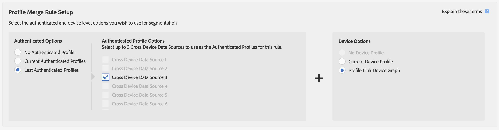

# Casos de uso do gráfico de dispositivo de link de perfil {#profile-link-device-graph-use-cases}

Recomendações e casos de uso para redefinição de metas de segmentos e qualificação de segmentos personalizados com o gráfico de [!UICONTROL Profile Link] dispositivos.

## Recomendações {#recommendations}

Considere o gráfico do [!UICONTROL Profile Link] dispositivo para campanhas que:

* Tenha um alto nível de autenticação em suas propriedades digitais. Use uma opção [de gráfico de dispositivo](../../features/profile-merge-rules/merge-rule-definitions.md#device-options) externo se você tiver uma pequena quantidade de usuários autenticados.
* Exigir direcionamento preciso de públicos conhecidos. O [!UICONTROL Profile Link device graph] é criado usando dados autenticados originais.
* Direcione públicos conhecidos em seus estados autenticados e não autenticados em tempo real.

## Redirecionando a configuração de caso de uso e de regra de mesclagem de perfil {#retargeting-use-cases}

Redirecione os públicos-alvo que foram autenticados anteriormente no site e/ou no aplicativo em vários dispositivos. Os segmentos podem ser compostos dos seguintes perfis:

* Último perfil de dispositivo autenticado conhecido.
* Atividade anônima em cada perfil de dispositivo.

>[!NOTE]
>
>As informações de características de qualquer tipo de perfil podem ser usadas para criar o segmento.

### Exemplo de redefinição de metas

Vamos ver como isso funciona com uma amostra de empresa de cartões de crédito. Este exemplo usa informações de características coletadas de atividades anônimas vistas somente em três perfis de dispositivos.

<table id="table_8C5ABA47A0634EBA9B1AA1B5C2AABF07"> 
 <thead> 
  <tr> 
   <th colname="col1" class="entry"> Caso de uso </th> 
   <th colname="col2" class="entry"> Descrição </th> 
  </tr> 
 </thead>
 <tbody> 
  <tr> 
   <td colname="col1"> 
 <b>Condições</b> 
 </td> 
   <td colname="col2"> 
Este caso de uso assume estas condições: 
 
 
     <ul id="ul_72373D0F304044AE84E4CC055E3E8154"> 
      <li id="li_375DA786ED4D4F18A74C8FE42ABF8448">Um usuário tem três dispositivos e foi a última pessoa a autenticar no site/aplicativo da empresa de cartão de crédito em todos os três dispositivos. </li> 
      <li id="li_77FDBFAED21B4DE19AB2B6C112E0C64B">No primeiro dispositivo, um usuário em um estado não autenticado exibe uma oferta de cartão de crédito premium. </li> 
      <li id="li_D3BE1B30BCCA49EA931AA9D97DD5F86D">No segundo dispositivo, um usuário em um estado não autenticado exibe a página de benefícios de cartão de crédito premium. </li> 
      <li id="li_39D894624FC44806B6DB2C77F459B39E">No terceiro dispositivo, um usuário em um estado não autenticado exibe a página de taxas e taxas de cartão de crédito premium. </li> 
     </ul> 
 </td> 
  </tr> 
  <tr> 
   <td colname="col1"> 
 <b>Resultados</b> 
 </td> 
   <td colname="col2"> 
Dadas essas condições,  o Audience Manager: 
 
 
     <ul id="ul_1B6174F5C3AF4C32831D4217C5113789"> 
      <li id="li_98FE54696B604C3C8D93CC1C1FBB48D9">Une a atividade anônima e não autenticada coletada de todos os 3 dispositivos usando o último perfil autenticado no dispositivo atual. </li> 
      <li id="li_A73C7DCE36BA42B6BAD26D8A075416C1">Avalia o usuário anônimo para qualificação de segmento com base em: 
       <ul id="ul_EF66EAFD12CA44F5ACCB66319606D937"> 
        <li id="li_541762056ECF4BC1ABF1F5116B5FED6C">Uma combinação de atividade anônima em todos os três dispositivos. </li> 
        <li id="li_C386CB62E5234E10AFEDE900ADC0E261">O último perfil autenticado no dispositivo atual. </li> 
       </ul> </li> 
      <li id="li_5C9BDC8FF886494589F005C9658A923C">Envia o segmento para qualquer destino em tempo real para redefinição de metas em todos os três dispositivos. </li>
     </ul> 
 </td> 
  </tr> 
 </tbody> 
</table>

### Exemplo de regra de mesclagem de perfil de redefinição de metas

Para configurar a redefinição de metas com [!UICONTROL Profile Link], seu [!UICONTROL Authenticated Options] e [!UICONTROL Device Options] devem ser semelhantes à configuração de regra mostrada abaixo. As [!UICONTROL Authenticated Profile] opções serão diferentes deste exemplo porque essas configurações usam os nomes das fontes de dados entre dispositivos.

## Configuração de caso de uso de personalização e regra de mesclagem de perfil {#personalization-use-case}

Personalize a experiência para públicos autenticados no site e/ou no aplicativo com base na atividade em vários dispositivos. Os segmentos podem ser compostos dos seguintes perfis:

* Perfil de dispositivo autenticado no momento.
* Perfis de dispositivo anônimos.

>[!NOTE]
>
>Um usuário deve estar em um estado autenticado para se qualificar para um segmento.

### Exemplo de personalização

Vamos ver como isso funciona com uma amostra de empresa de cartões de crédito.

<table id="table_D2F4D5D27EB54224BB2CC1D843DDEDA3"> 
 <thead> 
  <tr> 
   <th colname="col1" class="entry"> Caso de uso </th> 
   <th colname="col2" class="entry"> Descrição </th> 
  </tr> 
 </thead>
 <tbody> 
  <tr> 
   <td colname="col1"> 
 <b>Condições</b> 
 </td> 
   <td colname="col2"> 
Nosso caso de uso assume estas condições: 
 
 
     <ul id="ul_C4D2108E7B1C4D3C89411A9CCCDA6DAC"> 
      <li id="li_2F10EB17466B4B91A94DF707C3CB6BE5">Um usuário tem três dispositivos e foi a última pessoa a autenticar no site/aplicativo da empresa de cartão de crédito em todos os três dispositivos. </li> 
      <li id="li_1559C4DA51254BCF95291133F32A4057">No primeiro dispositivo, um usuário em um estado não autenticado exibe uma oferta de cartão de crédito premium. </li> 
      <li id="li_734465E5619C474291C42921160CEC6B">No segundo dispositivo, um usuário em um estado não autenticado exibe a página de benefícios de cartão de crédito premium. </li> 
      <li id="li_B96ABC0205384B59A1901708505B8BF8">No terceiro dispositivo, um usuário em um estado não autenticado exibe a página de taxas e taxas de cartão de crédito premium. </li> 
      <li id="li_1A7BDBD546BD4B8EACF4292D885127F2">Em qualquer um desses dispositivos, o cliente autentica (fazendo logon) para verificar seu equilíbrio. </li> 
     </ul> 
 </td> 
  </tr> 
  <tr> 
   <td colname="col1"> 
 <b>Resultados</b> 
 </td> 
   <td colname="col2"> 
Dadas essas condições,  o Audience Manager: 
 
 
     <ul id="ul_37DBF5FEABC5463D85C74AD9150EA177"> 
      <li id="li_B60FFA5CF3F64FB69997AA05595900D7">Une a atividade anônima e não autenticada coletada de todos os 3 dispositivos usando o perfil autenticado atual. O perfil autenticado fornece um identificador comum em cada dispositivo. </li> 
      <li id="li_AB9FD87DD804474BA33805C364B7B92D">Avalia o usuário autenticado para qualificação de segmento com base em: 
       <ul id="ul_EAF99E72159D4E329052B71344D9C69B"> 
        <li id="li_0B5E52BA6D8B493980291EA7B0AE235A">Uma combinação de atividade anônima em todos os três dispositivos. </li> 
        <li id="li_07588DEFBEF64F97850CB12CD62D0213">Seu perfil autenticado atual. </li> 
       </ul> </li> 
      <li id="li_E7CFCEAD7610496189F4486000D7860A">Envia o segmento para qualquer destino em tempo real para criar uma experiência de navegação personalizada para o usuário enquanto autenticado em seu dispositivo atual. 
Observação:  Isso qualifica todos os três dispositivos para o segmento, independentemente do estado de autenticação. Esse resultado pode causar preocupações de privacidade se esses dispositivos forem compartilhados. 
 </li>
     </ul> 
 </td>
  </tr>
 </tbody> 
</table>

### Exemplo de regra de mesclagem de perfil de personalização

Para configurar a personalização com [!UICONTROL Profile Link], seu [!UICONTROL Authenticated Options] e [!UICONTROL Device Options] devem ser semelhantes à configuração de regra mostrada abaixo. As [!UICONTROL Authenticated Profile] opções serão diferentes deste exemplo porque essas configurações usam os nomes das fontes de dados entre dispositivos.

Para obter mais informações sobre como esses processos de gráficos de dispositivos funcionam, baixe nosso PDF, [Audience Manager e Gráficos](https://marketing.adobe.com/resources/help/en_US/aam/downloads/AAM_Device_Graphs.pdf)de dispositivos externos.

>[!MORE_LIKE_THIS]
>
>* [Casos de uso do gráfico do dispositivo externo](../../features/profile-merge-rules/external-graph-use-cases.md)
>* [Casos de uso gerais para regras de mesclagem de perfil](../../features/profile-merge-rules/merge-rule-targeting-options.md)
>* [Perguntas frequentes sobre as regras de mesclagem de perfil](../../faq/faq-profile-merge.md)

