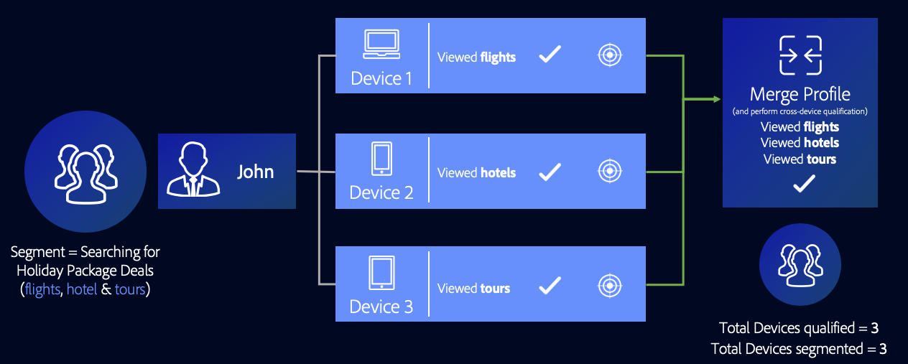

# Casos de uso do gráfico de dispositivo de link de perfis {#profile-link-device-graph-use-cases}

Recommendations e casos de uso para redirecionamento de segmento e qualificação de segmento personalizado com o [!UICONTROL Profile Link Device Graph].

## Recomendações   {#recommendations}

Considere o [!UICONTROL Profile Link] gráfico de dispositivos para campanhas que:

* Ter um alto nível de autenticação em suas propriedades digitais. Use um [opção de gráfico do dispositivo externo](merge-rule-definitions.md#device-options) se você tiver uma pequena quantidade de usuários autenticados.
* Exigir o direcionamento preciso de públicos conhecidos. A variável [!UICONTROL Profile Link Device Graph] O é criado usando dados autenticados primários do.
* Direcione públicos-alvo conhecidos em seus estados autenticado e não autenticado em tempo real.

## Direcionamento entre dispositivos {#cross-device-personalization}

Digamos que John seja proprietário de três dispositivos que ele usa regularmente para procurar por ofertas de pacotes de viagem: seu notebook ([!DNL Device 1]), seu smartphone ([!DNL Device 2]), e seu tablet ([!DNL Device 3]). No entanto, John usa seus dispositivos para procurar por diferentes itens das ofertas de pacotes:

* Ele usa seu laptop para procurar voos;
* Ele usa seu smartphone para procurar hotéis;
* Ele usa seu tablet para procurar visitas guiadas.

Mesmo que o John não seja autenticado em todos os três dispositivos mencionados acima, usando o **[!UICONTROL Last Authenticated Profiles]** + **[!UICONTROL Profile Link Device Graph]** regra, um provedor de pacotes de feriados pode associar esses dispositivos ao perfil autenticado de John, supondo que ele tenha sido a última pessoa a autenticar em todos os três dispositivos.

Como o Audience Manager qualifica cada perfil de dispositivo que participou da mesclagem de perfis para um segmento, todos os três perfis de dispositivo são segmentados. A variável [!UICONTROL Profile Link Device Graph] O permite que o Audience Manager analise o comportamento em todos os três dispositivos e qualifique cada dispositivo para um segmento para o qual nenhum perfil de dispositivo está qualificado por conta própria.

Este [!UICONTROL Profile Merge Rule] O permite que os profissionais de marketing forneçam uma experiência consistente para todos os dispositivos de propriedade de uma pessoa, com base na atividade do usuário, em vez da atividade individual do dispositivo.

>[!MORELIKETHIS]
>
>* [Casos de uso do gráfico do dispositivo externo](external-graph-use-cases.md)
>* [Casos de uso gerais para regras de mesclagem de perfis](merge-rule-targeting-options.md)
>* [Perguntas frequentes sobre Regras de mesclagem de perfis](../../faq/faq-profile-merge.md)

