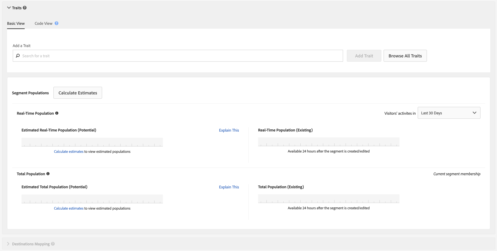

# [!UICONTROL Segment Builder] {#segment-builder}

Descreve as etapas obrigatórias e opcionais que criam um segmento no [!UICONTROL Segment Builder].

## Demonstração do vídeo

Comece assistindo ao vídeo [Criar segmentos no Audience Manager](https://images-tv.adobe.com/avp/vr/b7f88801-efe0-4786-9d58-554db16b34eb/81b6f004-cec0-452c-9b35-dabdc69ae3b4/9dc8a1d4-350d-46c3-90a6-5197dfb76f40_20180130023449.854x480at800_h264.mp4). O vídeo o orienta pelo processo de criação de segmentos. Leia as seções abaixo para obter mais informações.

## Criar um [!UICONTROL Segment] {#create-segment}

### Seção do Construtor de segmentos

<!-- t_create_segment.xml -->

[!UICONTROL Segment Builder] consiste em 3 seções separadas: [!UICONTROL Basic Information], [!UICONTROL Traits] e [!UICONTROL Destinations Mapping]. Para criar um [!UICONTROL segment], preencha os campos obrigatórios nas seções [!UICONTROL Basic Information] e [!UICONTROL Traits]. [!UICONTROL Destinations Mapping] configurações são opcionais. Consulte as instruções abaixo para obter ajuda adicional.

1. Na seção [Informações Básicas](../../features/segments/segment-builder.md#segment-builder-controls-basics):

   

   * Nomeie o [!UICONTROL segment]. O comprimento máximo de um nome [!UICONTROL segment] é de 255 caracteres.
   * Definir o status [!UICONTROL segment] (ativo é o padrão).
   * Escolha um [!UICONTROL data source]. Use o primeiro menu suspenso para filtrar entre o Audience Manager [!UICONTROL data sources], os conjuntos de relatórios do Adobe Analytics ou ambos. Em seguida, use o segundo menu suspenso para escolher o seu [!UICONTROL data source]. Se você não estiver usando conjuntos de relatórios do Adobe Analytics, o seletor de tipo [!UICONTROL data source] será desabilitado e assumirá como padrão apenas as fontes de dados do Audience Manager.
   * Selecione um [!UICONTROL profile merge rule] para usar na qualificação [!UICONTROL segment].
   * Atribua o [!UICONTROL segment] a uma pasta de armazenamento.

1. Na seção [Características](../../features/segments/segment-builder.md#segment-builder-controls-traits):
   
   * Procure o [!UICONTROL trait] que deseja adicionar a um segmento e clique em **[!UICONTROL Add Trait]**. Adicione outro [!UICONTROL trait] para criar um grupo [!UICONTROL trait].
   * Abra o modal [!UICONTROL Advanced Search] clicando em **[!UICONTROL Browse All Traits]**. Pesquise por [!UICONTROL traits] por nome, ID, descrição ou [!UICONTROL data source]. Clique em uma pasta enquanto pesquisa para limitar os resultados a essa pasta e suas subpastas. Você também pode filtrar [!UICONTROL traits] por [!UICONTROL trait type] ([!UICONTROL Folder Trait], [!UICONTROL Rule-based], [!UICONTROL Onboarded] e [!UICONTROL Algorithmic]) ou por tipo de população ([ID de Dispositivo](../../reference/ids-in-aam.md) e [ID entre Dispositivos](../../reference/ids-in-aam.md)).
     
   * Obtenha [recomendações de características](trait-recommendations.md) ativas à medida que você cria seu [!UICONTROL segment].
   * Clique e arraste [!UICONTROL traits] para criar grupos separados.
   * Passe o mouse entre grupos para definir relações com valores booleanos [!UICONTROL AND], [!UICONTROL OR], [!UICONTROL AND NOT].
   * Passe o mouse sobre o ícone de relógio para adicionar regras de [recenticidade e frequência](../../features/segments/recency-and-frequency.md) à [!UICONTROL trait].
   * Exiba dados de população de segmento ao adicionar ou remover [!UICONTROL traits]. Clique em **[!UICONTROL Calculate Estimates]** para ver (ou atualizar) os números de população estimados. Leia mais sobre [dados de população de segmentos](../../features/segments/segment-builder-data.md#segment-populations) em [!UICONTROL Segment Builder].
   * Clique em **[!UICONTROL Save]** quando terminar.

1. *(Opcional)* Mapeie um [!UICONTROL segment] para um [!UICONTROL destination] na seção [Mapeamento de Destino](../../features/segments/segment-builder.md#segment-builder-controls-destinations):
   * Pesquise por [!UICONTROL destination] e clique em **[!UICONTROL Add Destination]**. Observe que [!UICONTROL destination] já deve existir antes que você possa adicioná-lo a um [!UICONTROL segment].
   * Clique em **[!UICONTROL Save]** quando terminar.

Assista ao vídeo abaixo para obter uma visão detalhada de como as métricas entre dispositivos funcionam.

>[!VIDEO](https://video.tv.adobe.com/v/33445)

## [!UICONTROL Segment Builder] Controles: [!UICONTROL Basic Information] Seção {#segment-builder-controls-basics}

Em [!UICONTROL Segment Builder], as configurações de [!UICONTROL the Basic Information] permitem criar características novas ou editar características existentes. Para criar um novo [!UICONTROL segment], forneça um nome, um [!UICONTROL data source] e selecione uma pasta de armazenamento. Todos os outros campos são opcionais. Vá para a seção [!UICONTROL Traits] quando terminar.

<!-- r_segment_basic_info_section.xml -->

<!--

<table id="table_39DA4BC9470448B48F6654F2774EE0D5"> 
 <thead> 
  <tr> 
   <th colname="col1" class="entry"> Field </th> 
   <th colname="col2" class="entry"> Description </th> 
  </tr> 
 </thead>
 <tbody> 
  <tr> 
   <td colname="col1"> <b>Name</b> </td> 
   <td colname="col2"> 
Give the segment a short, logical name that describes its function or purpose. Avoid abbreviations and special characters. The maximum length of a segment name is 255 characters. 
 </td> 
  </tr> 
  <tr> 
   <td colname="col1"> <b>Description</b> </td> 
   <td colname="col2"> 
A field for additional descriptive information about the segment. 
 </td> 
  </tr> 
  <tr> 
   <td colname="col1"> <b>Integration Code</b> </td> 
   <td colname="col2"> 
A field for a user-defined ID or other company-specific information. 
 </td> 
  </tr> 
  <tr> 
   <td colname="col1"> <b>Data Source</b> </td> 
   <td colname="col2"> 
Associates the segment with a specific data provider. 
Use the first drop-down menu to filter between Audience Manager data sources, Adobe Analytics report suites, or both. Then, use the second drop-down menu to choose your data source.

 If you are not using Adobe Analytics report suites, the data source type selector is disabled and defaulted to Audience Manager data sources only.

 </td> 
  </tr> 
  <tr> 
   <td colname="col1"><b>Profile Merge Rule</b> </td> 
   <td colname="col2"> 
Selects the Profile Merge Rule to use for segment qualification. 
 </td> 
  </tr> 
  <tr> 
   <td colname="col1"> <b>Status</b> </td> 
   <td colname="col2"> 
Activates or deactivates the segment (active by default). 
 </td> 
  </tr> 
  <tr> 
   <td colname="col1"> <b>Folder Storage</b> </td> 
   <td colname="col2"> 
Determines which storage folder the segment belongs to. 
 </td> 
  </tr> 
 </tbody> 
</table>

-->

| Campo | Descrição |
|---------|----------|
| **[!UICONTROL Name]** | Dê ao segmento um nome curto e lógico que descreva sua função ou finalidade. Evite abreviações e caracteres especiais. O comprimento máximo de um nome de segmento é de 255 caracteres. |
| **[!UICONTROL Description]** | Um campo para obter informações descritivas adicionais sobre o segmento. |
| **[!UICONTROL Integration Code]** | Um campo para uma ID definida pelo usuário ou outras informações específicas da empresa. |
| **[!UICONTROL Data Source]** | Associa o segmento a um provedor de dados específico.   Use o primeiro menu suspenso para filtrar entre fontes de dados do Audience Manager, conjuntos de relatórios do Adobe Analytics ou ambos. Em seguida, use o segundo menu suspenso para escolher a fonte de dados.   Se você não estiver usando conjuntos de relatórios do Adobe Analytics, o seletor de tipo de fonte de dados será desabilitado e assumirá como padrão apenas as fontes de dados do Audience Manager. |
| **[!UICONTROL Profile Merge Rule]** | Seleciona a Regra de mesclagem de perfis a ser usada para qualificação de segmentos. |
| **[!UICONTROL Status]** | Ativa ou desativa o segmento (ativo por padrão). |
| **Armazenamento de pasta** | Determina a qual pasta de armazenamento o segmento pertence. |

## [!UICONTROL Segment Builder] Controles: [!UICONTROL Traits] Seção {#segment-builder-controls-traits}

No [!UICONTROL Segment Builder], a seção [!UICONTROL Traits] permite gerenciar [!UICONTROL traits] em um [!UICONTROL segment], criar grupos de [!UICONTROL trait] e definir critérios de qualificação. Para adicionar [!UICONTROL trait] a [!UICONTROL segment], digite o nome [!UICONTROL trait] no campo de pesquisa e clique em [!UICONTROL Add Trait]. Salve o [!UICONTROL trait] (se tiver terminado) ou vá para [!UICONTROL Destinations Mapping].

<!-- r_segment_traits_section.xml-->

**Pré-requisitos:** preencha os campos obrigatórios na seção [!UICONTROL Basic Information].

| Campo | Descrição |
|--- |--- |
| **[!UICONTROL Basic View]** | Esta seção fornece controles visuais que permitem: <ul><li>Criar novo e gerenciar [!UICONTROL segments] existente.</li><li>Remover [!UICONTROL traits] de um [!UICONTROL segment].</li><li>Adicione até 50 (máximo) [!UICONTROL traits] a [!UICONTROL segment].</li><li>Arraste e solte [!UICONTROL traits] para criar novos grupos.</li><li>Exibir grupos de [!UICONTROL traits] e [!UICONTROL trait] em um [!UICONTROL segment].</li><li>Defina critérios de qualificação com expressões booleanas, operadores de comparação e configurações de recenticidade/frequência.</li></ul> |
| **[!UICONTROL Code View]** | Abre um ambiente de desenvolvimento que permite criar e gerenciar [!UICONTROL traits], grupos e requisitos de qualificação com código em vez da interface visual. A exibição de código é útil se seu [!UICONTROL segments]: <ul><li>Contém mais de 50 [!UICONTROL traits] em um [!UICONTROL segment] individual. Observação: [!UICONTROL Segments] estão limitados a 5000 [!UICONTROL traits] (máximo).</li><li>Contém muitos grupos [!UICONTROL trait].</li><li>Têm requisitos complexos de qualificação.</li></ul> |
| Pesquisar | Ajuda você a encontrar [!UICONTROL traits] para adicionar a um [!UICONTROL segment]. |
| Recomendações   | Obtenha recomendações em tempo real para [!UICONTROL traits] semelhantes, dos feeds de dados [!UICONTROL traits] e [!UICONTROL Audience Marketplace] primários nos quais você está inscrito. Adicione essas recomendações à regra [!UICONTROL segment] para expandir seu público-alvo. Leia mais em [Recomendações de características](trait-recommendations.md). |
| **[!UICONTROL Marketplace Recommendations]** | Obtenha recomendações em tempo real para [!UICONTROL traits] semelhantes, de [!UICONTROL Audience Marketplace] feeds de dados para os quais você não tem assinatura. Leia mais em [Recomendações de características](trait-recommendations.md). |
| Dados reais e estimados de [!UICONTROL Segment] tamanho | Consulte [Dados de população de característica e segmento no Criador de segmentos](segment-builder-data.md). |

## Remover [!UICONTROL Traits] de um [!UICONTROL Segment] {#remove-traits}

Gerenciar o [!UICONTROL traits] no [!UICONTROL segments] é uma parte importante para manter o [!UICONTROL segments] viável. Siga estas etapas se precisar remover [!UICONTROL traits] de um [!UICONTROL segment].

Para remover [!UICONTROL traits] de um [!UICONTROL segment]:

1. Ir para **[!UICONTROL Audience Data > Segments]**. Percorra a lista ou use o recurso de pesquisa para localizar o [!UICONTROL segment] com o qual deseja trabalhar.
2. Clique no nome [!UICONTROL segment] para abrir a tela de detalhes [!UICONTROL segment].
3. Clique em **Editar** para abrir [!UICONTROL Segment Builder] e em **Características** para abrir o painel [!UICONTROL traits].
4. Passe o mouse sobre o [!UICONTROL trait] que deseja excluir e clique no X. Esta ação remove imediatamente o [!UICONTROL trait] do [!UICONTROL segment].

## [!UICONTROL Segment Builder] Controles: [!UICONTROL Destinations Mappings] Seção {#segment-builder-controls-destinations}

Em [!UICONTROL Segment Builder], a seção [!UICONTROL Destinations Mapping] opcional permite enviar dados de [!UICONTROL segment] para um [!DNL cookie], [!DNL URL] ou [!UICONTROL server-to-server destination] de terceiros. Para adicionar um [!UICONTROL destination], pesquise (ou procure) por um [!UICONTROL destination], forneça [!UICONTROL destination] informações específicas e clique em **[!UICONTROL Add Destination]**.

<!-- r_segment_destinations_map.xml -->

### Pré-requisitos

Preencha os campos obrigatórios nas seções [!UICONTROL Basic Information] e [!UICONTROL Traits]. Além disso, o destino já deve existir.

### [!UICONTROL Destination Mappings] Ferramentas de pesquisa

O painel **[!UICONTROL Destination Mappings]** contém ferramentas de pesquisa conforme descrito na tabela abaixo.

| Tipo de pesquisa | Descrição |
|---|---|
| **[!UICONTROL Search by Destination Name]** | Permite procurar um [!UICONTROL destination] específico pelo nome. Para pesquisar, comece a digitar. O campo será preenchido automaticamente com base nos termos de pesquisa. Clique em **[!UICONTROL Add Destination]** quando terminar. |
| **[!UICONTROL Browse All Destinations]** | Procurar uma lista de *todos* [!UICONTROL destinations] disponíveis para você. Selecione e adicione [!UICONTROL destinations] ao seu [!UICONTROL segment] na lista pop-up. |

## Campos nas Janelas Pop-up [!UICONTROL Destination Mappings] {#fields-in-dest-mappings}

No [!UICONTROL Segment Builder], a caixa de diálogo [!UICONTROL Add Destination] é exibida depois que você seleciona um [!UICONTROL destination]. Esta janela exibe informações estáticas sobre o [!UICONTROL destination] e campos que variam dependendo do tipo [!UICONTROL destination]. Forneça as informações necessárias nos campos vazios para configurar um [!UICONTROL destination mapping].

>[!NOTE]
>
>As datas de publicação são opcionais. Quando deixado em branco, o destino se torna ativo e nunca expira.

<!-- r_add_mappings_pop.xml -->

### [!UICONTROL Cookie Destination] Campos

Nos campos [!UICONTROL Destination Mapping], especifique os pares de valores chave usados para enviar dados ao [!UICONTROL destination]. Insira a chave no primeiro campo e os valores no segundo. O pop-up de [!UICONTROL cookie destination] pode ser semelhante a:

### [!UICONTROL URL Destination] Campos

Nos campos [!UICONTROL URL] e [!UICONTROL Secure URL], especifique o endereço padrão ou seguro completo usado para enviar dados ao [!UICONTROL destination].

### [!UICONTROL Server-to-Server Destination] Campos

No campo [!UICONTROL Destination Value], especifique o valor (parte de um par de valores chave) usado para enviar dados ao [!UICONTROL destination].

>[!MORELIKETHIS]
>
>* [Criar um Destino de Cookie](../../features/destinations/create-cookie-destination.md)
>* [Criar um Destino de URL](../../features/destinations/create-url-destination.md)
