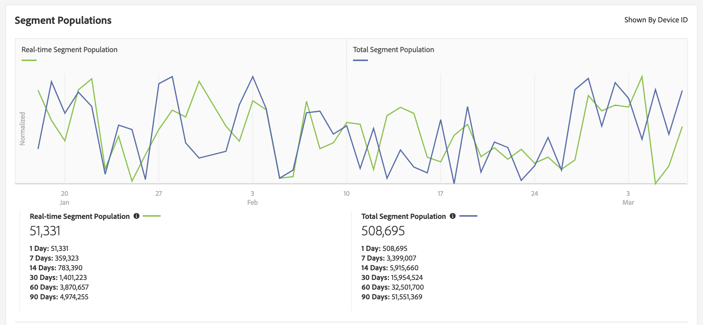

# Exibição do resumo do segmento {#segment-summary-view}

A [!UICONTROL Segment Summary] página exibe detalhes como nome, características no segmento, dados de desempenho de regras e informações de mapeamento de destino.

Clique em um nome de segmento no painel principal para acessar sua página de resumo. As seções de resumo incluem:

1. **[!UICONTROL Basic Information]:** Mostra os detalhes obrigatórios e opcionais especificados quando o segmento foi criado.
2. **[!UICONTROL Segment Graph]:** Exibe os dados de desempenho graficamente e os intervalos de performance, 7, 14, 30, 60 e 90 dias. Explicamos números de preenchimento de segmentos em um artigo [separado](../../features/segments/segment-builder-data.md).

   

3. **[!UICONTROL Identity Type Breakdown ]:** O relatório mostra o número de pessoas ou residências qualificadas para um segmento, contando o número de IDs de dispositivo cruzado e/ou IDs de gráfico de dispositivo externo que estão vinculadas aos dispositivos que estão qualificados para o segmento (mostrado pelo [!UICONTROL Total Segment Population]). As IDs de e-mail e IDs de gráfico de dispositivo externo exibidas neste relatório são usadas para unir perfis com a regra de mesclagem de perfil que o segmento está usando. Esse relatório é exibido somente se você selecionou uma fonte de dados entre dispositivos ou um Gráfico de dispositivo externo na regra de mesclagem de perfil que o segmento está usando.

   

   >[!NOTE]
   >
   >O Audience Manager somente exibe o [!UICONTROL Identity Type Breakdown] relatório se houver IDs de dispositivo cruzadas qualificadas para o segmento.

   >[!VIDEO](https://video.tv.adobe.com/v/27977/?captions=por_br)

4. **[!UICONTROL Segment Rules]:** Lista características no segmento junto com as regras de qualificação.
5. **[!UICONTROL Destination Mappings]:** Lista mapeamentos de destino para o segmento.
6. **[!UICONTROL Management Tools]:** Controles que permitem criar, editar, clonar e excluir segmentos.