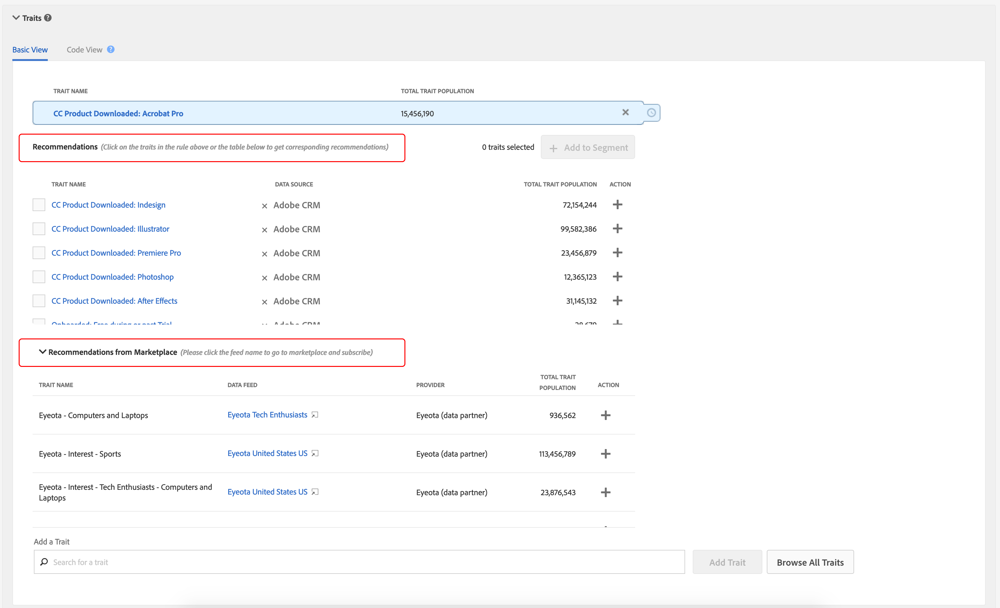

# Recomendações de característica

Obtenha recomendações de características dinâmicas à medida que cria seus segmentos, a partir de suas próprias características primárias e [!UICONTROL Audience Marketplace] feeds de dados.

## Demonstração do vídeo

Comece assistindo ao [!UICONTROL Trait Recommendations] abaixo e, em seguida, leia para obter mais informações. A demonstração em vídeo mostra como trabalhar com recomendações de suas próprias características primárias, bem como recomendações de características do [!UICONTROL Audience Marketplace] feeds de dados que *você já se inscreveu*.

>[!VIDEO](https://video.tv.adobe.com/v/26228/)

O próximo vídeo descreve o fluxo de trabalho para [!UICONTROL Marketplace Recommendations], que mostra como adicionar características aos segmentos, com base nas recomendações dos feeds de dados no [!UICONTROL Audience Marketplace]. Essas recomendações se baseiam em feeds de dados que *você não está inscrito*.

>[!VIDEO](https://video.tv.adobe.com/v/29363/)

## Visão geral

[!UICONTROL Trait Recommendations], powered by [!DNL Adobe Sensei]O traz a ciência de dados para seus fluxos de trabalho diários de Audience Manager.
Com [!UICONTROL Trait Recommendations], ao criar ou editar um segmento no [Construtor de segmentos](segment-builder.md)Além disso, você recebe recomendações sobre as características adicionais que pode incluir, semelhantes às características na regra de segmento.

O Audience Manager mostra as recomendações de características de suas características originais, na **[!UICONTROL Recommendations]** seção e de **[!UICONTROL Audience Marketplace]**, no **[!UICONTROL Recommendations from Marketplace]** seção.

Adicione as características recomendadas ao segmento para aumentar o público-alvo de destino.

**Resumindo:**

* O Audience Manager mostra características próprias na [!UICONTROL Recommendations] seção. As recomendações do Marketplace de feeds públicos e privados que você não assinou estão visíveis na [!UICONTROL Recommendations from Marketplace] seção. Clique no nome do feed para acessar [!UICONTROL Audience Marketplace] e assinar.
* Audience Manager mostra no máximo cinquenta características semelhantes à da regra de segmento.
* Você pode filtrar as fontes de dados a partir das quais não deseja ver nenhuma recomendação.
* Ao calcular as semelhanças, o Audience Manager considera [UUIDs](../../reference/ids-in-aam.md) que se qualificaram para a característica nos últimos 30 dias.
* Se você vir a mensagem de erro &quot;Nenhuma característica semelhante encontrada. As características podem ser muito novas.&quot;, significa que não houve atividade para essa característica nos últimos 30 dias ou o Audience Manager ainda não atualizou as recomendações para essa característica. Tente novamente em 24 horas.

## Casos de uso

Com [!UICONTROL Trait Recommendations], você poderá melhorar os workflows dependendo de como usa o Audience Manager:

* Como profissional de marketing, você pode encontrar rapidamente públicos-alvo interessados em produtos complementares com a ajuda de características semelhantes, para que possa aumentar seu alcance.
* Se você usar o Audience Manager como editor, com [!UICONTROL Trait Recommendations], você pode entender o comportamento do público-alvo e criar segmentos melhores para vendas de anúncios ou aquisição de usuários.
* Como um [!UICONTROL Audience Marketplace] comprador de dados, quero descobrir dados relevantes de terceiros sem navegar por um grande número de feeds.
* Como um [!UICONTROL Audience Marketplace] provedor de dados, quero recomendar dados relevantes aos compradores para que eu possa me beneficiar de assinaturas ideais e relevantes.

## Diferenças entre o Trait Recommendations e os Modelos algorítmicos

### Modelos algorítmicos

[!UICONTROL Algorithmic Models] O não só encontra as características mais influentes, como também classifica os usuários com base nessas características e atribui a cada usuário uma pontuação individual. Em seguida, você cria características algorítmicas para direcionar os usuários. Com controles de precisão e alcance no [!UICONTROL Trait Builder], você pode especificar quais usuários entre todos aqueles que têm as características influentes você deseja direcionar.

[!UICONTROL Algorithmic Models] permite selecionar usuários em diferentes níveis de precisão e testar [!UICONTROL Audience Lab] que grupo de usuários converte melhor. Consulte o caso de uso detalhado em [Comparar modelos no Audience Lab](../../features/audience-lab/audience-lab-use-cases.md#compare-models).

Entrada [!UICONTROL Algorithmic Models], o modelo é executado a cada 8 dias e atualiza os usuários qualificados para características algorítmicas.

### Recomendações de característica

[!UICONTROL Trait Recommendations] é uma maneira rápida de obter insights sobre outras características semelhantes àquelas que você está usando em um segmento.

Você deve usar [!UICONTROL Trait Recommendations] quando:

* Precisar de insights rápidos ao criar um segmento;
* Estiver usando os segmentos para campanhas curtas ou quando deseja suprimir rapidamente o público-alvo que converte;
* Estiver tentando maximizar o alcance.

## Fluxo de trabalho (WRK)

Ao criar ou editar um segmento no [Construtor de segmentos](segment-builder.md), você pode explorar características semelhantes às características na regra de segmento. A variável [Construtor de segmentos](segment-builder.md) o fluxo de trabalho é muito semelhante para segmentos novos e existentes:

### Novos segmentos

1. Ir para **Dados de público-alvo > Segmentos** e clique em **Adicionar novo**.
1. No **Características** adicione pelo menos uma característica à regra de segmento.
1. Você pode ver características recomendadas e [!UICONTROL Audience Marketplace] recomendações de características de feeds nos quais você está inscrito, na **[!UICONTROL Recommendations]** seção. A variável **[!UICONTROL Recommendations from Marketplace]** mostra as recomendações de características dos feeds nos quais você não está inscrito. Todas essas recomendações são semelhantes às características adicionadas à regra de segmento. Role para baixo para ver todas as características recomendadas.
1. (Opcional) Para excluir características primárias recomendadas de determinadas fontes de dados, clique no link **X** para as fontes de dados que deseja excluir.

   >[!NOTE]
   >
   >As fontes de dados excluídas são mostradas logo acima da lista de características recomendadas. Clique em **X** na caixa cinza para remover as exclusões e ver os resultados das respectivas fontes de dados novamente.
1. Para adicionar características recomendadas à regra de segmento, clique no **+** símbolo.

>[!IMPORTANT]
>
>Ao adicionar [!UICONTROL Marketplace] características de um segmento, as características são usadas apenas para estimativa de segmento, até que você se inscreva no feed de dados correspondente. As características provenientes de feeds de dados nos quais você não está inscrito são marcadas com um ícone de carrinho de compras na lista de características. Clique no nome da característica para ir para a página do feed de dados e assinar-a.
>
>
>
>Você só pode salvar um segmento com características de terceiros depois de assinar os feeds de dados correspondentes.

### Segmentos existentes

1. Ir para **[!UICONTROL Audience Data]>[!UICONTROL Segments]**, selecione o segmento que deseja editar e clique em .
1. Role para baixo até [!UICONTROL Traits] lista suspensa.
1. Você pode ver características recomendadas, semelhantes às características já presentes na regra de segmento. Role para baixo para ver todas as características recomendadas.
1. (Opcional) Para excluir características recomendadas de determinadas fontes de dados, clique no link **X** para as fontes de dados que deseja excluir.

   >[!NOTE]
   >
   >As fontes de dados excluídas são mostradas logo acima da lista de características recomendadas. Clique em **X** na caixa cinza para remover as exclusões e ver os resultados das respectivas fontes de dados novamente.
1. Para adicionar características recomendadas à regra de segmento, clique no **+** símbolo.

Ao criar ou editar um segmento e adicionar uma característica à regra de segmento, você verá no máximo cinquenta características recomendadas, semelhantes àquela adicionada. Se a regra de segmento contiver mais de uma característica, o Audience Manager usará um método de round robin para mostrar a melhor correspondência para cada característica, a segunda melhor correspondência para cada característica e assim por diante, para as maiores cinquenta características por população, na regra de segmento.

Por exemplo, quando há três características na regra de segmento, como mostrado abaixo, as características recomendadas são:

1. Melhor correspondência para a característica 3 (a característica com a maior população);
1. Melhor combinação para a característica 1;
1. Melhor correspondência para a característica 2;
1. Segunda melhor combinação para a característica 3;
1. A segunda melhor combinação para a característica 1, e assim por diante, até chegar a cinquenta características.

Para obter recomendações para uma característica específica, clique nas características na regra de segmento (1) ou na exibição de características recomendadas (2).

Clicar em uma característica própria abre uma janela pop-up, como mostrado na imagem abaixo. Se as características recomendadas não fizerem parte do segmento, você poderá adicioná-las ao segmento pressionando **+**.

>[!TIP]
>
>As fontes de dados excluídas da página principal são consideradas ao gerar recomendações na janela pop-up de informações de características. E, se você excluir fontes de dados nessa visualização, as exclusões se aplicam à página principal.

>[!NOTE]
>
>As características recomendadas podem ser suas características próprias ou características de terceiros a partir de feeds de dados nos quais você está inscrito [!UICONTROL Audience Marketplace].

## Como funciona

Para produzir recomendações de características, o Audience Manager calcula a [Semelhança de Jaccard](https://en.wikipedia.org/wiki/Jaccard_index) entre a característica do target e todas as outras características às quais sua conta tem acesso, incluindo dados de terceiros. O Audience Manager exibe, então, até cinquenta características que têm a maior similaridade.

## Pontuação de similaridade de característica {#trait-similarity-score}

Audience Manager calcule o [!UICONTROL Trait Similarity Score] duas características calculando a interseção e a união em termos do número de [!UICONTROL UUID]s e, em seguida, divida os dois. Para duas características A e B, o cálculo tem esta aparência:

Veja, também, os dois exemplos abaixo.

### Exemplo 1 - Baixa Pontuação De Similaridade De Característica

Considerando duas características A e B, digamos que cada uma tem uma população de 1.000.000 [!UICONTROL UUID]s, 25.000 [!UICONTROL UUID]s dos quais se qualificam para ambas as características.
Usando a fórmula acima, isso resultará em: 25.000 / 1.975.000 = 0,012. Esta é uma baixa [!UICONTROL Trait Similarity Score], as duas características são muito diferentes.

### Exemplo 2 - Pontuação de similaridade de característica

Se as mesmas características A e B tivessem 400 mil [!UICONTROL UUID]s qualificadas para ambas as características, a variável [!UICONTROL Trait Similarity Score] é muito maior: 400.000 / 1.600.000 = 0,25

### Como interpretar a pontuação de similaridade de características

Use a tabela abaixo como um guia aproximado para obter a similaridade de características. Este guia é baseado nas pontuações de similaridade observadas na maioria das características.

| [!UICONTROL Trait Similarity Score] | Significância |
|---------|----------|
| 0.1 e superior | Alta similaridade entre características |
| 0.03 - 0.1 | Semelhança média entre características |
| 0.01 - 0.03 | Baixa similaridade entre características |
| 0 - 0.01 | Semelhança muito baixa entre características |

## Controle de acesso baseado em função ( RBAC)

Para empresas que usam [!UICONTROL Role-Based Access Controls] ([!UICONTROL RBAC]), é necessário ter permissão para criar e editar segmentos para ver as características recomendadas. As recomendações de características que você vê são apenas aquelas das fontes de dados às quais você tem acesso via [!UICONTROL RBAC].

>[!IMPORTANT]
>
>Para adicionar [!UICONTROL Marketplace Recommendations] para um segmento, os usuários devem primeiro assinar os feeds de dados correspondentes. Somente usuários com privilégios de administrador podem assinar [!UICONTROL Audience Marketplace] feeds de dados.

Leia mais sobre [!UICONTROL RBAC] controles [aqui](../administration/administration-overview.md).

## Limitações

* Atualmente, o Audience Manager não mostra características de pastas como características recomendadas. Leia mais sobre características da pasta [aqui](../traits/manage-folder-traits.md).
* Ao exibir o Trait Recommendations, o Audience Manager não leva em consideração [!DNL Boolean] operadores ([!DNL AND], [!DNL OR], [!DNL NOT]) nas regras de segmento.
