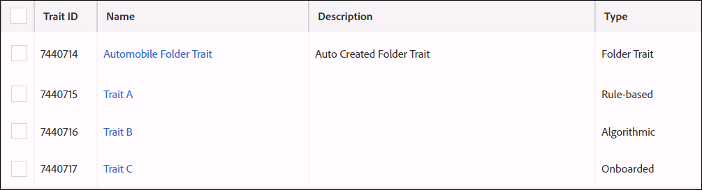

# Características da pasta: sobre {#folder-traits-about}

[!UICONTROL Folder traits] permite agregar automaticamente características que residem na mesma pasta e todas as pastas filhas em um segmento direcionável.

## Benefícios do uso de características da pasta {#benefits}

Um [!UICONTROL folder trait] contém todas as características em uma pasta principal e suas pastas secundárias associadas. Isso permite que você segmente e direcione seus usuários automaticamente em diferentes níveis de pasta. Por exemplo, digamos que você tenha uma estrutura de pastas como esta:

`*` Eletrônicos (principal)

    `*` Laptops (filho)

        `*` Marcas (netos)

[!UICONTROL Folder traits] qualificar todos os usuários nessas pastas em uma pasta criada automaticamente  [!DNL Electronics] [!UICONTROL Folder Trait] (com base no nome da pasta pai). E esse processo se repete à medida que você move para baixo a estrutura do arquivo. Nesse caso, as características das pastas capturam todos os usuários nas pastas Notebooks e Marcas em um Laptops criado automaticamente [!UICONTROL Folder Trait].

[!UICONTROL Folder traits] são selecionáveis em expressões de segmento. Selecionar um [!UICONTROL folder trait] equivale a selecionar todas as características nessa pasta e suas subpastas com um agrupamento [!UICONTROL OR].

## Realização de características da pasta - Recenticidade e frequência {#folder-traits-realization}

A contagem de frequência de uma característica da pasta é a soma das realizações das características em sua pasta e suas pastas filhas. A ilustração abaixo mostra as características A, B e C, que estão na pasta Automóvel. Considere que cada uma das características tem as seguintes realizações:

* Característica A: 5
* Característica B: 1
* Característica C: 1

Nesse caso, o [!DNL Automobile Folder Trait] tem 7 realizações.

## Relatório de características da pasta {#folder-traits-reporting}

[!UICONTROL Folder traits] capture todos os usuários das características na estrutura de pastas abaixo deles. Se você mover uma característica de uma pasta para outra pasta, a alteração se propagará para nossos [servidores de coleta de dados](../../reference/system-components/components-data-collection.md) da mesma forma que uma alteração de regra de característica. As atualizações de relatórios no próximo ciclo de relatórios para refletir essa alteração nos intervalos de datas do relatório (1, 7, 14, 30, 60, 90). Os números dos relatórios anteriores não serão alterados.

## Permissões de controles de acesso com base em função (RBAC) {#role-based-access-controls}

Para empresas que usam [!UICONTROL Role-Based Access Controls] ([!UICONTROL RBAC]), seus usuários com as permissões apropriadas [!UICONTROL RBAC] podem alterar a fonte de dados associada ao [!UICONTROL folder trait]. Um usuário deve pertencer a um grupo com uma das seguintes opções:

* `READ` permissões de  `WRITE` grupo e de uma fonte de dados de característica.
* `VIEW_ALL_TRAITS` permissões  `EDIT_ALL_TRAITS` curinga para fontes de dados de características.

Saiba como atribuir permissões [!UICONTROL RBAC] em nossa [documentação de administração](../../features/administration/administration-overview.md#create-group).

## Limites e outras considerações {#limits}

| Item | Descrição |
|---|---|
| Tipo de característica | [!UICONTROL Onboarded traits] e  [!UICONTROL algorithmic traits] contribuir no máximo com 1 realização na frequência de um  [!UICONTROL folder trait]visitante. |
| Mover características entre pastas | Mover uma característica de uma pasta para outra desqualificará essa característica da primeira pasta e a qualificará para a segunda [!UICONTROL folder trait]. Isso significa que, se você excluir ou mover uma característica da pasta, os usuários na população da característica não serão segmentados dos segmentos que usam a característica da pasta como uma expressão de segmento.   Ao mapear segmentos do Adobe Analytics ou conjuntos de relatórios para a organização do Experience Cloud, o Audience Manager cria automaticamente segmentos e características novos, correspondentes e somente leitura. Não é possível editar ou alterar o local de armazenamento dessas características do Audience Manager. No entanto, qualquer alteração que você realizar em seus segmentos Adobe Analytics ou conjuntos de relatórios mapeados será refletida no Audience Manager. |
| Variáveis do sistema | [!UICONTROL Folder traits] não pode ser realizado em chamadas de evento usando o  `d_sid` parâmetro . |
| Relatório | [!UICONTROL Folder traits] são características calculadas automaticamente e não aparecem em  **[!UICONTROL Overlap Reports]**. |
