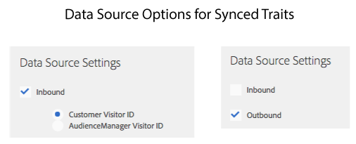

# Características do público-alvo ativo e características sincronizadas do Source de dados {#active-audience-traits-and-data-source-synced-traits}

Estas são características especiais usadas por [!UICONTROL Addressable Audiences]. [!UICONTROL Active Audience] e [!UICONTROL Data Source Synced Traits] estão localizados em [!UICONTROL Audience Data > Traits > Audience Traits].

>[!NOTE]
>
>O acesso exige permissões de administrador.

## Características do público-alvo ativo {#active-audience-traits}

Uma característica [!UICONTROL Active Audience] contém todos os dispositivos sob gerenciamento na sua conta [!DNL Audience Manager]. Você pode usar um [!UICONTROL Active Audience Trait] como outras características ao criar ou editar segmentos. Além disso, [Públicos-alvo endereçáveis](../../features/addressable-audiences.md) exigem essa característica para gerar dados de sobreposição. Todas as contas têm uma característica [!UICONTROL Active Audience] por padrão. Esta característica não pode ser excluída.

## Características sincronizadas do Data Source {#data-source-synced-traits}

[!UICONTROL Data Source Synced Traits] aparecem na pasta [!UICONTROL Audience Traits] quando você [cria ou edita uma fonte de dados](../../features/manage-datasources.md#create-data-source) e aplica uma destas configurações:

[!UICONTROL Data Source Synced Traits] rastreia todos os usuários associados a uma fonte de dados. Você pode usar um [!UICONTROL Data Source Synched Trait] como outras características ao criar ou editar segmentos. Quando você cria um [!UICONTROL Data Source Synced Trait], o nome da característica corresponde ao nome usado pela sua fonte de dados. Edite a fonte de dados para alterar o nome da característica. Essas características não podem ser excluídas.

>[!TIP]
>
>[!UICONTROL Data Source Synced Traits] são úteis para a solução de problemas. Clique em um nome de característica para verificar as métricas na página de resumo de característica. Se a característica selecionada retornar dados, isso indica que o processo de sincronização de ID está configurado corretamente e enviando dados para [!DNL Audience Manager].

>[!MORELIKETHIS]
>
>* [Públicos endereçáveis](../../features/addressable-audiences.md)
