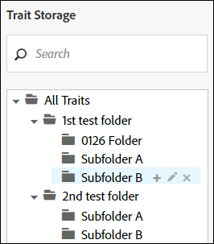

# Gerenciar características da pasta {#manage-folder-traits}

Criar, editar e excluir características da pasta.

## Criar uma característica de pasta {#create-folder-trait}

A [!UICONTROL folder trait] O é criado automaticamente quando você cria uma nova pasta na taxonomia.

<!-- create-folder-trait.xml -->

1. Ir para **[!UICONTROL Audience Data > Traits]** para navegar até o **Características** painel.
1. No [!UICONTROL Trait Storage] janela, passe o mouse sobre:

   * Texto &quot;Todas as características&quot; para adicionar uma nova pasta de nível raiz.
   * Uma pasta pai existente para adicionar uma nova pasta secundária.

   

1. Clique no ícone + para criar a pasta. Observe que você pode criar no máximo 2000 pastas em sua taxonomia. Consulte a documentação de [limites de uso](../../features/administration/usage-limits.md) para obter mais informações.
1. Nomeie a pasta e clique em **Salvar**. Por exemplo, uma pasta chamada Eletrônicos terá uma característica de pasta chamada &quot;Característica de pasta eletrônica&quot;. Você pode visualizar e selecionar a nova característica da pasta no painel de características.
1. A nova característica da pasta é automaticamente atribuída à variável [!DNL Audience Manager] fonte de dados gerada. Seus usuários com as [!UICONTROL Role-Based Access Control] ([!DNL RBAC]) podem alterar a fonte de dados no workflow editar característica da pasta. Consulte [Editar uma característica da pasta](../../features/traits/manage-folder-traits.md#edit-folder-trait).

## Editar uma característica da pasta {#edit-folder-trait}

Descreve como editar um [!UICONTROL folder trait].

<!-- edit-folder-trait.xml -->

1. No [!UICONTROL Traits] painel, passe o mouse sobre o **[!UICONTROL Actions]** para a característica da pasta que deseja editar.
1. Clique no lápis para editar a característica.

   

1. A variável **[!UICONTROL Edit]** O fluxo de trabalho do permite alterar a fonte de dados para características da pasta. Selecione a fonte de dados desejada e clique em **[!UICONTROL Save]**. As fontes de dados são classificadas numericamente, por [!DNL DPID], na caixa suspensa.

   Se sua empresa usar [!UICONTROL Role-Based Access Rights (RBAC)], você ou seus usuários precisam [permissões de acesso](../../features/traits/about-folder-traits.md#role-based-access-controls) às fontes de dados de características.

>[!NOTE]
>
>Não é possível renomear diretamente uma característica de pasta. [Renomear a pasta de armazenamento associada](../../features/traits/trait-storage.md#rename-delete-trait-storage-folder) para alterar o nome da característica da pasta.

## Excluir uma característica de pasta {#delete-folder-trait}

Exclua uma característica de pasta excluindo a pasta de armazenamento à qual a característica pertence.

<!-- delete-folder-trait.xml -->

1. **Dados de público-alvo > Características** para navegar até o **Características** painel.
1. No [!UICONTROL Trait Storage] exclua uma pasta ao passar o mouse sobre ela e clicar no ícone X.

   

>[!NOTE]
>
>Não é possível excluir uma característica de pasta, se ela for usada em uma expressão de segmento. Navegue até a [visualização de característica](../../features/traits/trait-details-page.md) para ver quais segmentos usam a característica da pasta. Em seguida, clique no nome do segmento para abrir o [visualização do resumo de segmentos](../../features/segments/segment-summary-view.md), que permite remover características de expressões de segmento.
