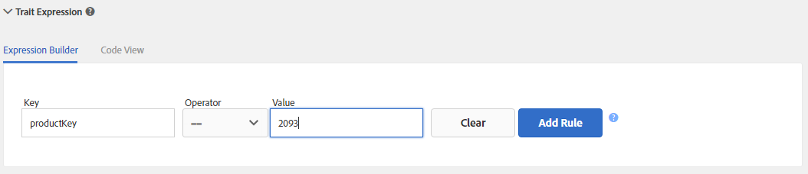
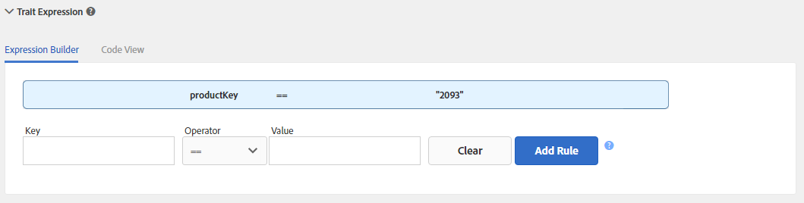

# Gerenciamento de regras de características {#managing-trait-rules}

No [!UICONTROL Trait Builder], o [!UICONTROL Expression Builder] permite criar e testar regras que estabelecem requisitos de qualificação de público-alvo. As regras consistem em pares de valores chave como `color == blue` ou `price > 100`. Os operadores de comparação estabelecem a relação entre chaves e valores. [!DNL Boolean] expressões determinam a relação entre grupos de regras.

<!-- c_tb_rules.xml -->

## Descrição dos recursos principais das regras de sinal

1. As guias **[!UICONTROL Expression Builder]** ou **[!UICONTROL Code View]** fornecem uma visão geral das regras em sua característica. A guia **[!UICONTROL Expression Builder]** permite criar regras com campos e menus suspensos. O **[!UICONTROL Code View]** permite criar regras gravando manualmente essas expressões como código. A ilustração acima mostra uma característica simples composta por um sinal que avalia dados para uma condição de qualificação em que uma chave do produto é igual a um valor específico, neste caso `color == "blue"`.

1. Os campos e controles nesta seção permitem criar sinais de pares de valores chave e definir a relação entre eles com um operador de comparação. Uma chave, operador e valor são necessários.
1. O [!UICONTROL Data Explorer Options] permite que você preencha retroativamente realizações de características para seus sinais.

   >[!NOTE]
   >
   >Esta opção está disponível somente para [!UICONTROL Data Explorer] clientes. Entre em contato com seu consultor da Adobe para obter detalhes.

1. Esta seção mostra uma estimativa das realizações de características nos últimos 7 dias, para os sinais definidos em [!UICONTROL Expression Builder], para características preenchidas retroativamente e não preenchidas retroativamente.

   >[!NOTE]
   >
   >Esta opção está disponível somente para [!UICONTROL Data Explorer] clientes. Entre em contato com seu consultor da Adobe para obter detalhes.

1. Os campos de teste permitem validar combinações de regras de sinal ou os [!DNL URL]s que você deseja usar ao enviar dados para o Audience Manager.

## Criar uma regra de característica {#create-trait-rule}

As regras (ou expressões) consistem em pares de valores chave individuais ou em grupos. Os operadores de comparação definem a relação entre pares de valores chave. Para criar uma regra, forneça uma chave, um valor, selecione um operador e clique em **[!UICONTROL Add Rule]**.

<!-- t_tb_create_rules.xml -->

Preencha os campos obrigatórios na seção **[!UICONTROL Basic Information]** *antes* de criar regras de características.

1. Expanda a seção **[!UICONTROL Trait Expression]** e insira um nome de chave e valor. Isso cria um *`signal`*.

   >[!NOTE]
   >
   >Inclua o prefixo `c_` (ou qualquer outra convenção de nomenclatura) para a variável principal se suas chamadas de evento enviarem dados para [!DNL Audience Manager] usando essa sintaxe.

1. Selecione um [operador de comparação](../../features/traits/trait-comparison-operators.md) na lista suspensa **[!UICONTROL Operator]**. O operador de comparação avalia a relação entre os elementos em um sinal.

   >[!NOTE]
   >
   >O operador [!DNL Boolean] [!UICONTROL OR] estabelece a relação entre vários sinais *dentro* de um grupo e não pode ser alterado.

1. Clique em **[!UICONTROL Add Rule]**. A regra salva aparece no espaço de trabalho de características acima dos campos de entrada de dados.

### Exemplo {#example-trait-rule}

No exemplo abaixo, um usuário criou uma nova regra de característica com base na ID do produto. Para criar essa regra, o usuário forneceu a chave `productkey` vinculada ao operador igual ( `==`) para o valor `2093`.

Clicar em **[!UICONTROL Add Rule]** salva e move a característica para o espaço de trabalho [!UICONTROL Expression Builder].

## Criar um novo grupo de regras {#create-rule-group}

Este procedimento descreve como criar um novo grupo de regras.

<!-- t_tb_new_rule_group.xml -->

Sua característica deve conter pelo menos duas regras para que você possa criar um novo grupo de regras.

1. Mova o cursor sobre a regra que deseja mover para realçá-la.
1. Passe o mouse sobre a borda da regra destacada.

   Isso separa automaticamente a regra de seu grupo atual e a move para um novo grupo.

   >[!NOTE]
   >
   >Arraste uma regra de volta ao seu grupo original se você movê-la involuntariamente.

1. Selecione um operador [!DNL Boolean] ([!UICONTROL AND], [!UICONTROL OR], [!UICONTROL AND NOT]) no menu suspenso para definir a relação entre os grupos de regras.

## Mover regras entre grupos {#move-rules-between-groups}

Para mover uma regra, clique nela e arraste-a para outro grupo.

## Editar uma característica {#edit-trait}

Este procedimento descreve como editar uma característica.

<!-- t_tb_edit.xml -->

1. No painel [!UICONTROL Traits], passe o mouse sobre a coluna **[!UICONTROL Actions]** da característica que deseja editar. Isso exibe os ícones de gerenciamento de características.
1. Clique no lápis para editar a característica.

   

## Excluir uma regra de característica {#delete-trait}

Este procedimento descreve como excluir uma regra de característica.

<!-- t_tb_delete_rule.xml -->

1. No painel [!UICONTROL Traits], passe o mouse sobre as colunas [!UICONTROL Actions] da característica que deseja editar e clique no ícone de lápis. Isso exibe os ícones de gerenciamento de características.
1. Expanda a seção [!UICONTROL Trait Expression].
1. Passe o mouse sobre a regra que deseja excluir e clique no ícone X. A regra é excluída imediatamente.

>[!MORELIKETHIS]
>
>* [Criar um Novo Grupo de Regras](../../features/traits/manage-trait-rules.md#create-rule-group)
>* [Mover Regras Entre Grupos](../../features/traits/manage-trait-rules.md#move-rules-between-groups)
>* [Criar uma regra de característica](../../features/traits/manage-trait-rules.md#create-trait-rule)
>* [Excluir uma regra de característica](../../features/traits/manage-trait-rules.md#delete-trait)
>* [Mover Regras Entre Grupos](../../features/traits/manage-trait-rules.md#move-rules-between-groups)
