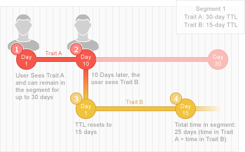

# Segment and Trait Time-to-Live Explained {#segment-time-to-live-explained}

How trait [!UICONTROL time-to-live] ([!DNL TTL]) interval affects segment membership.

<!-- segment-ttl-explained.xml -->

## Tempo para ao vivo

[!DNL TTL] define por quanto tempo um visitante do site permanece em um segmento após o último evento de qualificação de característica. [!DNL TTL] é definido em características e não em segmentos. Visitors fall out of a segment if they do not see a qualifying trait before the end of the [!DNL TTL] interval. The default [!DNL TTL] for new traits is 120 days. Quando definido como 0 dias, o traço nunca expira. [Defina o valor do TTL](../../features/traits/create-onboarded-rule-based-traits.md#set-expiration-interval) ao criar ou editar uma característica na [!UICONTROL Advanced Options] seção da interface de criação de traços.

## [!DNL TTL] E soltar fora de um segmento

A user falls out of a segment if they do not see any of its traits within the [!DNL TTL] interval. For example, if you have a 1-trait segment with a 30 days [!DNL TTL], the user will drop out of that segment if they do not see the trait again within the 30 days.

## [!DNL TTL] e Renovação de segmento

The [!DNL TTL] resets, and the user remains in a segment, if they see that segment’s trait within the [!DNL TTL] period. Also, because most segments contain multiple traits with their own [!DNL TTL] periods, a user can remain in a segment (and reset the [!DNL TTL] interval) as long as they keep seeing any traits associated with a segment. For example, say you have Segment 1 composed of Trait A (30 day [!DNL TTL]) and Trait B (15 day [!DNL TTL]). Assuming the user sees each trait only once, the illustration below outlines the [!DNL TTL] renewal process and total in-segment duration.

## [!DNL Audience Manager] Ttls são independentes das configurações TTL de terceiros

Remember, the [!DNL TTL] set on your [!DNL Audience Manager] pixel operates independently from the [!DNL TTL] set on other pixels used by third parties ([!DNL DSP]s, ad networks, etc.).

>[!MORE_ LIKE_ THIS]
>
>* [Definir um intervalo de expiração de características](../../features/traits/create-onboarded-rule-based-traits.md#set-expiration-interval)

