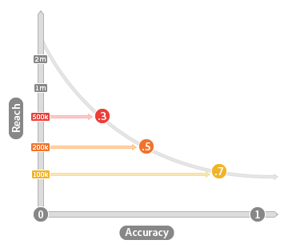

# Precisão e alcance {#accuracy-and-reach}

Descreve a relação entre precisão e alcance em traços algorítmicos.

<!-- c_accuracy_reach.xml -->

## Precisão vs Alcance: About

É importante entender a relação entre precisão e alcance ao trabalhar com traços algorítmicos. A precisão é representada por um valor pontuado que reflete o quão semelhantes os usuários são à sua linha de base. A escala de precisão varia de 0 (menos precisa) a 1 (mais precisa). Alcance é simplesmente um valor que representa o número de usuários únicos que você gostaria de incluir em uma característica. Alcance e precisão estão inversamente relacionados. Características exatas alcançam menos usuários e características com maior alcance são menos precisas. A imagem a seguir ilustra esse conceito.

## Precisão e alcance afetam o tamanho da Audiência

Seus objetivos de negócios devem ajudá-lo a tomar as decisões certas sobre precisão e alcance ao trabalhar com características algorítmicas. Se a precisão for a sua meta, observe que a população de uma característica pode aumentar ou diminuir ao longo de execuções de modelo. As alterações demográficas são os resultados das decisões tomadas pelo algoritmo durante cada período de avaliação. Às vezes, o algoritmo encontra mais usuários qualificados durante um ciclo de processamento e, em outros, pode encontrar menos. Os resultados são determinados pelos dados de linha de base usados para criar o modelo e novos visitantes e qualificações de característica que ocorreram desde a execução do modelo anterior. Por outro lado, ao trabalhar com o alcance, a contagem de população do usuário permanece constante. Por exemplo, se você quiser atingir 10.000 usuários, o algoritmo sempre acessará esse número para cada execução de modelo.

## Casos de uso geral para precisão vs alcance

O foco na precisão ou alcance depende do que você deseja alcançar com um segmento específico. A tabela a seguir pode ajudá-lo a avaliar a precisão e o alcance ao criar uma característica.

| Decisão de características favorece | Ajuda para localizar |
|---|---|
| **Precisão** | Usuários semelhantes aos clientes de linha de base em seu modelo. Útil para campanhas direcionadas quando você deseja alcançar uma audiência específica. |
| **Alcance** | Um número específico de usuários para cada execução de dados. Útil para campanhas de marca quando você está interessado em atingir uma audiência de tamanho específico. |