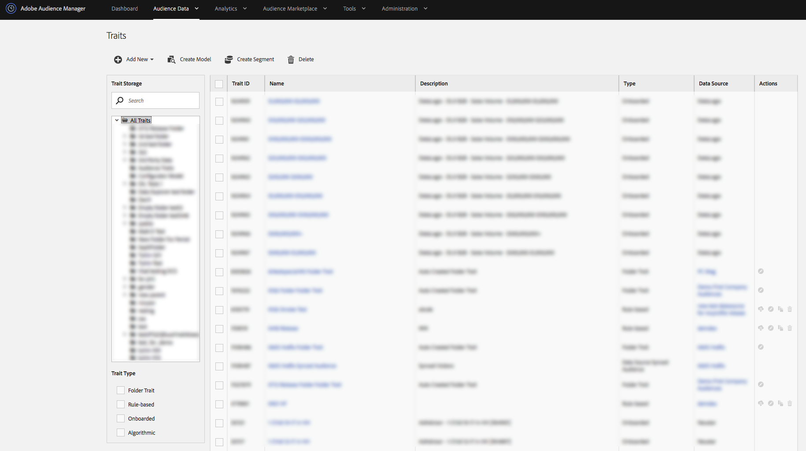

# Painel de características {#traits-dashboard}

O painel [Características](https://bank.demdex.com/portal/Traits/Traits.ddx#show/list) é um espaço de trabalho centralizado para gerenciar características. Você pode ver o painel [!UICONTROL Traits] navegando até **[!UICONTROL Audience Data]** > **[!UICONTROL Traits]**.

<!-- c_tb_dashboard.xml -->

O painel [!UICONTROL Traits] contém recursos e ferramentas que ajudam você a:

1. Veja todas as suas características e detalhes relacionados em uma tabela com colunas que você pode classificar.
2. Revise e trabalhe com [Características de Audiência ativas e Características sincronizadas da fonte de dados](../../features/traits/client-activity-synced-audience-traits.md).
3. Crie, edite e exclua características.
4. Visualização e gerenciamento de pastas de armazenamentos de características.
5. Procure características por nome, ID, descrição ou fonte de dados. Clique em uma pasta enquanto pesquisa para limitar os resultados a essa pasta e suas subpastas.
6. Filtre as características por tipo de característica (integrado, baseado em regras, algorítmico, características de pastas).