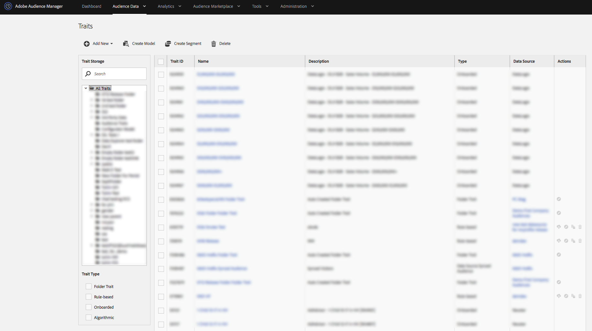

# Painel de características {#traits-dashboard}

O painel de características é um espaço de trabalho centralizado para gerenciar características. Você pode ver o painel [!UICONTROL Traits] navegando até **[!UICONTROL Audience Data]** > **[!UICONTROL Traits]**.

<!-- c_tb_dashboard.xml -->

O painel [!UICONTROL Traits] contém recursos e ferramentas que ajudam você a:

1. Veja todas as suas características e detalhes relacionados em uma tabela com colunas que você pode classificar.
2. Revise e trabalhe com [Características do público-alvo ativo e Características sincronizadas do Data Source](../../features/traits/client-activity-synced-audience-traits.md).
3. Crie, edite e exclua características.
4. Exibir e gerenciar pastas de armazenamento de características.
5. Procure características por nome, ID, descrição ou fonte de dados. Clique em uma pasta enquanto pesquisa para limitar os resultados a essa pasta e suas subpastas.
6. Filtrar características por tipo de característica (integrada, baseada em regras, algorítmica, características de pasta).
