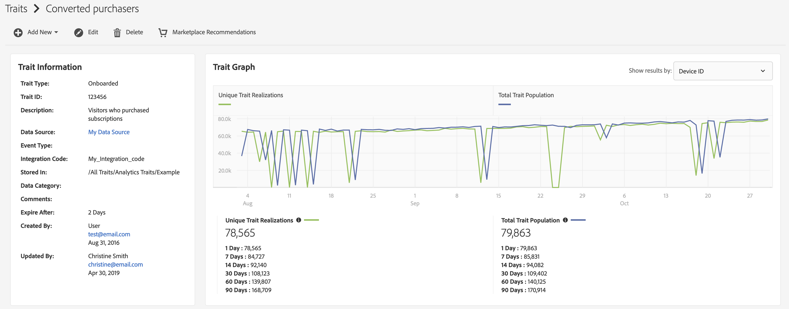

# Página de detalhes [!UICONTROL Trait] {#trait-details-page}

A página de detalhes de um [!UICONTROL trait] individual fornece uma visão geral dos detalhes de [!UICONTROL trait], como o nome, a ID, as métricas de desempenho, as expressões que definem o [!UICONTROL trait], os segmentos aos quais ele pertence e o log de auditoria [!UICONTROL trait]. [!UICONTROL trait] Para exibir esses detalhes, vá para **[!UICONTROL Audience Data]** > **[!UICONTROL Traits]** e clique no nome da [!UICONTROL trait] com a qual você deseja trabalhar.

## Ferramentas de gerenciamento de [!UICONTROL Trait] {#trait-management-tools}

A parte superior da página de detalhes do [!UICONTROL trait] hospeda as ferramentas que você pode usar para gerenciar o [!UICONTROL traits]:

1. **[!UICONTROL Add New]**: Use esta opção para criar novos [!UICONTROL rule-based], [!UICONTROL algorithmic] ou [!UICONTROL onboarded traits].
2. **[!UICONTROL Edit]**: Use esta opção para alterar a configuração da [!UICONTROL trait] atual.
3. **[!UICONTROL Delete]**: Use esta opção para remover o [!UICONTROL trait] atual da sua conta do Audience Manager.
4. **[!UICONTROL Marketplace Recommendations]**: Use esta opção para localizar [!UICONTROL traits] semelhante ao que você está visualizando, de [!UICONTROL Audience Marketplace] taxas de dados para as quais você não tem assinatura. Consulte [Audience Marketplace para Compradores de Dados](../audience-marketplace/marketplace-data-buyers/marketplace-data-buyers.md) para saber como navegar no [!UICONTROL Marketplace] e encontrar características semelhantes.

## Informações de [!UICONTROL Trait] {#basics}

A seção [!UICONTROL Trait Information] mostra detalhes sobre os campos obrigatórios e opcionais que você concluiu ao criar o [!UICONTROL trait]. Isso inclui itens como o tipo [!UICONTROL trait], a ID [!UICONTROL trait], a descrição, [!UICONTROL data source] e outros metadados. Esses detalhes variam dependendo do tipo [!UICONTROL trait] ([!UICONTROL folder], [!UICONTROL onboarded] ou [!UICONTROL rule-based]).

## [!UICONTROL Trait Graph] {#trait-graph}

O [!UICONTROL Trait Graph] fornece métricas de desempenho instantâneas para o [!UICONTROL trait] selecionado. Mantenha o cursor sobre uma linha de tendência para ver dados adicionais da [!UICONTROL trait] selecionada.

[!UICONTROL Unique Trait Realizations] representa uma contagem de usuários únicos que adicionaram este [!UICONTROL trait] a seus perfis no intervalo de tempo especificado. O [!UICONTROL Total Trait Population] indica o número de usuários únicos qualificados atualmente para este [!UICONTROL trait].

Para [!UICONTROL rule-based traits], a qualificação de [!UICONTROL trait] acontece em tempo real, já que os usuários se qualificam para um [!UICONTROL trait] em seus navegadores.

Para [!UICONTROL onboarded traits], a qualificação [!UICONTROL trait] acontece depois que um arquivo de entrada é processado, ou seja, o arquivo de entrada é [alimentado no Audience Manager](../../faq/faq-inbound-data-ingestion.md) e é quando ocorre a qualificação [!UICONTROL trait].

O [!UICONTROL Trait Graph] mostra as seguintes informações:

* **[!UICONTROL Show results by]**
   * **[!UICONTROL Cross-Device ID]**: selecione esta opção para ver os resultados de [!UICONTROL traits] que estão coletando dados para perfis autenticados. Ao selecionar essa opção, você verá apenas dados no relatório [!UICONTROL Cross-Device ID], e nenhum dado estará presente no relatório [!UICONTROL Device ID].
   * **[!UICONTROL Device ID]**: selecione esta opção para ver os resultados de [!UICONTROL traits] que estão coletando dados para perfis de dispositivo. Ao selecionar essa opção, você verá apenas dados no relatório [!UICONTROL Device ID], e nenhum dado estará presente no relatório [!UICONTROL Cross-Device ID].

     

* **[!UICONTROL Unique Trait Realizations]**: Uma contagem de usuários únicos que adicionou este [!UICONTROL trait] ao seu perfil no intervalo de tempo especificado.
* **[!UICONTROL Total Trait Population]**: O número de usuários exclusivos qualificados atualmente para este [!UICONTROL trait].

* **[!UICONTROL Identity Type Breakdown]**: as três primeiras entradas mostram as três [!UICONTROL cross-device data sources] principais com a maior contagem de população qualificada para [!UICONTROL trait], em ordem decrescente. A quarta entrada mostra a soma de todos os outros [!DNL DPUUIDs] ([!DNL CRM IDs]) qualificados para [!UICONTROL trait], de [!UICONTROL cross-device data sources] que não estão entre os três primeiros. Este relatório aparecerá somente se você selecionar [!UICONTROL Cross-device ID] no menu suspenso [!UICONTROL Show Results By] na parte superior direita da página. A opção suspensa padrão é [!UICONTROL Device ID], onde este relatório não é exibido.

  

  >[!NOTE]
  >
  >O Audience Manager só exibirá o relatório [!UICONTROL Identity Type Breakdown] se você tiver [!UICONTROL cross-device] IDs qualificadas para o [!UICONTROL trait].

  >[!VIDEO](https://video.tv.adobe.com/v/32079?captions=por_br)

## [!UICONTROL Trait] Expressão {#trait-expression}

A seção [!UICONTROL Trait Expression] mostra os critérios que os usuários devem atender para se qualificarem para o [!UICONTROL trait]. Estas regras são definidas quando você [cria ou edita uma característica](../../features/traits/about-trait-builder.md).

## [!UICONTROL Trait] Segmentos {#trait-segments}

A seção [!UICONTROL Segments with this Trait] lista todos os segmentos aos quais o [!UICONTROL trait] selecionado pertence. Você pode clicar em um nome de segmento para ver detalhes sobre ele.

## [!UICONTROL Trait] Log de auditoria/histórico {#trait-audit-history}

Para [!UICONTROL rule-based] e [!UICONTROL onboarded traits], o [!UICONTROL Trait Expression Change History] mostra as últimas 10 alterações feitas nas regras de expressão [!UICONTROL trait] e quem as fez. Se o seu [!UICONTROL trait] tiver mais de 10 alterações, clique em **[!UICONTROL Export to CSV]** para baixar todo o log de auditoria. Log de auditoria não disponível para [!UICONTROL folder] ou [!UICONTROL algorithmic traits].

>[!NOTE]
>
>[!UICONTROL Not Available] na coluna [!UICONTROL By User] significa que a conta desse usuário foi excluída.

