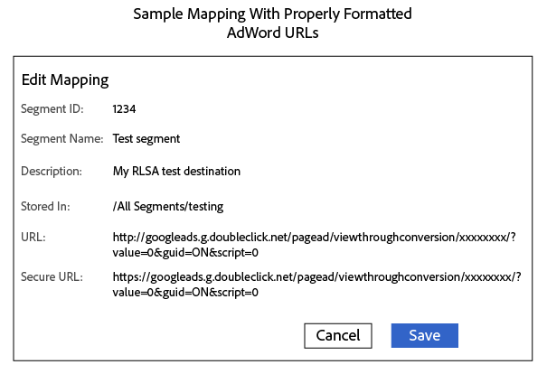

# Enviar segmentos para uma Lista de remarketing do Google Ads {#send-segments-to-a-google-adwords-remarketing-list}

Este procedimento requer uma lista de remarketing [!DNL Google Ads], um código de pixel e um Audience Manager [!DNL URL] [!DNL destination]. Também é conhecida como lista de remarketing para integração de anúncios de pesquisa ([!DNL RLSA]). Aplica-se somente à pesquisa paga.

>[!IMPORTANT]
>Observe que essa não é uma integração produzida dos dois sistemas.

Para configurar uma lista de remarketing [!DNL Google Ads] como um [!DNL Audience Manager] [!DNL URL destination]:

1. Na sua conta do [!DNL Google Ads], [crie uma lista de remarketing para sites](https://support.google.com/tagmanager/answer/6106960?hl=en) e anote sua ID de conversão.
1. Use o seguinte URL como modelo para o URL básico e o URL seguro. Substitua a seção xxxxxxxx pelo seu ID de conversão.

   ```
    //googleads.g.doubleclick.net/pagead/viewthroughconversion/xxxxxxxx/?value=0&guid=ON&script=0&data=%ALIAS%
   ```

1. No Audience Manager, [Crie um  [!DNL URL destination]](../../features/destinations/create-url-destination.md) ou edite um [!DNL destination] existente. Usar as seguintes configurações ao criar o [!DNL destination]:
   * Tipo: URL
   * Serialização: ativada
   * Delimitador: ponto e vírgula ( &semi; )

1. Na seção [!UICONTROL Segment Mappings] do [!DNL URL] [!DNL destination], adicione o código da etapa 2 aos campos [!DNL URL] e [!DNL Secure URL]. Prefixe o código com `http:` e `https:` nos campos [!DNL URL] e [!DNL Secure URL], respectivamente.

   >[!IMPORTANT]
   >
   >Substituir &quot;E&quot; comercial codificado `&` por &quot;E&quot; comercial não codificado `&`

   Código [!DNL URL] não seguro:

   ```
    http://googleads.g.doubleclick.net/pagead/viewthroughconversion/xxxxxxxx/?
    value=0&guid=ON&script=0&data=%ALIAS%
   ```

   Código [!DNL URL] seguro:

   ```
    https://googleads.g.doubleclick.net/pagead/viewthroughconversion/xxxxxxxx/?
    value=0&guid=ON&script=0&data=%ALIAS%
   ```

1. Clique em **[!UICONTROL Save]**.

   >[!NOTE]
   >
   >Se estiver trabalhando com vários segmentos, obtenha um novo pixel para cada segmento que deseja mapear para um [!DNL Google Ads] [!DNL destination]. Isso garante que os dados sejam aplicados à lista de remarketing apropriada.

1. Ao mapear um novo segmento para este [!DNL destination] no Audience Manager, defina o mapeamento como `aam=segmentID` e substitua `segmentID` pela ID do seu segmento.
1. Ao definir um bucket no [!DNL Google Ads], crie uma regra que corresponda ao mapeamento definido na etapa 6.

Um mapeamento concluído pode ser semelhante a este:



>[!MORELIKETHIS]
>
>* [[!DNL Destinations]](../../features/destinations/destinations.md)
>* [Criar um [!DNL URL Destination]](../../features/destinations/create-url-destination.md)
>* [Sobre Listas de Remarketing do AdWords](https://support.google.com/adwords/answer/2472738)
>* [Como funciona o remarketing do AdWords](https://support.google.com/adwords/answer/2454000)
