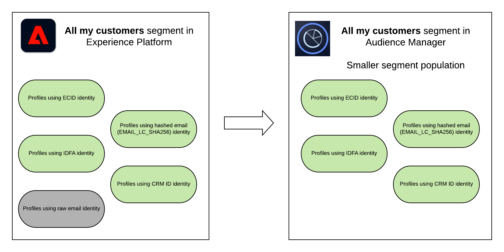

# Compartilhamento de segmento do Experience Platform com o Audience Manager e outras soluções do Experience Cloud {#aam-aep-audience-sharing}

>[!NOTE]
>
> Entre em contato com seu representante de vendas do Adobe para desbloquear o acesso a essa funcionalidade.

## Visão geral {#overview}

A funcionalidade de compartilhamento de público-alvo entre o Audience Manager e o Adobe Experience Platform permite compartilhar características e segmentos do Audience Manager com o Adobe Experience Platform e vice-versa. Você precisa do [[!DNL Audience Manager Connector]](https://docs.adobe.com/content/help/en/experience-platform/sources/connectors/adobe-applications/audience-manager.html) para ativar o compartilhamento de público-alvo entre o Audience Manager e o Adobe Experience Platform.

Você pode usar características e segmentos do Audience Manager no Experience Platform para adicionar dados do Audience Manager aos perfis do cliente e se beneficiar do Experience Platform [serviço de segmentação](https://www.adobe.io/apis/experienceplatform/home/profile-identity-segmentation/profile-identity-segmentation-services.html#!api-specification/markdown/narrative/technical_overview/segmentation/segmentation-overview.md).

No Audience Manager, é possível usar segmentos de Experience Platform para casos de uso da Plataforma de gerenciamento de dados, como:
* Adicionar [dados de terceiros](/help/using/overview/data-types-collected.md#third-party-data) aos seus segmentos;
* [Modelagem algoritmica](/help/using/features/algorithmic-models/understanding-models.md);
* Ative seus segmentos para destinos que ainda não são suportados no catálogo de destinos Experience Platform [a1/>.](https://docs.adobe.com/content/help/en/experience-platform/rtcdp/destinations/destinations-cat/destinations-catalog.html)

Além disso, seus segmentos do Experience Platform são compartilhados com outras soluções Experience Cloud, por meio de [Serviços principais](https://docs.adobe.com/content/help/en/core-services/interface/experience-cloud.html).

>[!IMPORTANT]
>
> * Você precisa de uma licença do Audience Manager para ativar os casos de uso da Plataforma de gerenciamento de dados mencionados acima.
> * Você *não precisa de* uma licença do Audience Manager para compartilhar segmentos do Experience Platform com Adobe Advertising Cloud, Adobe Target, Marketo e outras soluções do Experience Cloud, por meio da integração dos Serviços principais.

  

Consulte a tabela abaixo para obter uma visão geral dos casos de uso de compartilhamento de público-alvo:

| **Caso de uso** | **Adobe Experience Platform** | **Audience Manager** | **Principais serviços** |
---------|----------|---------|---------
| **Compartilhamento de público** | <ul><li>Enriqueça os perfis do cliente com dados do Audience Manager</li><li>Usar dados de Audience Manager na segmentação de Experience Platform</li></ul> | <ul><li>Adicionar dados de terceiros aos segmentos</li><li>Modelagem algoritmica</li><li>Ativação para destinos adicionais</li></ul> | Use segmentos do Experience Platform em outras soluções do Experience Cloud, como Adobe Target, Advertising Cloud ou Marketo. |

  

## Segmentos Audience Manager e características no Adobe Experience Platform {#aam-segments-traits-in-aep}

Suas características e segmentos do Audience Manager aparecem no Experience Platform como **Audiences** no fluxo de trabalho do segmento. Para obter mais informações sobre seus segmentos de Audience Manager e características no Experience Platform, consulte:

* [Visão geral do serviço de segmentação](https://docs.adobe.com/content/help/en/experience-platform/segmentation/home.html#audiences)
* [Guia do usuário do Experience Platform Segment Builder](https://docs.adobe.com/content/help/en/experience-platform/segmentation/ui/overview.html#audiences)
* [Conector Audience Manager](https://docs.adobe.com/content/help/en/experience-platform/sources/connectors/adobe-applications/audience-manager.html)

  

## Segmentos Adobe Experience Platform no Audience Manager {#aep-segments-in-aam}

Os segmentos criados no Experience Platform aparecem na interface do Audience Manager como sinais, características e segmentos, com as seguintes regras de composição:

* Sinal: Para cada segmento de Experience Platform, você deve ver sinais no formato `segID = segment ID`.
* Característica: A regra de característica é a ID do segmento Experience Platform.
* Segmento: O segmento consiste na característica descrita acima.

### Sinais {#aep-segments-as-aam-signals}

Selecione **[!UICONTROL Audience Data > Signals > General Online Data]** e pesquise por `SegId` para encontrar sinais que chegam do Experience Platform. Você pode usar essa tela para fins de depuração, para verificar se a integração entre o Experience Platform e o Audience Manager foi configurada corretamente.

### Características {#aep-segments-as-aam-traits}

O Audience Manager cria automaticamente uma pasta de características chamada **Experience Platform Traits** no armazenamento de características.

Você pode usar características criadas automaticamente em segmentos ao lado de outras características. Por exemplo, você pode misturar características criadas em segmentos de Experience Platform com características de terceiros adquiridas por meio do [Audience Marketplace](/help/using/features/audience-marketplace/audience-marketplace.md).

Para obter um exemplo de uma característica criada automaticamente a partir de um segmento de Experience Platform, consulte a captura de tela abaixo:

| Número do item | Nome | Descrição |
---------|----------|---------
| 1 | [!UICONTROL Trait Type] | As características criadas a partir de segmentos Experience Platform são criadas como características integradas no Audience Manager. |
| 2 | [!UICONTROL Data Source] | Criado automaticamente. Todas as características e segmentos criados automaticamente a partir de segmentos de Experience Platform são armazenados na fonte de dados **[!UICONTROL Adobe Experience Platform Audience Sharing]**. |
| 3 | [!UICONTROL Integration Code] | O código de integração corresponde à ID do segmento no Experience Platform. |
| 4 | [!UICONTROL Trait Expression] | A expressão de característica é `segID = segment ID in Experience Platform`. |
| 5 | [!UICONTROL Segments with this Trait] | Um segmento criado automaticamente que usa essa característica como sua composição. |

  

### Segmentos {#aep-segments-as-aam-segments}

O Audience Manager cria automaticamente uma pasta de segmento chamada **Experience Platform Segments** no armazenamento de segmento.

Para obter um exemplo de um segmento criado automaticamente a partir de um segmento de Experience Platform, consulte a captura de tela abaixo:

| Número do item | Nome | Descrição |
---------|----------|---------
| 1 | [!UICONTROL Integration Code] | O código de integração corresponde à ID do segmento no Experience Platform. |
| 2 | [!UICONTROL Data Source] | Criado automaticamente. Todas as características e segmentos criados automaticamente a partir de segmentos de Experience Platform são armazenados na fonte de dados **[!DNL Adobe Experience Platform Audience Sharing]**. |
| 1 | [!UICONTROL Profile Merge Rule] | **[!UICONTROL External Merge Policy]** indica que os segmentos criados automaticamente seguem a política de mesclagem configurada no Experience Platform. |
| 4 | [!UICONTROL Segment Rule] | O segmento consiste na característica descrita na seção [Características](#aep-segments-as-aam-traits). |

## Suporte ao Controle de exportação de dados do Audience Manager no Experience Platform {#aam-data-export-control-in-aep}

Para impor a conformidade do uso de dados no Experience Platform, todos os conjuntos de dados e campos aplicáveis devem receber os [rótulos de uso de dados](https://docs.adobe.com/content/help/en/experience-platform/data-governance/labels/overview.html) apropriados. Além disso, [políticas de uso de dados](https://docs.adobe.com/content/help/en/experience-platform/data-governance/policies/overview.html) devem ser habilitadas para ações de marketing específicas em relação a esses rótulos, conforme descrito pela [estrutura DULE (Data Usage Labeling and Enforcement, Rotulagem e aplicação de uso de dados)](https://docs.adobe.com/content/help/en/experience-platform/data-governance/home.html#dule-framework).

No processo de compartilhamento de público-alvo entre o Audience Manager e o Experience Platform, todos os Controles de exportação de dados que foram aplicados a segmentos do Audience Manager são traduzidos para rótulos e ações de marketing equivalentes reconhecidos pela Governança de dados do Experience Platform, e vice-versa.

>[!NOTE]
>
>Para obter informações mais gerais sobre Controles da exportação de dados, consulte a [documentação sobre Controles da exportação de dados](https://docs.adobe.com/content/help/en/audience-manager/user-guide/features/data-export-controls.html).
>
>Este documento fornece uma referência para como os Controles de exportação de dados do Audience Manager são mapeados para rótulos de uso de dados e ações de marketing na plataforma.

### Controles da exportação de dados para rótulos de uso de dados

A tabela a seguir descreve como os Controles de exportação de dados específicos são mapeados para rótulos de uso de dados reconhecidos:

| Controle da exportação de dados | Rótulo de uso de dados |
| --- | --- |
| Não pode ser usado com informações de identificação pessoal | C3: Os dados não podem ser combinados ou usados com informações diretamente identificáveis |
| Não pode ser usado para direcionamento de anúncio externo | C5: Os dados não podem ser usados para direcionamento de conteúdo ou anúncios baseado em interesses entre sites |
| Não pode ser usado para direcionamento de anúncios no site | C6: Os dados não podem ser usados para o direcionamento de anúncios no site |
| Não pode ser usado para personalização no site | C7: Os dados não podem ser usados para o direcionamento no site do conteúdo |

### Controles da exportação de dados para ações de marketing

A tabela a seguir descreve como os Rótulos de exportação de dados específicos mapeiam para ações de marketing reconhecidas:

| Rótulo de exportação de dados | Ação de marketing |
| --- | --- |
| Este destino pode permitir uma combinação com informações pessoalmente identificáveis (PII) | Combinar com PII |
| Esse destino pode ser usado para direcionamento de anúncios fora do site | Direcionamento entre sites |
| Esse destino pode ser usado para o direcionamento de anúncios no site | Publicidade no site |
| Esse destino pode ser usado para personalização de anúncios no site | Personalização no site |

## Entender as diferenças de população do segmento entre Audience Manager e Experience Platform {#aep-aam-segment-population-differences}

Os números de população do segmento podem variar entre seus segmentos de Audience Manager e Experience Platform. Embora os números de segmentos para públicos semelhantes ou idênticos devam ser próximos, as diferenças nas populações podem ser devidas aos fatores listados abaixo.

### Avaliação de segmento no Experience Platform

O Audience Manager atualiza os números dos relatórios na interface uma vez por dia.   O tempo dessa atualização raramente se alinha ao tempo da avaliação de segmento no Experience Platform.

### Diferenças entre as Regras de mesclagem de perfis e as Políticas de mesclagem

[[!UICONTROL Profile Merge Rules]](/help/using/features/profile-merge-rules/merge-rules-overview.md) em Audience Manager e  [[!UICONTROL Merge Policies]](https://docs.adobe.com/content/help/en/experience-platform/profile/ui/merge-policies.html) em Experience Platform funcionam de forma diferente, e o gráfico de identidade usado para cada um varia. Por esse motivo, são esperadas algumas diferenças entre as populações de segmentos.

### Composição do segmento no Experience Platform

A integração entre o Adobe Experience Platform e o Audience Manager compartilha vários namespaces de identidade padrão [para todos os clientes: ECID, IDFA, GAID, endereços de email com hash (EMAIL_LC_SHA256), AdCloud ID. ](https://docs.adobe.com/content/help/en/experience-platform/identity/namespaces.html#identity-types) Se os segmentos de Experience Platform usarem qualquer uma dessas características como identidade primária para os perfis qualificados, os perfis serão contados em características e segmentos de Audience Manager.

>[!NOTE]
>
> Os públicos-alvo no Experience Platform com identidades destacadas em emails brutos nunca aparecem no Audience Manager.

Por exemplo, se você tivesse um segmento Experience Platform &quot;Todos os meus clientes&quot; e os perfis qualificados fossem IDs de CRM, ECID, IDFA, endereços de email brutos e com hash, o segmento correspondente no Audience Manager incluiria apenas perfis com hash ECID, IDFA e endereços de email com hash. A população do segmento no Audience Manager seria menor que a do Experience Platform.

<!--

If you created a data source in Audience Manager for the CRM IDs in Experience Platform, then the qualified profiles keyed off those CRM IDs would appear in Audience Manager and the segment population in Audience Manager would increase.

-->

>[!MORELIKETHIS]
>
>* [Visão geral do serviço de segmentação](https://docs.adobe.com/content/help/en/experience-platform/segmentation/home.html#audiences)
>* [Guia do usuário do Experience Platform Segment Builder](https://docs.adobe.com/content/help/en/experience-platform/segmentation/ui/overview.html#audiences)
>* [Conector Audience Manager](https://docs.adobe.com/content/help/en/experience-platform/sources/connectors/adobe-applications/audience-manager.html)

