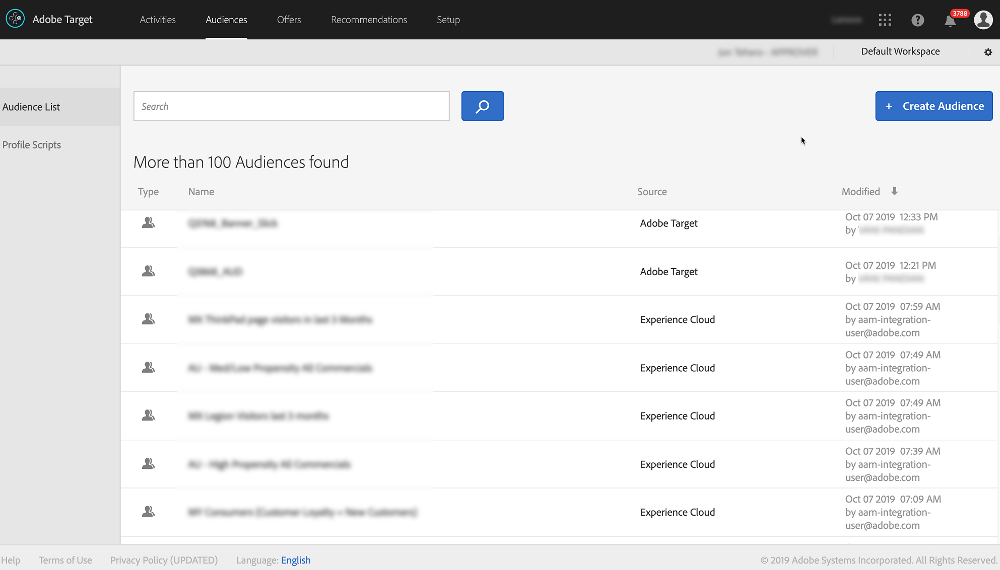

# Integrar O Audience Manager Ao Target {#integrate-audience-manager-with-target}

Essa integração permite que você envie segmentos do Audience Manager para a Adobe [!DNL Target].

Um Audience Manager - a integração exige [!DNL Target] :

* O serviço [da](https://marketing.adobe.com/resources/help/en_US/mcvid/)Experience Cloud. Se você não estiver usando esse serviço, consulte os guias [de](https://marketing.adobe.com/resources/help/en_US/mcvid/mcvid-implementation-guides.html) implementação para começar.
* Perfis e públicos-alvo. Se você não estiver provisionado para Perfis e públicos-alvo, preencha o formulário na página [Integrações da](https://adobe.allegiancetech.com/cgi-bin/qwebcorporate.dll?idx=X8SVES) Experience Cloud ou entre em contato com seu consultor para começar.

Todos os seus segmentos do Audience Manager aparecerão em [!DNL Target] pouco tempo depois que você concluir essas etapas no processo de implementação. Procure **[!UICONTROL Audiences > Audience List]** para ver seus segmentos do Audience Manager em [!DNL Target]. Identifique os segmentos do Audience Manager pela Experience Cloud na **[!UICONTROL Source]** coluna e `aam-integration-user@adobe.com` na **[!UICONTROL Modified]** .

