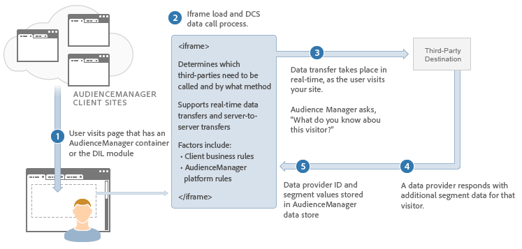

# Descrição do processo de transferência de dados em tempo real{#real-time-data-transfer-process-described}

Uma visão geral de como o Audience Manager executa transferências de dados em tempo real com um provedor de conteúdo de terceiros.

<!-- real-time-data-transfer-explained.xml -->

## Transferências de dados em tempo real

As transferências de dados em tempo real enviam e recebem IDs de segmento como visitas de usuários ou ações em seu site. Normalmente, as transferências de dados síncronas são úteis quando você precisa qualificar ou segmentar os usuários imediatamente, à medida que eles navegam pelo inventário.

## Etapas da integração de dados

O processo de integração de dados em tempo real funciona da seguinte maneira:

1. Um usuário visita o site de um cliente que contém o código Audience Manager.
1. O Audience Manager carrega um iframe e faz uma chamada para o nosso [!UICONTROL Data Collection Server] ( [!DNL DCS]).
1. O [!DNL DCS] chama o servidor de terceiros (em tempo real) para verificar se o fornecedor tem alguma informação de segmento sobre o usuário.
1. O provedor de conteúdo retorna informações de segmento sobre esse usuário para o Audience Manager.
1. O Audience Manager recebe essas informações de segmento e as disponibiliza para direcionar e criar novas características e segmentos.

