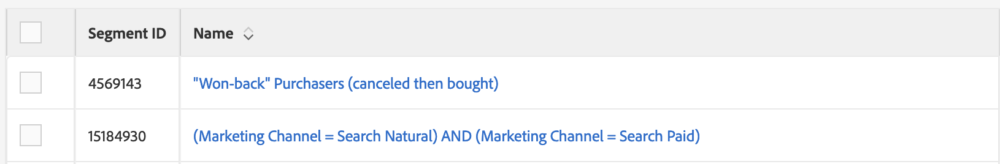

# Acessibilidade no Audience Manager {#accessibility}

## Visão geral {#overview}

Acessibilidade refere-se a uma série de recursos que tornam um produto de software utilizável, com o mínimo esforço possível de usuários com várias deficiências, como visuais, auditivas, cognitivas, motoras ou de outro tipo.

O Adobe é líder do setor em acessibilidade e oferece suporte à criação de experiências notáveis na Web, incentivando os desenvolvedores a produzir conteúdo rico e envolvente, acessível a todos os usuários. Para obter mais detalhes sobre o compromisso do Adobe com a acessibilidade, consulte [Acessibilidade Adobe](https://www.adobe.com/accessibility.html).

Os recursos de acessibilidade mais comuns encontrados em produtos de software são: navegação por teclado, estrutura semântica, contraste suficiente entre elementos de primeiro plano e elementos de plano de fundo, suporte a tecnologia assistiva, rótulos de elementos claros e assim por diante.

Para tornar [!DNL Audience Manager] mais fácil de usar para todos, desenvolvemos suporte para vários recursos de acessibilidade.

## Navegação do teclado {#keyboard-navigation}

[!DNL Audience Manager] oferece suporte à acessibilidade total do teclado:

* A variável `Tab` e as setas se movem entre elementos individuais da interface do usuário.

   

* A variável `Return` (`Enter`) e `Space` as teclas ativam o item selecionado.

## Classificação de tabela acessível {#table-sorting}

Os cabeçalhos da tabela podem ser selecionados ao navegar através da `Tab` e você poderá alterar a ordem de classificação pressionando `Space`.

## Suporte para tecnologias assistivas {#assistive-technologies}

Através da utilização de códigos semânticos e [ARIA](https://www.w3.org/WAI/standards-guidelines/aria/), elementos interativos dentro da [!DNL Audience Manager] A interface do usuário do inclui rótulos correspondentes, nomes acessíveis e funções que identificam a finalidade e o estado atual.

Isso garante que as tecnologias assistivas, como leitores de tela, possam ler os rótulos e outras informações para os usuários para que eles possam interagir facilmente com os controles do aplicativo.

Todos os elementos interativos na interface do usuário do Audience Manager incluem rótulos correspondentes. Isso garante que as tecnologias assistivas, como leitores de tela, possam ler os rótulos para os usuários.

## Cores e contraste {#colors-contrast}

A variável [!DNL Audience Manager] a interface do usuário do se esforça para fornecer contraste suficiente no aplicativo e assim garantir uma experiência de exibição acessível para usuários com limitações visuais ou de percepção de cor.

Por exemplo, as telas de carregamento incluem um ponteiro de carregamento dentro de uma caixa modal branca, tudo em cima de uma sobreposição cinza escuro.

## Leitura adicional {#further-reading}

[!DNL Audience Manager] O se esforça para fornecer um grau cada vez maior de acessibilidade, tornando o produto fácil de usar para todos.

Recomendamos que você use o [Formulário de feedback de acessibilidade do Adobe](https://www.adobe.com/accessibility/feedback.html) para nos enviar sugestões de aprimoramento e problemas de acessibilidade que você esteja observando. Teremos muito prazer em levar seus comentários em consideração e melhorar [!DNL Audience Manager].
